# 모듈 1: 사용자 인증

이 모듈에서는 Wild Rydes 애플리케이션을 위한 Amazon Cognito 사용자 풀 및 자격 증명 풀을 생성합니다.
Cognito 사용자 풀은 사용자 프로필 정보를 저장하고 가입 및 로그인 기능을 제공하며 Cognito 자격 증명 풀은 응용 프로그램 내에서 IAM (Identity and Access Management) 역할을 맡을 수 있는 기능을 제공합니다.

Wild Rydes는 탑승 공유 응용 프로그램이므로 모든 사용자는 탑승을 요청하기 전에 가입 및 로그인을 해야합니다. 이러한 목적으로 [AWS Amplify](https://aws-amplify.github.io/) JavaScript 라이브러리를 통해 [Amazon Cognito](https:/aws.amazon.com/cognito/)와 통합되는 어플리케이션을 구성합니다. 


## 솔루션 아키텍처

이 모듈의 아키텍처는 매우 간단합니다 HTML, CSS, JavaScript, 이미지 및 기타 파일을 포함한 모든 정적 웹 컨텐츠는 Cloud9 작업 영역에서 로컬로 제공됩니다. 웹 사이트 애플리케이션 코드를 변경하면 모든 변경 사항이 자동으로 수행됩니다. 라이브 리로드 기능을 통해 브라우저에 업데이트되어 표시됩니다.

이 모듈에서는 안전한 사용자 디렉토리인 Cognito 사용자 풀을 생성 한 다음 AWS Amplify 라이브러리를 사용하여 Amazon Cognito를 애플리케이션에 쉽게 통합하도록 애플리케이션을 구성합니다.

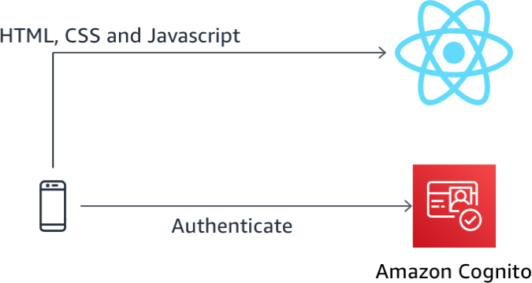

## 구현 지침

다음 각 섹션은 구현 개요와 자세한 단계별 지침을 제공합니다. 이 개요는 이미 AWS Management Console에 익숙하거나 연습을 거치지 않고 직접 서비스를 탐색하려는 경우 구현을 완료하기에 충분한 컨텍스트를 제공할 수 있어야 합니다. 

최신 버전의 Chrome, Firefox 또는 Safari 웹 브라우저를 사용하는 경우 섹션을 펼칠 때까지 단계별 지침이 표시되지 않습니다.


### 1. 로컬에서 웹사이트 운영 

1. Cloud9 작업 공간에서 터미널 창을 선택하고 *~/environment/aws-serverless-workshops/Auth/website* 로 이동한 뒤 다음 명령을 실행하여 로컬 웹 서버를 시작합니다. 

    ```console
    yarn start
    ```

	개발 서버가 시작될 때까지 기다립니다. *Compiled with warnings* 와 같은 메세지가 표시된다면 응용 프로그램에 기능을 추가할 예정이므로 무시해도 됩니다.


2. 개발 서버가 시작되었으므로 화면 상단의 실행 버튼 옆에있는 **실행중인 응용 프로그램 미리보기**를 클릭하십시오.

    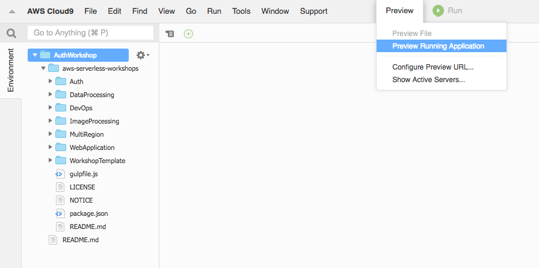  

3. 웹 애플리케이션은 Cloud9 IDE 하단의 터미널 옆에있는 작은 창에 로드됩니다. **Brower** 단어 옆에있는 **re-size button**을 클릭하여이 창을 새 탭에서 여십시오.

    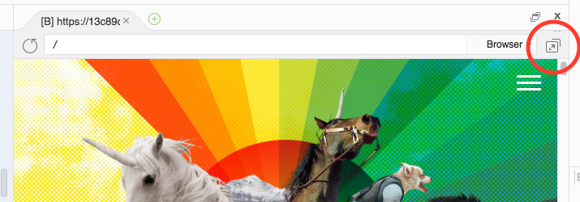   


	웹 애플리케이션을 변경하면 이 탭이 변경 사항을 반영하여 자동으로 새로 고침됩니다.이 탭을 열어두고 Cloud9 IDE 탭으로 돌아가서 workshop을 계속하십시오.

    Wild Rydes 웹 사이트가 작동하는 것처럼 보일 수 있지만 현재 가입 또는 로그인 요청을 위한 통합 기능이 없습니다.


### 2. Cognito 사용자 풀 만들기

Amazon Cognito 사용자 풀을 사용하면 웹 및 모바일 앱에 사용자 가입 및 로그인 기능을 빠르고 쉽게 추가 할 수 있습니다. 이 단계에서는 Wild Rydes 앱을 위한 Cognito 사용자 풀을 생성합니다.


#### 고급 지침 

이메일 확인이 필요한 Amazon Cognito 사용자 풀을 생성하려면 AWS 콘솔을 사용하십시오.

> 콘솔의 지역은 이전에 사용했던 마지막 지역으로 기본 설정되며 이전에 Cloud9 환경을 시작한 지역으로 변경하십시오.

<details>
<summary><strong>단계별 지침 (expand for details)</strong></summary><p>

1. In the AWS 관리 콘솔에서 **Services**를 클릭하고 Security, Identity, and Compliance 카테고리의 **Cognito** 로 이동합니다. 

2. 콘솔 오른쪽 상단에서 원하는 **Region** 을 선택했는지 확인합니다. 이 리전은 이전에 Cloud9 개발 환경을 만든 리전과 일치해야 합니다. 

3. **Manage User Pools**을 선택합니다. 

4. 콘솔의 오른쪽 상단에서 **Create a User Pool** 을 클릭합니다. 

5. `WildRydes` 와 같이 사용자 풀의 이름을 지정합니다.

6. 사용자 풀 옵션을 설정하기위해 **Step through settings** 을 선택합니다. 

	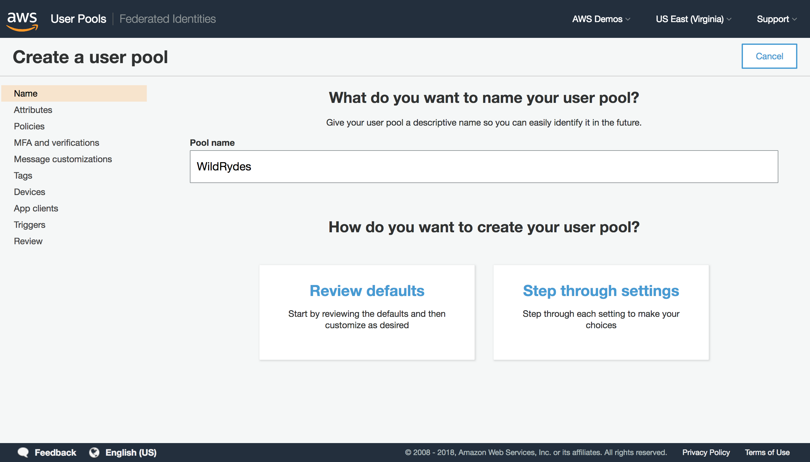

7. **Username** 은 선택된 상태로 두고, **Also allow sign in with verified email address** 와 **Also allow sign in with verified phone number** 을 추가적으로 선택합니다.

8. 다른 설정들은 기본값을 그대로 둡니다. 

9. **Next step**을 클릭합니다.

	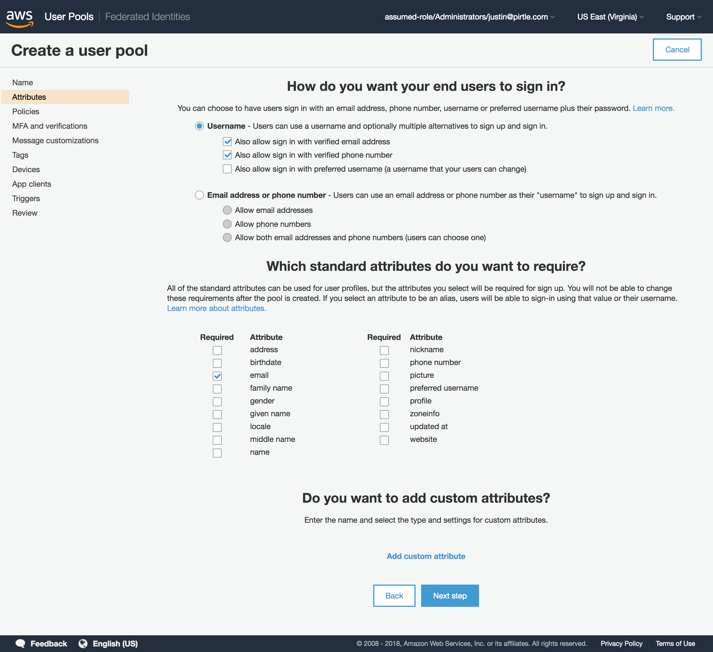

10. 비밀번호 정책 및 사용자 등록 설정을 기본 설정으로 유지하고 **Next step**를 클릭합니다. 

	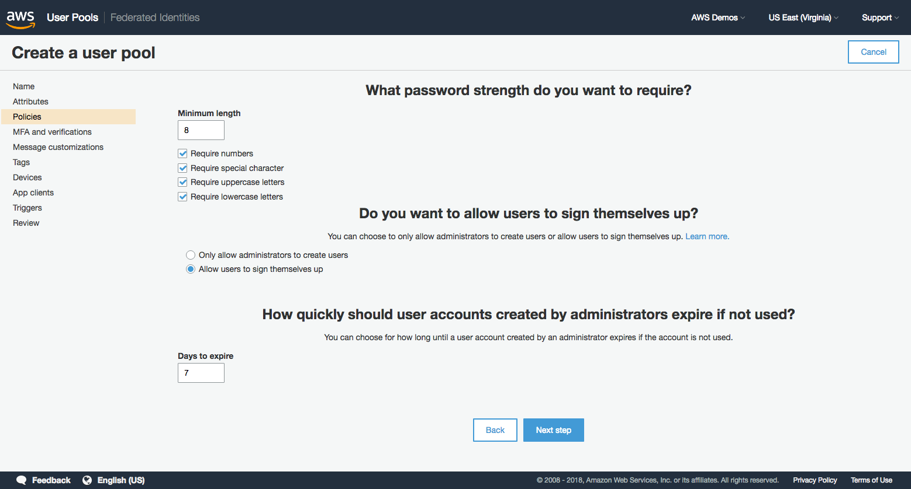

11. 이번 워크샵에서는 **MFA set to Off** 상태로 둡니다. 

12. 이메일 확인 필요에 대한 기본설정은 그대로 둡니다. 

13. **Next step**을 클릭합니다. 

	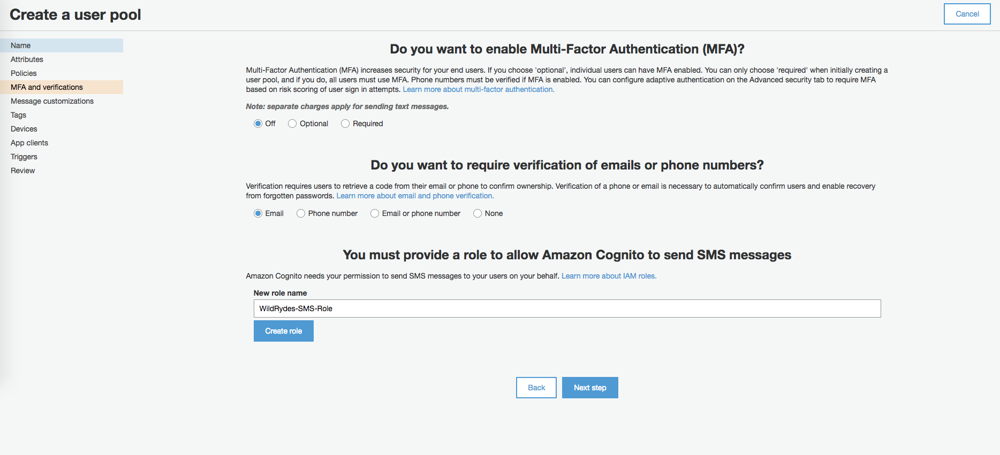

14. 모든 메세지와 SES 기본설정을 그대로 두고 **Next step**을 클릭합니다. 

15. 태그 추가는 생략하고 **Next step**을 클릭합니다. 

16. 사용자 디바이스를 기억하지 않기 위해 **No** 를 선택하고 **Next step**을 클릭합니다. 

	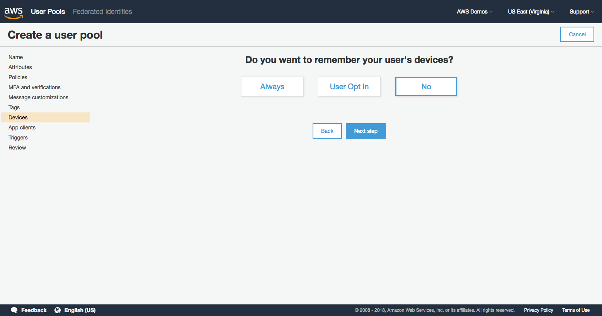

17. 다음 화면에서 **Add an app client** *링크*를 클릭합니다.

18. app client 이름으로 `wildrydes-web-app` 을 입력합니다. 

19. *Generate client secret* 을 **선택해재**합니다. 클라이언트 시크릿은 서버 측 애플리케이션 인증에 사용되며 JavaScript 애플리케이션에는 필요하지 않습니다.

20. **Create app client**을 클릭합니다. 

21. **Next step**을 클릭합니다. 

	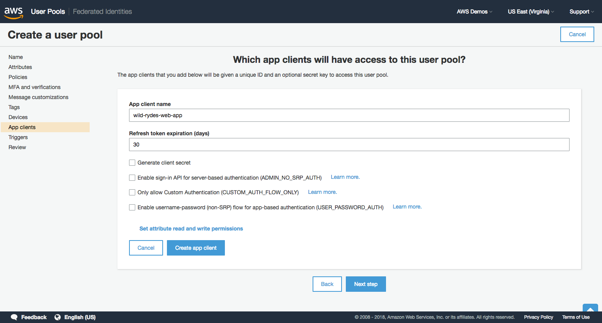

22. 모든 Lambda 트리거 설정을 *none*으로 설정합니다. 이 트리거 설정을 사용하면 사용자 지정 로직을 사용하여 out-of-the-box 가입 및 로그인 흐름을 확장 할 수 있지만 이 번 워크샵에서는 이 기능을 사용하지 않습니다. 

23. **Next step**을 클릭합니다.

24. 제공된 모든 설정의 요약을 확인한 뒤 **Create pool**을 클릭합니다. 

	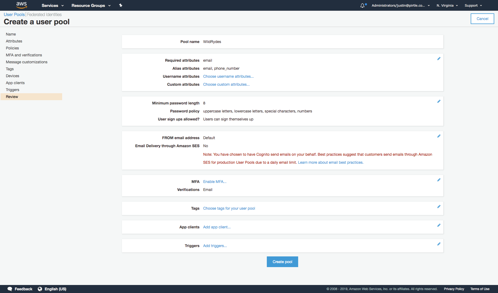

25. Cloud9에서 **+** 기호를 클릭하고 **New File**을 클릭합니다. 새로운 빈 편집기 탭은 다양한 리소스 이름 및 변수에 대한 스크래치 패드로 사용됩니다.

	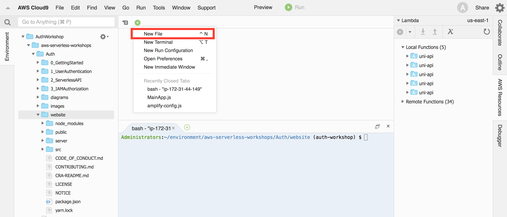

26. 다시 AWS Cognito 콘솔로 돌아와서, *User Pool Id* 를 복사하여 이전 단계에서 만든 스크래치 패드에 붙여 넣습니다. 

	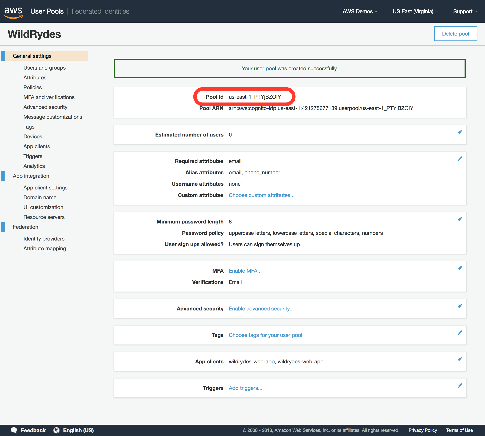

27. Cognito 탐색 패널의 *General settings* 에서  **App clients** 을 클릭합니다. 

28. *App 클라이언트 ID*를 스크래치 패드에 복사하십시오. 나중에이 두 값을 모두 사용하게됩니다.

	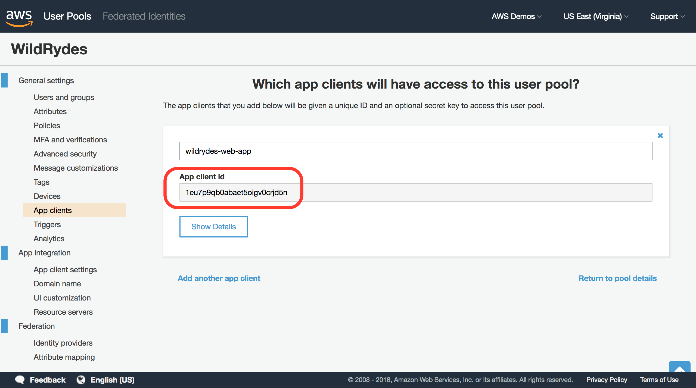

</p></details>

### 3. Cognito 자격 증명 풀 만들기

Cognito 자격 증명 풀은 IAM 역할을 통해 최종 사용자 애플리케이션에 AWS 자격 증명을 제공하는 데 사용되며, Cognito 배포 및 사용자를 다른 AWS 서비스와 통합 할 예정이므로 이제 이 자격 증명 풀을 생성해보도록 하겠습니다.

#### 고급 지침

방금 생성한 Cognito 사용자 풀 및 앱 클라이언트 ID에 연결된 Cognito 자격 증명 풀을 생성해야합니다. 애플리케이션에는 인증되지 않은 사용자가 AWS 리소스에 액세스 할 필요가 없으므로 인증되지 않은 자격 증명에 대한 액세스를 활성화 할 필요가 없습니다.

<details>
<summary><strong>단계별 지침 (expand for details)</strong></summary><p>

1. Cognito 콘솔에서, Cognito Federated Identities 콘솔로 전환하기 위해 헤더 표시 줄에서 **Federated Identities**를 클릭합니다. 

1. **Create new Identity pool**을 클릭합니다. 

1. 자격 증명 풀 이름으로 `wildrydes_identity_pool`을 입력합니다.

1. **Authentication providers**을 확장합니다.

1. Cognito 탭에서 이전에 스크래치 패드 탭에 복사 한 사용자 풀 ID 및 앱 클라이언트 ID를 입력합니다. 

	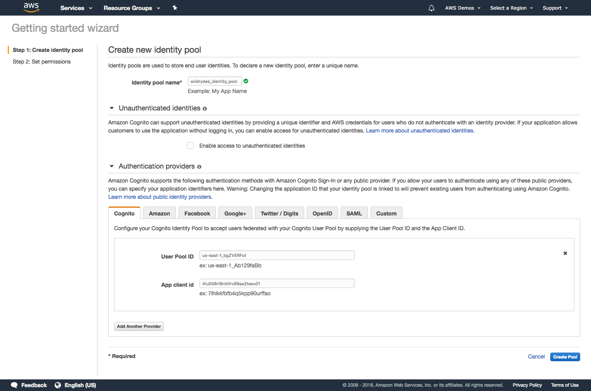

1. **Create Pool**을 클릭합니다. 

1. Cognito 자격 증명 풀이 애플리케이션 사용자의 IAM 역할을 설정하도록 허용하려면 **Allow**를 선택하십시오. 이러한 역할의 권한과 설정은 나중에 사용자 지정할 수 있습니다.

1. Get AWS Credentials 섹션의 코드 샘플에서 빨간색으로 강조 표시된 *Identity Pool ID*를 Cloud9 스크래치패드 편집기 탭에 복사하여 붙여 넣습니다.

	> 따옴표를 복사하지 말고 지역 코드와 ":"문자를 포함하십시오.

	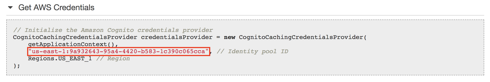
	
1. 스크래치 패드에 이제 다음 Cognito 자원에 대한 값이 있어야합니다 : 

	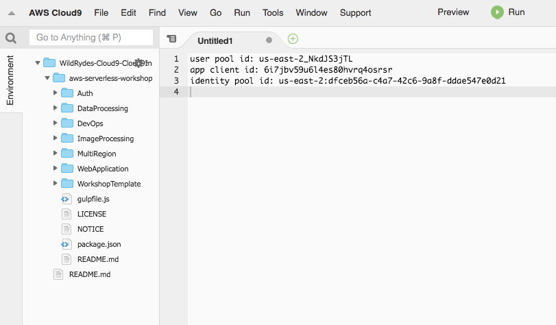

</p></details>


### 4. AWS Amplify를 사용하여 애플리케이션을 Amazon Cognito와 통합

Cognito 사용자 풀 및 자격 증명 풀을 생성 및 구성 했으므로 Amazon Cognito에 통합되도록 애플리케이션을 구성하여 사용자 프로필을 저장하고 가입 및 로그인을 활성화해야합니다.

#### 고급 지침

[AWS Amplify](https://aws-amplify.github.io/) JavaScript 라이브러리를 프로젝트로 가져온 다음 가입 및 로그인 유틸리티 클래스를 추가하여 기존 UI 및 프론트 엔드 구성 요소와 통합합니다.

*/Auth/website/src/auth/signIn.js* 파일 내에서 onSubmitForm 및 onSubmitVerification 메소드의 구현과 */Auth/website/src/auth/signIn.js* 파일 내에서 동일한 이름의 메소드의 구현을 완료해야합니다. 마지막으로 */Auth/website/src/index.js* 페이지 내에서 사용자 인증 여부를 확인하는 메소드 구현을 완료해야합니다.


<details>
<summary><strong>단계별 지침 (expand for details)</strong></summary><p>

1. AWS Amplify 모듈을 사용하기 전에 먼저 */Auth/website/src/amplify-config.js* 파일을 업데이트하여 새로 생성된 Cognito 리소스를 사용하도록 Amplify를 구성해야합니다.

1. Cloud9 IDE 편집기에서 해당 파일을 연 뒤 다음 매개 변수 값을 이전 스크래치 패드에서 구성 값 매개 변수 값으로 복사합니다.
	- `identityPoolId`
	- `region`
	- `userPoolId`
	- `userPoolWebClientId`

	> 구성 값으로 **``빈칸**을 채우십시오. 주석에 표시된 예제 값은 단지 참조 용이며 응용 프로그램에서 활용하지 않으므로 수정하지 않아도됩니다.

1. **변경사항을 저장**하여 Amplify 구성 파일에 새 설정을 적용합니다. 파일에 저장되지 않은 변경 사항은 편집기 탭에 점 아이콘으로 표시되므로 파일 이름 옆에 회색 점이 표시되는 경우 저장을 잊었을 수 있으므로 확인이 필요합니다. 

1. 다음으로 *website/src/index.js* 파일을 편집하여 **파일 상단에** **(하지만 import절 아래에 있어야합니다.)**에 다음 줄을 추가하여 Amplify를 구성한 다음 변경 사항을 저장합니다 :

	```
	import Amplify from 'aws-amplify';
	import awsConfig from './amplify-config';
	
	Amplify.configure(awsConfig);
	```
	
	> 파일을 수정한 뒤에, 전체 import 절은 다음과 같아야합니다. 

	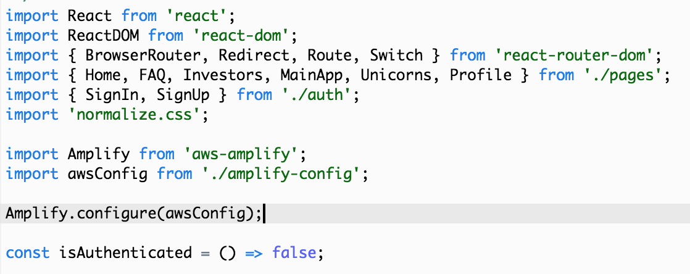
	
1. *website/src/index.js*에서 **변경사항을 저장**합니다.

1. 다음으로, 애플리케이션이 사용자의 인증 여부를 평가하는지 확인해야합니다. 동일한 */website/src/index.js* 파일에서 **isAuthenticated 메소드**를 찾아 아래 코드로 바꾸어 상태를 확인하는 Amplify 라이브러리의 내장 사용자 세션을 사용합니다. 

	```
	const isAuthenticated = () => Amplify.Auth.user !== null;
	```
	
1. *website/src/index.js*에서 **변경사항을 저장**합니다.

1. Amplify를 가져 와서 Amplify 라이브러리를 구성 했으므로 */website/src/auth/SignUp.js* 내에서 특정 메소드를 다음 코드로 대체하여 Amplify 및 Cognito 사용자 풀을 사용하여 사용자를 등록하도록 응용 프로그램 코드를 업데이트해야합니다. 

	>이 두 가지 메소드만 교체하면되며 나머지 SignUp.js 파일은 수정하지 않아야 합니다.

	> onSubmitForm 메소드는 등록 양식이 제출 될 때 이벤트를 처리하며, Cognito 사용자 풀에 사용자를 등록하는 AWS Amplify 라이브러리에서 Auth.signUp 메소드를 호출합니다.

	> onSubmitVerification 메소드는 초기 등록 요청 후 확인 코드 입력 양식이 제출 될 때 이벤트를 처리하며, Cognito 사용자 풀 내에서 사용자 등록을 확인하는 AWS Amplify 라이브러리에서 Auth.confirmSignUp 메소드를 호출합니다.


	```
	async onSubmitForm(e) {
	  e.preventDefault();
	  try {
	      const params = {
	          username: this.state.email.replace(/[@.]/g, '|'),
	          password: this.state.password,
	          attributes: {
		          email: this.state.email,
		          phone_number: this.state.phone
	          },
	          validationData: []
	      };
	      const data = await Auth.signUp(params);
	      console.log(data);
	      this.setState({ stage: 1 });
	  } catch (err) {
	    if (err === "No userPool") {
	      // User pool not defined in Amplify config file
	      console.error("User Pool not defined");
	      alert("User Pool not defined. Amplify config must be updated with user pool config");
	    } else if (err.message === "User already exists") {
	        // Setting state to allow user to proceed to enter verification code
	        this.setState({ stage: 1 });
	    } else {
	        if (err.message.indexOf("phone number format") >= 0) {err.message = "Invalid phone number format. Must include country code. Example: +14252345678"}
	        alert(err.message);
	        console.error("Exception from Auth.signUp: ", err);
	        this.setState({ stage: 0, email: '', password: '', confirm: '' });
	    }
	  }
	}
	
	async onSubmitVerification(e) {
	    e.preventDefault();
	    try {
	      const data = await Auth.confirmSignUp(
	          this.state.email.replace(/[@.]/g, '|'),
	          this.state.code
	      );
	      console.log(data);
	      // Go to the sign in page
	      this.props.history.replace('/signin');
	    } catch (err) {
	      alert(err.message);
	      console.error("Exception from Auth.confirmSignUp: ", err);
	    }
	}
	```
	
1. */website/src/auth/SignUp.js* 에서 **변경사항을 저장**합니다. 

1. 또한 AWS Amplify 및 Cognito를 사용하기 위해 로그인 기능을 통합하려면 */website/src/auth/SignIn.js* 파일에서 다음 메소드를 찾아 아래 코드로 교체해야 합니다.

	>이 두 가지 메소드만 교체하면 되며 나머지 SignIn.js 파일은 수정하지 않아야합니다.

	> onSubmitForm 메소드는 AWS Amplify에서 Auth.signIn 메소드를 호출하여 Cognito 사용자 풀로 로그인 요청을 시작한 다음 사용자가 성공적으로 로그인했음을 나타내는 로컬 상태를 설정합니다.

	> onSubmitVerification 메소드는 인증을 위해 다단계 인증이 필요할 때마다 확인 코드를 제출하는 데 사용되며,이 워크샵에서는 Cognito 사용자 풀을 구성 할 때 다단계 인증이 필요하지 않기 때문에 이 메소드가 호출되지 않습니다.

    ```
	async onSubmitForm(e) {
	    e.preventDefault();
	    try {
	        const userObject = await Auth.signIn(
	          this.state.email.replace(/[@.]/g, '|'),
	          this.state.password
	        );
	        console.log('userObject', userObject);
	        if (userObject.challengeName) {
	          // Auth challenges are pending prior to token issuance
	          this.setState({ userObject, stage: 1 });
	        } else {
	          // No remaining auth challenges need to be satisfied
	          const session = await Auth.currentSession();
	          // console.log('Cognito User Access Token:', session.getAccessToken().getJwtToken());
	          console.log('Cognito User Identity Token:', session.getIdToken().getJwtToken());
	          // console.log('Cognito User Refresh Token', session.getRefreshToken().getToken());
	          this.setState({ stage: 0, email: '', password: '', code: '' });
	          this.props.history.replace('/app');
	        }
	    } catch (err) {
	        alert(err.message);
	        console.error('Auth.signIn(): ', err);
	    }
	}

	async onSubmitVerification(e) {
	    e.preventDefault();
	    try {
	      const data = await Auth.confirmSignIn(
	        this.state.userObject,
	        this.state.code
	      );
	      console.log('Cognito User Data:', data);
	      const session = await Auth.currentSession();
	      // console.log('Cognito User Access Token:', session.getAccessToken().getJwtToken());
	      console.log('Cognito User Identity Token:', session.getIdToken().getJwtToken());
	      // console.log('Cognito User Refresh Token', session.getRefreshToken().getToken());
	      this.setState({ stage: 0, email: '', password: '', code: '' });
	      this.props.history.replace('/app');
	    } catch (err) {
	      alert(err.message);
	      console.error('Auth.confirmSignIn(): ', err);
	    }
	}
    ```
1. */website/src/auth/SignIn.js* 에서 **변경사항을 저장**합니다. 

</p></details>

### 5. 가입 및 로그인에 대한 유효성 검사가 이제 Amazon Cognito에서 작동하고 있습니다.

Amplify 코드를 애플리케이션에 통합 했으므로 사이트가 테스트되어 인증이 end-to-end로 작동하는지 확인해야 합니다.

#### 고급 지침

Cloud9 IDE에서  Wild Rydes 애플리케이션을 시작한 브라우저 탭으로 돌아갑니다. 코드 변경 사항을 저장하면 이 페이지가 자동으로 새로 고침 되므로 이제 모든 변경 사항을 반영하고 테스트 할 준비가되었습니다.

*/register* 경로를 방문하여 새 사용자로 가입하고 `+country_code`를 포함한 전화 번호를 제공하십시오. 한국기반의 전화 번호는`+821012345678`와 같습니다. 그런 다음 로그인 전에 필요한 과정인 verification 메일이 일회성 코드와 함께 전송되는지 확인합니다. 

새 사용자로 가입 한 후 */signin* 경로에서 동일한 사용자로 로그인하십시오. 페이지가 지도를 로드하면 로그인에 성공한 것이며 따라서 앱 인증을 위해 Cognito를 성공적으로 통합했다는 의미입니다. 

<details>
<summary><strong>단계별 지침 (expand for details)</strong></summary><p>

1. Cloud9 웹 사이트의 `/register` 경로를 방문하여 등록 페이지로 이동하십시오.

1. 이메일 주소, `+country_code`를 포함한 전화번호, 비밀번호를 두 번 입력합니다. 예를들어, 한국 전화 번호는`+821012345678`와 같습니다. 

	> 비밀번호는 대문자와 소문자를 포함하여 8 자 이상, 숫자와 특수 문자는 1 자 이상이어야합니다.

1. **Let's Ryde**를 클릭하여 등록을 제출합니다. 

1. 이메일 확인 화면에서 제공된 이메일 주소로 전송 된 일회성 코드를 입력 한 다음 **Veirtfy**을 선택합니다.

	> 받은 편지함에 확인 코드가 포함 된 확인메일이 없는 경우 스팸 폴더를 확인하십시오.

1. 오류가 발생하지 않으면 로그인 화면으로 리디렉션되고 등록시 입력한 것과 동일한 이메일 주소와 암호로 로그인을 합니다. 

1. 다음 페이지에서 지도가 로드되면 로그인에 성공했으며 앱 인증을 위해 Cognito를 성공적으로 통합한 것입니다.

1. *선택적으로*, 스크롤을 밑으로 내려 지도 너머로 사용자의 신원 토큰을 복사 한 후 [JWT.io](http://jwt.io)의 '인코딩 된'입력 상자에 붙여 넣어 해독헤 볼 수 있습니다. 토큰이 발행 된 시간, 토큰이 만료되는 시간, 사용자의 고유 ID 등과 같은 다른 표준 속성과 함께 모든 사용자 속성이 토큰 내에 인코딩되어 있는지 확인하십시오.

</p></details>

이 섹션을 마치면 다음 모듈 인 [Serverless API Auth](../2_ServerlessAPI)로 진행할 수 있습니다.