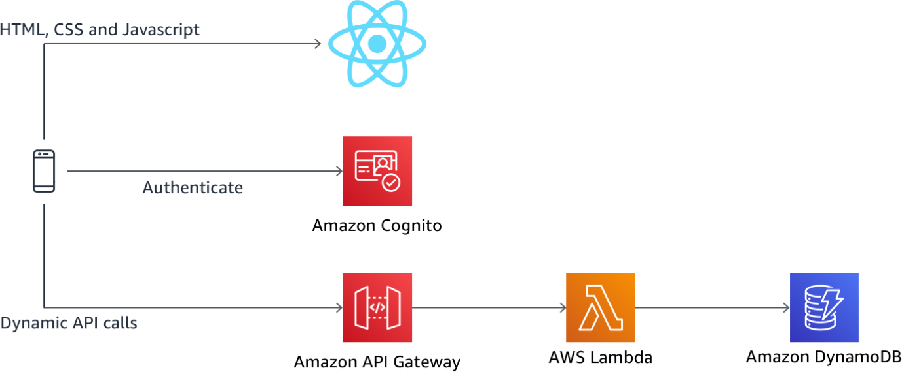
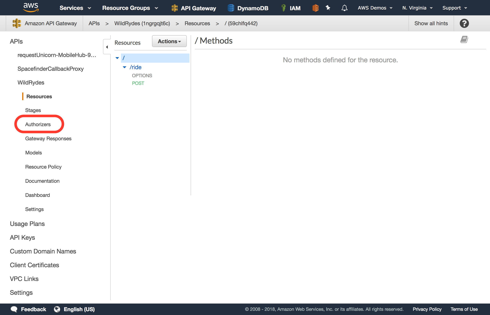
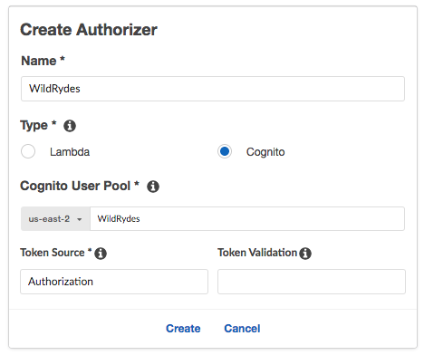
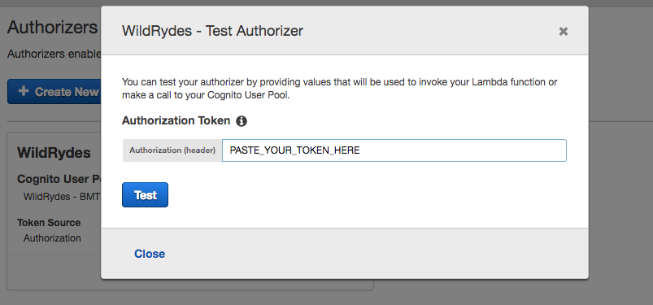
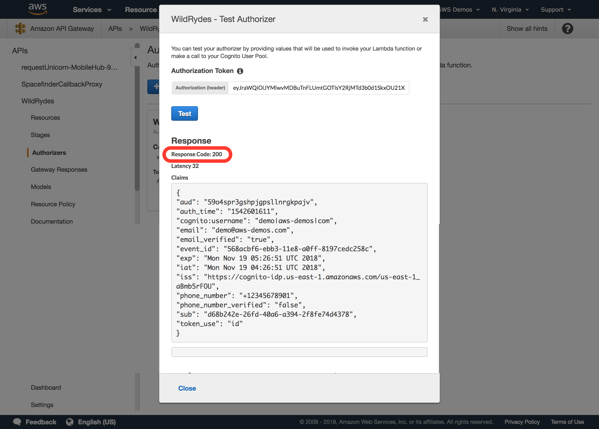
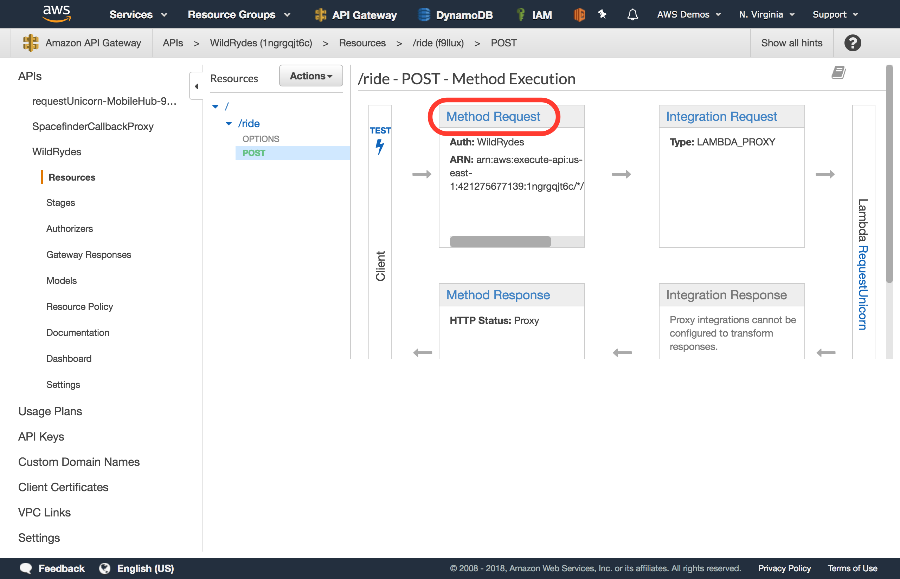
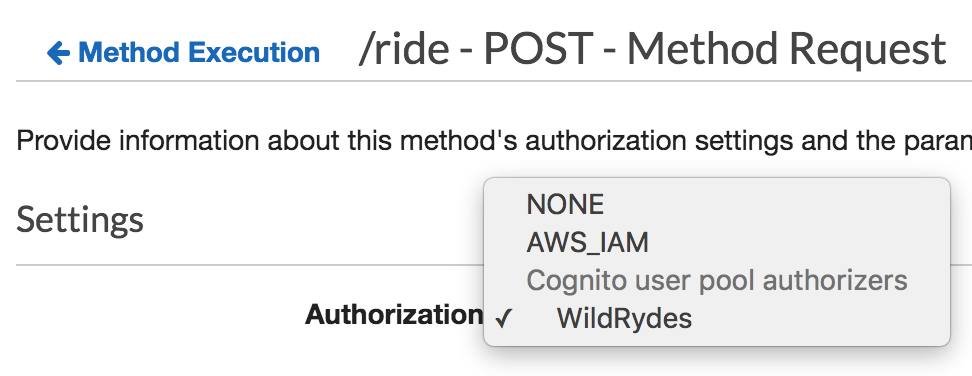
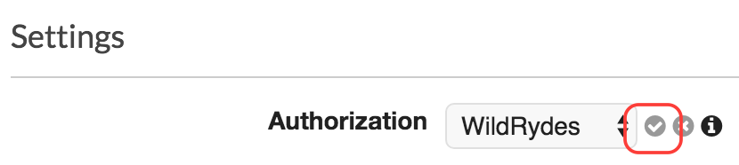
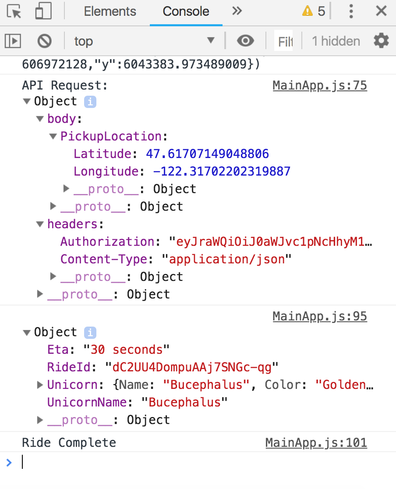

# 모듈 2 : 서버리스 API 인증 및 권한 부여

이 모듈에서는 [Amazon API Gateway](https://aws.amazon.com/api-gateway/) 및 [AWS Lambda](https://aws.amazon.com/lambda/)를 활용하여 서버리스 백엔드를 Wild Rydes 애플리케이션에 추가합니다. 그런 다음 API에서 인증 및 권한 부여를 활성화하여 유효한 승인된 요청만 수락하도록 백엔드를 보호할 수 있습니다. 

## 솔루션 아키텍처

모듈 1을 기반으로하는 이 모듈은 Amazon API Gateway 및 AWS Lambda를 사용하여 구축 된 서버리스 백엔드를 추가합니다. 데이터의 지속성을 위해 Amazon DynamoDB를 NoSQL 데이터 저장소로 사용합니다. 위의 모든 서비스는 서버리스이므로 수요가 증가함에 따라 애플리케이션을 원활하게 확장 할 수 있습니다. API를 생성 한 후 AWS Amplify 라이브러리를 통해 호출하기 위해 클라이언트 애플리케이션을 통합합니다. 



## 구현 지침

다음 각 섹션은 구현 개요와 자세한 단계별 지침을 제공합니다. 이 개요는 이미 AWS Management Console에 익숙하거나 연습을 거치지 않고 직접 서비스를 탐색하려는 경우 구현을 완료하기에 충분한 컨텍스트를 제공할 수 있어야 합니다. 

최신 버전의 Chrome, Firefox 또는 Safari 웹 브라우저를 사용하는 경우 섹션을 펼칠 때까지 단계별 지침이 표시되지 않습니다.

### 1. CloudFormation 템플릿에서 서버리스 API 백엔드 스택 생성

CloudFormation 템플릿을 통해 Amazon API Gateway, AWS Lambda 및 Amazon DynamoDB로 구축 된 서버리스 API를 생성하게됩니다. 이 워크샵은 인증 및 권한 부여에 중점을 두기 때문에 이 템플릿은 백엔드 인프라를 만들기만 하고 보안 설정은 활성화하지 않으며 나머지 모듈에서 이러한 설정을 활성화 및 구성할 예정입니다. 

#### 고급 지침

모듈 2 폴더의 **ServerlessBackend.yaml** 파일을 기반으로 CloudFormation 스택을 시작하여 새로운 WildRydes Serverless 백엔드 스택을 만듭니다. 스택의 이름을 `WildRydesBackend`로 지정하십시오.

이 WildRydes 백엔드 CloudFormation 템플릿은 컴퓨팅을 위한 Lambda 함수, 데이터 지속성을 위한 DynamoDB 데이터베이스 및 모듈 3에서 사용될 사진 업로드를 위한 S3 버킷으로 API 게이트웨이 배포를 프로비저닝합니다. 또한 필요한 Lambda 함수 호출 권한 및 실행 역할 기능도 제공됩니다.

Region Name | Region Code | Launch
------|-----|-----
US East (N. Virginia) | us-east-1 | [](https://console.aws.amazon.com/cloudformation/home?region=us-east-1#/stacks/new?stackName=WildRydesBackend&templateURL=https://s3.amazonaws.com/wildrydes-us-east-1/Auth/2_ServerlessAPI/ServerlessBackend.yaml)
US East (Ohio) | us-east-2 | [](https://console.aws.amazon.com/cloudformation/home?region=us-east-2#/stacks/new?stackName=WildRydesBackend&templateURL=https://s3.amazonaws.com/wildrydes-us-east-2/Auth/2_ServerlessAPI/ServerlessBackend.yaml)
US West (Oregon) | us-west-2 | [](https://console.aws.amazon.com/cloudformation/home?region=us-west-2#/stacks/new?stackName=WildRydesBackend&templateURL=https://s3.amazonaws.com/wildrydes-us-west-2/Auth/2_ServerlessAPI/ServerlessBackend.yaml)
EU (Ireland) | eu-west-1 | [](https://console.aws.amazon.com/cloudformation/home?region=eu-west-1#/stacks/new?stackName=WildRydesBackend&templateURL=https://s3.amazonaws.com/wildrydes-eu-west-1/Auth/2_ServerlessAPI/ServerlessBackend.yaml)
Asia Pacific (Singapore) | ap-southeast-1 | [](https://console.aws.amazon.com/cloudformation/home?region=ap-southeast-1#/stacks/new?stackName=WildRydesBackend&templateURL=https://s3.amazonaws.com/wildrydes-ap-southeast-1/Auth/2_ServerlessAPI/ServerlessBackend.yaml)

<details>
<summary><strong>단계별 지침 (expand for details)</strong></summary><p>

1. 위의 링크에서 CloudFormation 스택을 시작하고 이 워크샵에서 선택한 리전에 적합한 링크를 선택하십시오. *이 워크샵에서 이전에 사용했던 것과 동일한 지역을 선택해야 합니다.*

2. 다음 단계 인 2 단계에서 스택 이름이`WildRydesBackend`인지 확인하고 **Next**을 클릭합니다. 

3. 스택 옵션 구성 페이지에서 모든 기본값을 승인하고 **Next**을 클릭합니다. 

4. **Acknowledge that the CloudFormation template may create IAM resources with custom names**을 선택합니다. 마지막으로 **Create stack**을 클릭합니다. 

5. 스택을 만드는 데 몇 분이 걸립니다. **Stack Info** 탭을 선택하여 전체 스택 상태 페이지로 이동하여 스택이 완성되고 *CREATE_COMPLETE* 상태를 표시 할 때까지 기다리십시오. 진행률 업데이트를 보려면 새로 고침 아이콘을 클릭힙니다. 

6. *WildRydesBackend* 스택이 선택된 상태에서 **Outputs** 탭을 클릭하고 *WildRydesApiInvokeUrl*에 대해 표시된 값을 Cloud9 스크래치 패드 편집기 탭에 복사합니다. 


</p></details>

### 2. Wild Rydes 애플리케이션에 API 통합

서버리스 API를 만들었으므로 이제 Wild Rydes 웹 애플리케이션을 업데이트하여 통합해야 합니다. AWS Amplify 클라이언트 라이브러리를 활용하여 API를 호출하고 보안을 원활하게 주입하여 인증 및 권한 부여 시나리오를 지원합니다.

#### 고급 지침

먼저 *amplify-config.js* 파일을 확장하여 새 API Gateway 엔드 포인트를 저장하십시오. 다음으로, 페이지 아래의 *MainApp.js* 내에서 기능을 주석 해제하여 *hasAPI* 메소드를 사용하십시오. 또한 *getData* 메소드를 업데이트하여 맵에서 선택된 위도와 경도를 캡처하고 위도와 경도를 모두 포함하는 PickupLocation 객체로 API에 보냅니다.


<details>
<summary><strong>단계별 지침 (expand for details)</strong></summary><p>

1. 먼저, 새 API 게이트웨이 엔드 포인트를 포함하도록 */website/src/amplify-config.js* 파일을 업데이트 해야 합니다. *WildRydesAPI* 섹션 아래의 엔드 포인트 특성에서 /prod를 포함하는 엔드 포인트를 엔드 포인트 값으로 저장하십시오.

	>이 구성 파일에서`WildRydesAPI`라는 이름을 변경하지 마십시오. 그렇지 않으면 작업장의 기능이 작동하지 않습니다. 구성을 올바르게 업데이트 한 후 amplify-config 파일의 API 구성 부분의 예는 다음과 같습니다.

	```
	  API: {
	        endpoints: [
	            {
	                name: 'WildRydesAPI',
	                endpoint: 'https://1ngrgqjt6c.execute-api.us-east-1.amazonaws.com/prod',
	                region: 'us-east-1'
	            }
	        ]
	    },
	```

2. 다음으로 */website/src/pages/MainApp.js* 내에서 코드의 주석을 해제하여 hasAPI 메소드를 활성화해야합니다.

	```
	  hasApi() {
	    const api = awsConfig.API.endpoints.filter(v => v.endpoint !== '');
	    return (typeof api !== 'undefined');
	  }
	```

3. 마지막으로 동일한 파일 내에서 요청 된 위도 및 경도가 포함 된 본문을 픽업 위치로 보내는 API에 POST 요청으로 탑승에 대한 API 요청을 구현합니다. *getData()* 메소드를 다음과 같이 업데이트합니다. 

	```
	  async getData(pin) {
	    const apiRequest = {
	      body: {
	        PickupLocation: {
	          Longitude: pin.longitude,
	          Latitude: pin.latitude
	        }
	      },
	      headers: {
	        'Authorization': '', // To be updated
	        'Content-Type': 'application/json'
	      }
	    };
	    console.log('API Request:', apiRequest);
	    return await API.post(apiName, apiPath, apiRequest);
	  }
	```

</p></details>

### 3. API 기능 및 Wild Rydes 앱과의 통합을 확인

새로운 Serverless API를 호출하기 위해 코드 변경 사항을 통합했으므로 종단 간 사용자 환경을 테스트하여 응용 프로그램이 올바르게 작동하는지 확인해야 합니다. 현재는 API에 인증이 필요하지 않으므로 필요한 인증을 활성화 할 때까지 모든 요청이 승인됩니다.

#### 고급 지침

Wild Rydes가 실행중인 브라우저 탭으로 돌아가서`/signin`에서 다시 로그인하십시오. 로그인 한 후지도의 아무 곳이나 클릭하여 픽업 위치를 표시 한 다음 **Request**  버튼을 선택하여 탑승을 요청하십시오.

유니콘의 도착에 대한 안내가 화면 오른쪽에 나타아야 합니다. 

### 4. Cognito 사용자 풀로 API 게이트웨이 인증 활성화

#### 배경
Amazon API Gateway는 Cognito 사용자 풀이 반환한 JSON 웹 토큰 (JWT)을 사용하여 API 호출을 인증 할 수 있습니다. 이 단계에서는 [module 1](../1_UserAuthentication)에서 생성한 사용자 풀을 사용하도록 API 권한 부여자(Authorizer)를 구성합니다.

Cognito 사용자 풀은 [OpenID Connect](https://en.wikipedia.org/wiki/OpenID_Connect) JSON 웹 토큰을 구현합니다. API Gateway는 액세스 또는 ID 토큰의 서명을 Cognito 사용자 풀의 알려진 공개 키와 비교하여 응용 프로그램에 추가 코드를 작성하지 않고도 확인 및 인증을 수행 할 수 있습니다.

#### 고급 지침
Amazon API Gateway 콘솔에서 API에 대한 새로운 Cognito 사용자 풀 권한 부여자(Authorizer)를 생성하십시오. 이전 모듈에서 작성한 사용자 풀을 사용하도록 구성할 수 있습니다. 현재 웹 사이트의`/signin` 경로를 통해 로그인 한 후 콘솔에 인쇄 된 ID 토큰을 복사하여 붙여 넣어 콘솔에서 구성을 테스트 할 수 있습니다. 설정 한 후에는 API 요청과 함께 적절한 JSON 웹 토큰을 보내도록 애플리케이션 코드를 변경합니다.

<details>
<summary><strong>단계별 지침 (expand for details)</strong></summary><p>

1. AWS Management Console에서 **Services**를 선택한 다음 Networking and Content Delivery 카테고리에서 **API Gateway** 를 클락힙나다.

2. *WildRydes*라는 API를 클락힙나다. 

3. 새로 생성 한 API에서 **Authorizers**를 클락힙나다.

    

4. **Create New Authorizer**를 클릭합니다.

5. Authorizer 이름으로 `WildRydes`를 입력합니다.

6. 유형으로 **Cognito**을 선택합니다.

7. **Cognito User pool** 아래의 리전 드롭 다운에서 이전 모듈에서 Cognito 사용자 풀을 생성 한 지역을 선택합니다(기본적으로 현재 지역을 선택해야 함).

8. **Cognito User Pool** 입력에 `WildRydes` (또는 사용자 풀에 지정한 이름)를 입력합니다. 

9. **Token Source**에 `Authorization`를 입력합니다. 

10. *Token Validation*은 편집하지 않고 **blank**으로 둡니다.

11. **Create**을 클릭합니다.

    

**권한 부여자 구성 확인**

12. 다른 브라우저 탭에서 Wild Rydes 애플리케이션으로 돌아간 다음 아직 로그인하지 않은 경우 로그인하십시오. 로그인 한 후 */app*로 리디렉션되어야합니다. [브라우저의 개발자 콘솔](https://support.airtable.com/hc/en-us/articles/232313848-How-to-open-the-developer-console)을 열고 콘솔 로그 출력 섹션으로 이동하십시오.

13. 콘솔 로그에서 *Cognito User Identity Token:* 부분을 찾아 메시지 아래에 긴 문자열을 확인합니다.

14. 소개 메시지를 제외한 긴 문자열을 클립 보드에 복사하십시오. 토큰을 완전히 복사하려면 여러 줄로 복사해야합니다.

15. 권한 부여자(Authorizer) 작성을 마친 이전 탭으로 돌아갑니다.

16. 권한 부여자(Authorizer) 하단에서 **TEST**를 클릭합니다.

17. 팝업 대화 상자의 **Authorization Token** 필드에 인증 토큰을 붙여 넣습니다.

	

18. **TEST** 버튼을 클릭하고 응답 코드가 200이고 사용자의 클레임이 표시되는지 확인합니다. 이것이 신원 토큰이기 때문에, 사용자의 속성은 프로그래밍 방식으로 파싱 될 수 있는 클레임 형태로 JWT 내에 인코딩됩니다. 

	> 아래에 표시된대로 테스트 결과가 제대로 표시되지 않으면 권한 부여자가 올바르게 구성되어 이 테스트를 통과 할 수있을 때 까지 진행하지 마십시오.

	

**API 게이트웨이에 Cognito 인증 필요**

19. API Gateway 콘솔의 Wild Rydes API 내에서 **Resources**로 이동합니다. 

20. */ride* 자원 경로에서 **POST** 메소드를 생성합니다.

21. **Method Request**을 선택합니다

    

22. `Authorization`옆에 있는 연필 아이콘을 선택하여 설정을 편집하십시오.

23. 제시된 옵션 목록에서 새로운 Cognito Authorizer를 선택합니다.

	>이 옵션이 표시되지 않으면 브라우저 페이지를 **Reload** 하면 이 권한 부여 옵션이 드롭 다운 목록에 나타납니다.

  

24. 드롭 다운 옆에있는 확인 표시 아이콘을 클릭하여 선택 사항을 **저장**합니다.

  

25. 그런 다음 리소스 목록 상단에서 **Actions** 버튼을 클릭합니다.

26. 제시된 옵션 목록에서 **Deploy API**를 클릭합니다.

27. 배포 단계에서 `prod`를 선택한 다음 **Deploy**를 클릭합니다.

28. 이제 새 인증 통합을 API 프로덕션 환경에 성공적으로 배포했습니다.


**API 요청을 인증하도록 Wild Rydes 웹앱 구성**

새 권한 부여자(Authroizer) 구성을 프로덕션에 배치 했으므로 모든 API 요청이 인증되도록 해야합니다. 

29. Wild Rydes 앱으로 돌아가서 필요한 경우 */signin*에 로그인 한 후 탑승을 요청하십시오.

30. *Error finding unicorn* 이라는 에러가 날 것입니다. 개발자 콘솔을 열면 HTTP 401 오류가 표시되어 승인되지 않은 요청임을 나타냅니다. 요청을 올바르게 인증하려면 Authorization 헤더를 보내야합니다.

	> 처음에 여전히 오류없이 요청이 진행되는 경우 30-60 초 내에 다시 탑승을 요청하여 API 게이트웨이 변경 사항이 완전히 전파되도록 하십시오.

31. Cloud9로 돌아가 */website/src/pages/MainApp.js* 파일을 엽니다.

32. 이전에 업데이트 한 *getData* 메소드를 찾아보십시오. 요청의 헤더에는 현재 빈 *Authorization* 헤더가 포함되어 있습니다.

33. 현재 *getData* 메소드를 모든 요청과 함께 *Authorization* 헤더에서 JSON 웹 토큰으로 인코딩 된 사용자의 Cognito ID 토큰을 보내는 다음 코드로 바꿉니다.

	```
	  async getData(pin) {
	    const apiRequest = {
	      body: {
	        PickupLocation: {
	          Longitude: pin.longitude,
	          Latitude: pin.latitude
	        }
	      },
	      headers: {
	        'Authorization': this.state.idToken,
	        'Content-Type': 'application/json'
	      }
	    };
	    console.log('API Request:', apiRequest);
	    return await API.post(apiName, apiPath, apiRequest);
	  }
	```

34. 어플리케이션을 새로고침하고 다시 로그인 한 후 탑승을 요청하십시오.

35. 유니콘 타기 요청은 이전과 같아야 합니다. 전송된 전체 요청 헤더를 보려면 개발자 콘솔의 *API Request* 메세지애서 전체 헤더 및 요청 본문을 포함한 API 요청 세부 사항을 확인합니다. 

	

</p></details>
<br>

이제 API가 올바르게 호출되고 응용 프로그램 기능이 예상 소환 유니콘으로 실행되면 **다음 중 하나를 완료 할 수 있습니다**.

- **선택적 module 2 확장 :** [Fine-grained IAM-based authorization with API Gateway](./Optional-APIGateway-IAMAuth.md)

또는

- **선택적 module 2 확장**을 완료하지 않고 모듈 3으로 진행하려면 [client-side IAM-based Authorization](../3_IAMAuthorization).을 클릭합니다. 