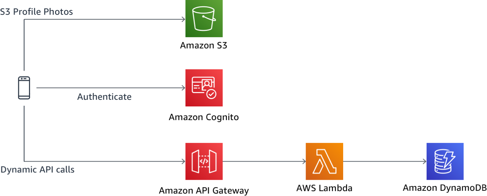
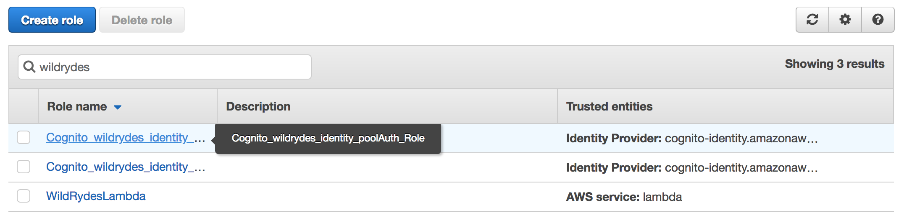
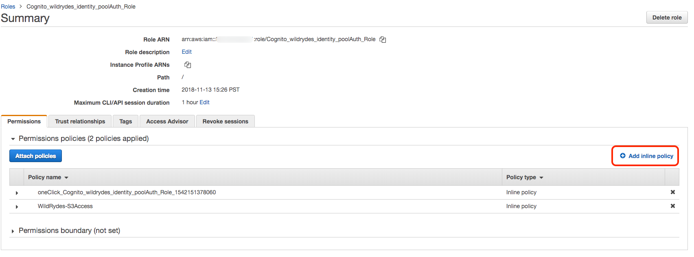

# Module 3: AWS integration with IAM-based authorization

이 모듈에서는 프로파일 관리 및 프로파일 사진 관리 기능을 활성화하여 Wild Rydes 애플리케이션을 확장합니다. [Amazon Cognito](https://aws.amazon.com/cognito/)는 사용자의 프로필 정보 및 사용자 지정 특성을 저장하는 데 사용되며 [Amazon S3](https://aws.amazon.com/s3/)은 사용자의 프로필 사진을 저장하며, 사진에 대한 링크만 사용자의 프로필에 직접 저장됩니다. 

## 솔루션 아키텍처

모듈 1 및 2를 기반으로 이 모듈은 Amazon S3 버킷을 통해 사진 스토리지 및 관리를 추가합니다. 웹 애플리케이션에서 AWS 리소스 액세스를 위해 Amazon Cognito는 앞에서 본 JWT뿐만 아니라 사용자가 애플리케이션 내에서 IAM 역할을 시작할 수 있도록 합니다. 그러면 이 AWS IAM 역할을 통해 애플리케이션이 안전하게 S3에 연결하여 사진을 업로드 및 다운로드할 수 있습니다. (다른 AWS API도 이 기능을 사용할 수 있음). 사진 스토리지 및 버킷에 대한 액세스를 보호하기 위해 IAM 정책을 활용하여 세밀한 제어가 가능합니다.



## 구현 지침

다음 각 섹션은 구현 개요와 자세한 단계별 지침을 제공합니다. 이 개요는 이미 AWS Management Console에 익숙하거나 연습을 거치지 않고 직접 서비스를 탐색하려는 경우 구현을 완료하기에 충분한 컨텍스트를 제공할 수 있어야 합니다. 

최신 버전의 Chrome, Firefox 또는 Safari 웹 브라우저를 사용하는 경우 섹션을 펼칠 때까지 단계별 지침이 표시되지 않습니다.

### 1. AWS Amplify와 함께 사용할 S3 버킷 설정

프로파일 이미지를 S3 버킷에 안전하게 저장하려면 AWS Amplify를 구성해야합니다. 시간을 절약하기 위해, 이 워크샵을 위해 CloudFormation 템플릿을 통해 생성한 서버리스 백엔드 API는 이미 CORS (Cross-Origin Resource Sharing) 설정이 이미 설정된 S3 버킷을 생성했습니다. 이 버킷을 애플리케이션의 코드와 연결하기만 하면 됩니다.

#### 고급 지침

이전 모듈에서 생성 된 CloudFormation 스택을 찾아보고 Outputs에서 S3 버킷의 이름을 찾으십시오. 이름이 있으면 *amplify-config.js* 파일을 다시 열고 버킷 이름과 리전으로 스토리지 섹션을 업데이트하십시오.

<details>
<summary><strong>단계별 지침 (expand for details)</strong></summary><p>

1. AWS Management Console로 이동하여 **Services**를 클릭 한 다음 Management Tools 카테코리에서 **CloudFormation**을 선택합니다. 

1. CloudFormation 콘솔에서 **WildRydesBackend**와 같은 Wild Rydes 스택 이름을 클릭하십시오.

1. **Output** 탭을 클릭합니다.

1. 버킷 이름을 클립 보드에 복사하십시오. *WildRydesProfilePicturesBucket*이라는 키의 `Value`에 표시된 이름입니다.

1. 다음으로 Cloud9 IDE로 돌아와 */website/src/amplify-config.js* 파일을 엽니다.

1. 방금 복사 한 버킷 이름과 CloudFormation 템플릿이 시작된 지역의 값을 모두 입력합니다.

1. *amplify-config.js*의 스토리지 구성에 대한 최종 구조는 다음과 같습니다.

	```
	    Storage: {
	        bucket: 'wildrydes-profilepicturesbucket-1rmvuic97osxd',
	        region: 'us-east-1'
	    }
	```

</p></details>

### 2. 사용자의 IAM 권한 구성

이제 AWS Amplify를 통해 사진 업로드를 시도 할 수 있지만 Amplify는 모듈 1에서 생성한 (아직 연결된 정책이 없는) Cognito 자격 증명 풀 역할을 사용하므로 생성 된 S3 버킷에 액세스 할 수 없습니다. S3 프로필 사진 버킷에 대한 액세스 권한을 부여하는 정책을 가지려면 다음에 역할을 업데이트해야합니다.

#### 고급 지침

IAM 콘솔로 이동하여 Cognito Identity Pool의 인증 된 사용자 역할을 찾습니다.  IAM 정책 변수를 활용하여 사용자 별 [S3 버킷 보호 및 개인 수준 액세스](https://aws-amplify.github.io/docs/js/storage#file-access-levels)를 제공하는 이 역할에 대한 인라인 정책을 만듭니다. 

<details>
<summary><strong>단계별 지침 (expand for details)</strong></summary><p>

1. AWS Management Console로 이동하여 **Services**를 클릭 한 다음 Security, Identity, and Compliance 카테고리에서 **IAM**을 선택합니다.

1. **Roles**을 선택합니다. 

1. *WildRydes*를 검색하여 모듈 1 에서 자격 증명 풀을 만들 때 Cognito 자격 증명 풀에서 만든 두 가지 역할을 찾습니다. 여기서 역할을 찾을 수 없는 경우 **Cognito Federated Identities** 콘솔로 이동하여 올바른 자격 증명 풀을 찾은 다음 오른쪽 상단 모서리에있는 **Edit Identity Pool**을 클릭하여 나열된 역할을 조회합니다. 각 자격 증명 풀에는 인증되지 않은 사용자 역할과 인증 된 사용자 역할이 있습니다.

1. 역할 이름을 찾았으면 IAM 콘솔로 돌아가 인증 된 사용자에 대한 *Auth* 역할을 선택합니다. 

	> 열 너비로 인해 역할의 전체 이름이 보기에서 숨겨져 있으면 부분적으로 보이는 역할 이름 위에 마우스를 올려서 역할의 전체 이름을 확인합니다.

	

1. 이 역할에 명시적으로 권한을 부여하여 인라인 정책을 사용합니다. 이 정책은 역할이 삭제될 경우 함께 삭제됩니다.

1. 오른쪽에서 **Add inline policy**를 선택하여이 IAM 역할과 관련된 새 인라인 정책을 만듭니다.

	

1. **JSON** 탭을 선택하여 새 정책을 자유롭게 편집 할 수 있습니다.

1. S3 액세스에 대한 다음 IAM 정책 설명을 붙여 넣습니다. 붙여 넣은 후에는 총 4번 **버킷 이름을 바꿔야합니다.**
	
	> 교체 값 전후의 리소스 이름의 일부를 그대로 두고 수정하지 마십시오.
	
	> 다음 정책은 *${aws:userid}*를 통해 현재 인증된 사용자의 고유 한 Cognito 자격 증명 ID를 나타내는 IAM 정책 변수를 사용합니다. 이 정책의 유효 권한은 인증 된 모든 사용자가 버킷의 루트 및 /protected 경로에서 객체를 읽을 수 있도록 하지만 사용자는 자신의 개인 하위 경로를 읽고 보호 된 경로 내의 하위 경로에 쓸 수만 있습니다. 이는 [파일 액세스 수준](https://aws-amplify.github.io/docs/js/storage#file-access-levels)을 쉽게 설정하기 위해 AWS Amplify와 통합 된 기본 경로입니다.

	```
	{
	    "Version": "2012-10-17",
	    "Statement": [
	        {
	            "Effect": "Allow",
	            "Action": [
	                "s3:PutObject",
	                "s3:GetObject",
	                "s3:GetObjectVersion",
	                "s3:DeleteObject",
	                "s3:DeleteObjectVersion"
	            ],
	            "Resource": "arn:aws:s3:::REPLACE_WITH_YOUR_BUCKET_NAME/private/${aws:userid}/*"
	        },
	        {
	            "Effect": "Allow",
	            "Action": [
	                "s3:GetObject",
	                "s3:GetObjectVersion"
	            ],
	            "Resource": "arn:aws:s3:::REPLACE_WITH_YOUR_BUCKET_NAME/protected/*"
	        },
	        {
	            "Effect": "Allow",
	            "Action": [
	                "s3:PutObject",
	                "s3:DeleteObject",
	                "s3:DeleteObjectVersion"
	            ],
	            "Resource": "arn:aws:s3:::REPLACE_WITH_YOUR_BUCKET_NAME/protected/${aws:userid}/*"
	        },
	        {
	            "Effect": "Allow",
	            "Action": [
	                "s3:PutObject",
	                "s3:GetObject",
	                "s3:GetObjectVersion",
	                "s3:DeleteObject",
	                "s3:DeleteObjectVersion"
	            ],
	            "Resource": "arn:aws:s3:::REPLACE_WITH_YOUR_BUCKET_NAME/public/*"
	        }
	    ]
	}
	```
1. **Review policy**를 클릭합니다.

1. 정책 이름을 `WildRydes-S3Access`이라고 지정합니다.

1. 설정한 내용을 리뷰한 뒤, **Create policy**을 클릭합니다.

</p></details>

### 3. AWS Amplify로 사진을 업로드하도록 애플리케이션 업데이트

이제 IAM 정책과 Amplify SDK가 초기화되었으므로 Amplify의 내장 UI 구성 요소를 사용하여 최소한의 코드로 사진을 업로드하고 S3 사진을 렌더링 할 수 있습니다. S3 이미지는 React 애플리케이션의 이미지 객체를 렌더링하고 이미지 선택기를 내장하여 업로드에 도움을 주는 데 사용되는 구성 요소입니다.

#### High-Level Instructions

아직 로그인하지 않은 경우 Wild Rydes 앱에서 인증 한 다음 */profile* 경로로 이동하십시오. Cognito 사용자 풀 속성이 시스템에서 동적으로 읽히고 있음을 알 수 있습니다. 다음으로, AWS Amplify의 [image picker](https://aws-amplify.github.io/docs/js/storage#s3image)를 추가하여 S3에 저장된 사진을 업로드하고 표시하기 위한 UI 구성 요소를 렌더링합니다. 이 프로필 사진은 탑승객을 데리러 갈 때 유니콘이 누구를 찾아야 하는지에 대한 라이더 경험을 개인화하는 데 사용됩니다.

<details>
<summary><strong>단계별 지침 (expand for details)</strong></summary><p>

1. Wild Rydes에 로그인 한 후 (아직 인증되지 않은 경우) **/profile** 경로로 이동하십시오.

1. 등록한 이메일 주소와 전화 번호가 표시됩니다.

1. Cloud9 IDE 환경을 열고 */website/src/pages/Profile.js* 파일을 여십시오.

1. *S3Image*라고 표시된 줄의 주석을 **해제**합니다. 이는 이미지 렌더링 및 업로드를 위한 React 앱용 Amplify UI 구성 요소를 인스턴스화하는 한줄의 코드입니다.

1. Wild Rydes 앱으로 돌아가서 로그인 한 후 **/profile** 경로로 이동합니다. 이제 새 이미지 선택기로 사진을 업로드 할 수 있습니다.

</p></details>

### 4. Cognito 사용자 풀 프로파일에 프로파일 사진 링크 저장

이미지 업로드가 작동하면 브라우저를 닫을 때까지 정상적으로 작동하지만, 이후 사용자 프로필과 프로필 사진 간의 참조는 손실됩니다. 이 문제를 해결하기 위해 *picture*라는 Cognito 사용자 풀 사용자 속성을 활용하여 S3 객체 키를 유지하므로 로그인 할 때마다 동일한 이미지를 로드하고 탑승을 요청할 때 유니콘에 표시되도록 유지할 수 있습니다. 이를 가능하게 하려면 */website/src/pages/Profile.js* 및 *onImageLoad*라는 메소드를 업데이트해야합니다.

#### 고급 지침 

이미지가 변경 될 때마다 현재 사용자의 Cognito *picture* 속성에 업로드 된 이미지를 유지하는 방법을 구현합니다.

<details>
<summary><strong>단계별 지침 (expand for details)</strong></summary><p>

1. Cloud9 IDE 환경을 열고 */website/src/pages/Profile.js* 파일을 엽니다.

1. S3Image UI 구성 요소에는 호출 시 업로드 된 이미지의 전체 URL을 제공하는 *onImageLoad*라는 내장 메소드가 있습니다. 이 내장 함수를 사용하여 이미지 URL을 Cognito에 유지합니다.

1. 기존 *onImageLoad* 함수를 다음 코드로 바꾸십시오.

	```
	async onImageLoad(url) {
	    if (!this.state.user.getSession) { return };
	    console.log('Profile Picture URL:', url);
	    try {
	        let result = await Auth.updateUserAttributes(this.state.user, {
	            'picture': this.state.image_key
	        });
	        console.log(result);
	    } catch (ex) {
	        console.error('Attribute update error:', ex);
	    }
	}
	```

1. 이제 이 새로운 메소드를 사용하여 Wild Rydes에 로그인 한 후 새 사진을 업로드 한 다음 브라우저를 닫으십시오. 새 창을 열고 다시 로그인하십시오. 사진이 이전과 같이로드 되어야 합니다.

</p></details>

## Conclusion

축하합니다! Wild Rydes Auth 워크숍을 완료했습니다. 이번에는 대화식 학습이 도움이 되었기를 바랍니다. 이 주제에 대한 자세한 내용은 [서버리스 인증 리소스](../Resources.md)목록을 참조해 주시기 바랍니다. 

오늘 워크숍 동안 생성된 모든 자원을 삭제하려면 [Clean up steps](../9_CleanUp)를 실행해야 합니다.

이 워크샵에 참여해 주셔서 감사합니다!

