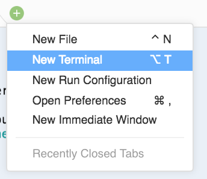
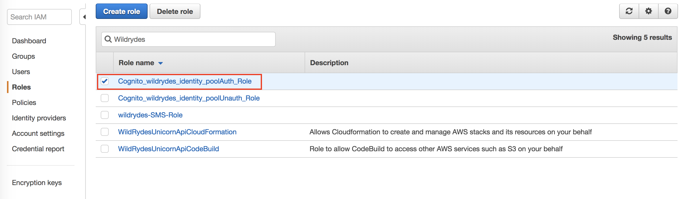

# 정리

#### *계정에 추가 비용이 발생하지 않도록하려면 더 이상 필요없는 리소스를 모두 제거해야합니다.*

#### S3 버킷 내용을 비우고 버킷 제거

1. 먼저 서버리스 백엔드 CloudFormation 템플릿으로 생성 된 ***S3 버킷***을 비워야합니다.
2. AWS Management Console로 이동하여 **Services**를 클릭 한 다음 Management Tools 에서 **CloudFormation**을 선택합니다.
3. **CloudFormation** 콘솔에서`WildRydesBackend`와 같은 *Wild Rydes* 스택 이름을 클릭하십시오.
4. **Output** 탭을 클릭하십시오.
5. 버킷 이름을 클립 보드에 복사하십시오. `WildRydesProfilePicturesBucket` 이라는 키의 값 아래에 표시되는 이름입니다.
6. Cloud9 개발자 환경을 엽니다.  
7. Cloud9 IDE 내에서 터미널을 엽니 다. 아래쪽 창에서`+`아이콘을 클릭하고 **New Terminal**을 선택하면됩니다.

	 

8. 다음 명령애서 S3 버킷 이름을 편집하고 실행합니다. 

	```
	$ aws s3 rb s3://MY-BUCKET-NAME --force 
	```

#### Cognito 자원 삭제

1. **Cloud9 개발자 환경**에서 다음을 실행하십시오 : 
	
	```
	aws cognito-identity delete-identity-pool --identity-pool-id YOUR-IDENTITY-POOL-ID-HERE
	```
	> 스크래치 패드에서 Cognito 자격 증명 풀 ID를 복사하여 붙여 넣습니다 (예 : us-west-2 : b4b755cd-d359-42a1-9b49-f0e73f5b2571).

	> Cognito idenity 풀 ID로 스크래치 패드를 닫은 경우 CLI를 통해 다음 목록 호출을 실행하여 적절한 풀 ID를 찾은 다음 위의 삭제 호출을 실행할 수 있습니다.
	
	```
	aws cognito-identity list-identity-pools --max-results 10
	```

2. 다음 명령을 실행하여 생성 한 Cognito 사용자 풀을 삭제합니다. : 

	```
	aws cognito-idp delete-user-pool --user-pool-id YOUR-USER-POOL-ID-HERE
	```
	
	> 스크래치 패드에서 Cognito 자격 증명 풀 ID를 복사하여 붙여 넣습니다 (예 : us-west-2 : b4b755cd-d359-42a1-9b49-f0e73f5b2571).

	> Cognito idenity 풀 ID로 스크래치 패드를 닫은 경우 CLI를 통해 다음 목록 호출을 실행하여 적절한 풀 ID를 찾은 다음 위의 삭제 호출을 실행할 수 있습니다.

	```
	aws cognito-idp list-user-pools --max-results 10
	```
	
#### CognitoIdentityPoolAuthStandardPolicy IAM 정책 분리

1. 백엔드 스택을 삭제하기 전에 **Auth** 역할에 수동으로 연결한 IAM 정책을 제거해야합니다.

	IAM (Identity and Access Management) 콘솔로 이동하여 **Auth** 역할을 검색하고 클릭하십시오.

	
	
2. 역할 요약 페이지의 권한 탭에서 이름이 **WildRydesAPI-StandardUserPolicy** 인 정책을 찾으십시오. 정책을 찾은 후 **X**를 클릭하여 IAM 역할에서 이 정책을 제거합니다. 팝업창에서 제거 할 것인지 확인하는 메시지가 표시됩니다. 빨간색 **Detach** 버튼을 클릭하십시오.

#### WildRydes 백엔드 제거 

1. 다음으로 API의 *CloudFormation 스택*을 제거해야합니다. 이 스택의 이름은 **WildRydesBackend**입니다. 다시 한 번 터미널 창에서 다음을 실행하십시오. :

	```
	aws cloudformation delete-stack --stack-name WildRydesBackend
	```
	> 스택 이름을 기본값에서 변경 한 경우 스택 이름을 변경 한 이름으로 업데이트해야합니다. 지침에서 빠른 링크를 클릭 한 경우 위 명령을 조정할 필요가 없습니다. `aws cloudformation describe-stacks`를 실행하여 스택 이름을 찾을 수 있습니다.

#### Cloud9 와 VPC Stack 제거 

1. 마지막으로 **Cloud9 인스턴스** 및 해당 VPC에 대한 *CloudFormation 스택*을 제거해야합니다. 이 스택의 이름은 **WildRydes-Cloud9** 입니다. 이 스택을 삭제하면 Cloud9 환경과 그 안에 있는 모든 코드 또는 프로젝트가 **종료되어 영구적으로 삭제되므로**이 명령을 실행하기 전에 다시 한번 확인이 필요합니다. 

	```
	aws cloudformation delete-stack --stack-name WildRydes-Cloud9
	```
	
	> 스택 이름을 기본값에서 변경 한 경우 스택 이름을 변경 한 이름으로 업데이트해야 합니다. 지침에서 빠른 링크를 클릭 한 경우에는 위 명령을 수정할 필요가 없습니다. `aws cloudformation describe-stacks`를 실행하여 스택 이름을 찾을 수 있습니다.
