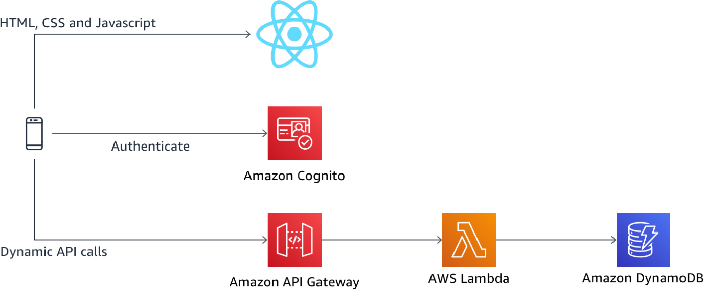

# 서버리스 identity 관리, 인증 및 인가 워크샵 

이 워크샵에서는 사용자가 Wild Rydes 에서 유니콘 타기를 요청할 수있는 서버리스 마이크로 서비스 응용 프로그램을 구축합니다.이 응용 프로그램은 사용자에게 가입, 로그인, 탑승 요청 위치를 나타내는 사용자 인터페이스와 유니콘 프로필을 제공합니다. 

이 애플리케이션 아키텍처는 [Amazon Cognito](https://aws.amazon.com/cognito/), [Amazon API Gateway](https://aws.amazon.com/api-gateway),  [AWS Lambda](https://aws.amazon.com/lambda/) 및 [AWS Identity and Access Management (IAM)](https://aws.amazon.com/iam) 를 사용하여 종단 간 인증 및 권한 부여 패턴을 보여줍니다. 단일 페이지 [React JS](https://reactjs.org/) 웹 앱은 HTML, CSS 및 JavaScript를 호스팅하여 프론트 엔드를 렌더링 한 다음 Amazon API Gateway와 Amazon Lambda를 사용하여 구축 한 퍼블릭 서버리스 백엔드 API에 연결합니다. Amazon Cognito는 백엔드 API를 보호하기 위해 사용자 자격 증명 관리 및 인증 기능을 제공하며, 마지막으로 DynamoDB는 API의 Lambda 함수를 통해 데이터를 저장하고 검색하는 지속성 계층을 제공합니다.

전체 아키텍처에 대한 설명은 아래 다이어그램을 참조하십시오.

## 모듈

이 워크샵은 여러 모듈로 나뉘어져 있으며 Wild Rydes 응용 프로그램을 확장해 나갈 떄 각 모듈은 이전 모듈을 기반으로 하기 때문에 다음 모듈로 진행하기 전에 각 모듈을 완료해야합니다.

1. **사용자 인증** - 이 모듈에서는 ID 관리 및 사용자 인증을 위한 Cognito 사용자 풀을 생성하고 이를 기존 WildRydes React JS 웹 응용 프로그램과 통합하고 Cognito ID 풀도 구성합니다. 응용 프로그램 내에서 IAM (Identity and Access Management) 역할을 시작할 수 있는  수있는 기능을 제공합니다.

2. **서버리스 백엔드** - 이 모듈에서는 API Gateway 및 Lambda를 사용하여 Wild Rydes 애플리케이션에 서버리스 백엔드를 추가 한 다음 API에서 인증 및 권한 부여를 활성화하여 유효한 요청만 승인하도록 백엔드를 보호합니다.

3. **IAM 인증** - 이 모듈에서는 프로파일 관리 및 프로파일 사진 관리 기능을 활성화하여 Wild Rydes 애플리케이션을 확장합니다. Amazon Cognito는 사용자의 프로필 정보와 속성을 저장하는 데 사용되고 Amazon S3는 사용자의 프로필 정보에 저장된 사진에 대한 링크와 함께 사용자의 프로필 사진을 저장합니다.

## 시작하기

시작하기 전에 [Getting Started Module](./0_GettingStarted)의 단계를 완료했는지 확인하십시오.

이 단계를 완료하면 [모듈 1-사용자 인증](./1_UserAuthentication)으로 진행할 수 있습니다.