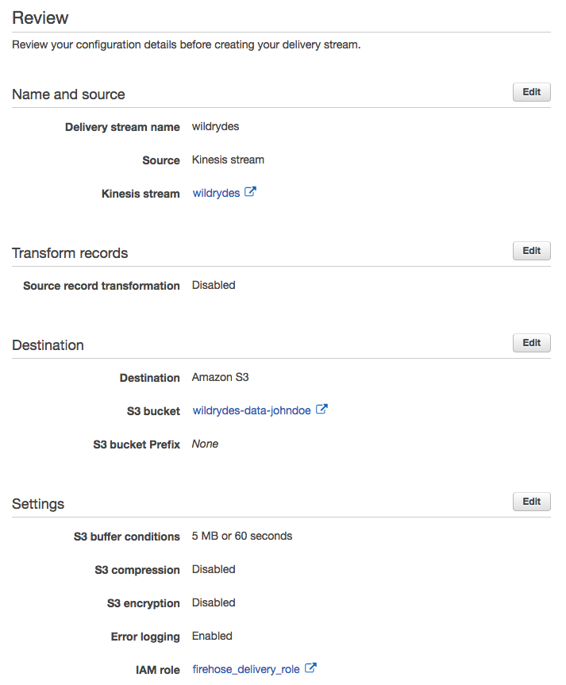
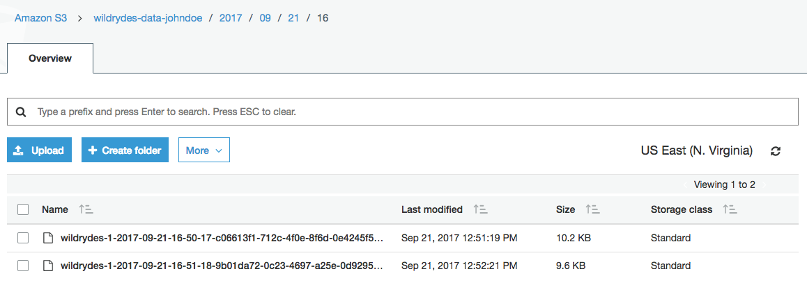

## 데이터 레이크

이 모듈에서는 [Amazon Kinesis Data Firehose][firehose]를 생성하여
첫 번째 모듈에서 생성한 Amazon Kinesis 스트림의 데이터를
[Amazon Simple Storage Service (Amazon S3)][s3]로 일괄 배치로 이관합니다. 그런 다음 [Amazon Athena][athena]를 이용하여 원본 데이터에 대해 쿼리를 실행합니다.

### 개요

이 모듈의 아키텍처는 첫 번째 모듈에서 생성한 Amazon Kinesis 스트림을 기반으로 합니다. Amazon Kinesis Data Firehose를 사용하여 데이터를 배치 처리하고 Amazon S3로 전달하여 보관합니다. Amazon Athena를 사용하여 Amazon S3 버킷의 원본 데이터에 대해 비정기적 쿼리를 실행합니다.

### 구현

#### 1. Amazon S3 버킷 생성

콘솔 또는 CLI를 사용하여 S3 버킷을 생성하십시오. 버킷 이름은 전 세계적으로 고유해야 합니다. `wildrydes-data-yourname`과 같은 이름을 사용하는 것이 좋습니다.


**:white_check_mark: 단계별 지침**

1. AWS 콘솔에서 **Services**를 클릭 한 다음 스토리지에서 **S3**을 선택하십시오.

1. **+ Create Bucket**을 클릭하십시오.

1. 버킷의 전역 고유 이름 (예 :`wildrydes-data-yourname`)을 입력합니다.

1. 버킷을 생성할 지역을 선택하십시오.

    </kbd>

1. **Next**를 세 번 클릭 한 다음 **Create Bucket**을 클릭하십시오.

#### 2. Amazon Kinesis Data Firehose 전송 스트림 생성

**wildrydes**라는 Amazon Kinesis Data Firehose 전송 스트림(Delivery Stream)을 생성합니다.
**wildrydes** 스트림에서 데이터를 소싱하고 이전 섹션에서 생성된 S3 버킷에 일괄적으로 그 데이터를 전송하도록 구성합니다.

**:white_check_mark: 단계별 지침**

1. AWS 콘솔에서 **Services**를 클릭 한 다음 Analytics 아래에서 **Kinesis**를 선택하십시오.

1. **Create delivery stream**을 클릭합니다.

1. **Delivery stream name**에 `wildrydes`를 입력하십시오.

1. **Source**로 **Kinesis stream** 중 **wildrydes**를 선택하십시오.

1. **Next**을 클릭하십시오.

1. **Record transformation** 및 **Record format conversation** 비활성화한 후 **Next**을 클릭하십시오.

1. **Destination**에서 **Amazon S3**을 선택합니다.

1. 이전 섹션에서 생성한 버킷을 선택합니다 (예 : **wildrydes-data-johndoe**).

1. **Next**을 클릭하십시오.

1. **S3 Buffer**의 **Buffer Interval**에 `60`을 입력하여 분당 1회 S3로 전달하도록 전달 주기를 설정하십시오.


1. 페이지 하단으로 스크롤하여 **IAM 역할**에서 **Create new or Choose**을 클릭하십시오. 새 탭에서 **Allow**을 클릭하십시오.

1. **Next**을 클릭하십시오. 전송 스트림 세부 사항을 검토하고 **Create delivery stream**을 클릭하십시오.

    </kbd>

#### 3. Amazon Athena 테이블 생성

Amazon Athena 테이블을 생성하여 JSON SerDe를 이용해 Amazon S3에서 원본 데이터를 쿼리합니다.테이블  이름을 **wildrydes**로 지정하고 다음 속성을 원본 데이터에 포함하십시오.

- _Name_ (string)
- _StatusTime_ (timestamp)
- _Latitude_ (float)
- _Longitude_ (float)
- _Distance_ (float)
- _MagicPoints_ (int)
- _HealthPoints_ (int)

**:white_check_mark: 단계별 지침**

1. **Services**를 클릭 한 다음 Analytics 섹션에서 **Athena**를 선택하십시오.

1. 프롬프트가 표시되면 **시작하기**를 클릭하고 모달 대화 상자의 오른쪽 상단에 있는 **x**를 눌러 최초 실행 튜토리얼을 종료하십시오.
   

1. 다음 SQL 문을 복사하여 붙여 넣어 테이블을 작성하십시오. 
   **YOUR_BUCKET_NAME_HERE** 자리를 여러분의 실제 버킷 이름으로 교체하십시오. (예: LOCATION 절의 wildrydes-data-johndoe) :

    ```sql
    CREATE EXTERNAL TABLE IF NOT EXISTS wildrydes (
           Name string,
           StatusTime timestamp,
           Latitude float,
           Longitude float,
           Distance float,
           HealthPoints int,
           MagicPoints int
         )
         ROW FORMAT SERDE 'org.apache.hive.hcatalog.data.JsonSerDe'
         LOCATION 's3://YOUR_BUCKET_NAME_HERE/';
    ```
 

1. **Run Query**을 클릭하십시오.

1. **wildrydes** 테이블이 추가되었는지 왼쪽 네비게이션의 테이블 목록을 확인하십시오.
   

#### 4. 배치 처리된 데이터 파일 탐색

AWS Management Console을 사용하여 다음과 같이 Kinesis Data Firehose 전송 위치로 지정한 S3 버킷으로 이동합니다. Firehose가 배치 처리된 데이터 파일들을 버킷으로 전송하고 있는지 확인합니다. 파일 중 하나를 다운로드하여 텍스트 편집기로 내용을 확인합니다.

**:white_check_mark: 단계별 지침**

1. **Services**를 클릭 한 다음 스토리지 섹션에서 **S3**을 선택하십시오.

1. **Search for buckets**에, 첫번째 섹션에서 생성한 버킷의 이름을 입력합니다.

1. 버킷 이름을 클릭하고 연도, 월, 일 및 시간을 탐색하십시오. 폴더에 파일이 채워져 있는지 확인하십시오.

    

1. 파일 중 하나를 클릭합니다.

1. **Select from** 탭을 클릭하여, **File format**에서 ``JSON ''을 선택한 다음 **파일 미리보기 표시**를 클릭해 파일 내용을 미리 볼 수 있습니다.

    


#### 5. 데이터 파일 쿼리

Amazon Athena 테이블을 쿼리하여 Kinesis Data Firehose를 통해 S3에 제공된 모든 레코드를 봅니다.

**:white_check_mark: 단계별 지침**

1. **Services**를 클릭한 다음 Analytics 섹션에서 **Athena**를 선택하십시오.

1. 다음 SQL 쿼리를 복사하여 붙여 넣습니다.

    ```sql
    SELECT * FROM wildrydes
    ```
 

1. **쿼리 실행**을 클릭하십시오.

    

[firehose]: https://aws.amazon.com/kinesis/firehose/
[s3]: https://aws.amazon.com/s3
[athena]: https://aws.amazon.com/athena
[client-installation]: ../README.md#kinesis-command-line-clients
[shard-iterator-type-documentation]: http://docs.aws.amazon.com/kinesis/latest/APIReference/API_GetShardIterator.html#Streams-GetShardIterator-request-ShardIteratorType


## :star: 요약

:key: Amazon Kinesis Data Firehose는 Amazon S3와 같은 저장소로 데이터를 스트리밍하기 위해 이용되는 관리형 서비스입니다. Amazon Athena는 표준 SQL을 사용하여 원본 데이터에 대해 비정기적 쿼리를 실행합니다.

:wrench: 이 모듈에서는 Kinesis Data Firehose 전송 스트림을 생성하여 Kinesis 스트림에서 Amazon S3 버킷으로 데이터를 전송했습니다. 또한 아테나를 사용하여 S3에서 이 데이터에 대해 쿼리를 실행했습니다.

## 다음

:tada: 모든 모듈이 끝났습니다! 워크샵을 완료했습니다. **참여해주셔서 감사합니다!**
워크샵 진행자나 GitHub 또는 메일로 발송되는 설문 링크를 통해 피드백을 주시면 워크샵 내용 향상을 위해 반영하도록 하겠습니다.

:white_check_mark: 시간이 남나요? [Extra credit][extra-credit] 과제에 도전해보세요.

:white_check_mark: 추가 비용이 발생하지 않도록 워크샵 리소스를 [정리][cleanup]해야 합니다.


[extra-credit]: extra-credit.md
[cleanup]: cleanup.md