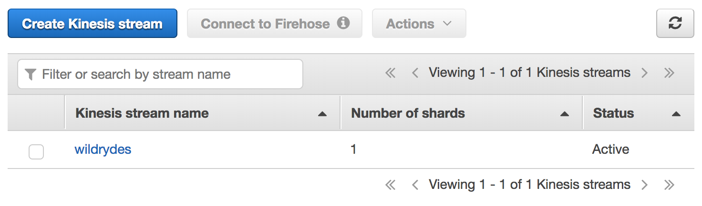
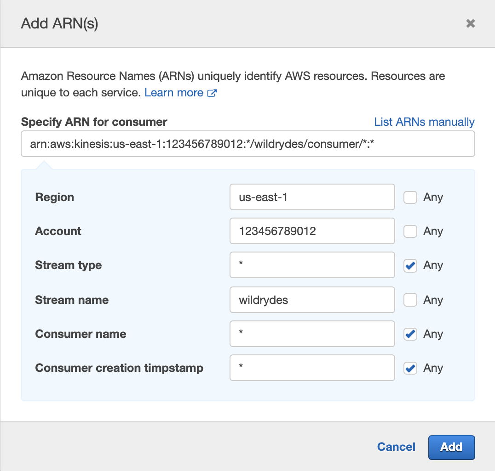
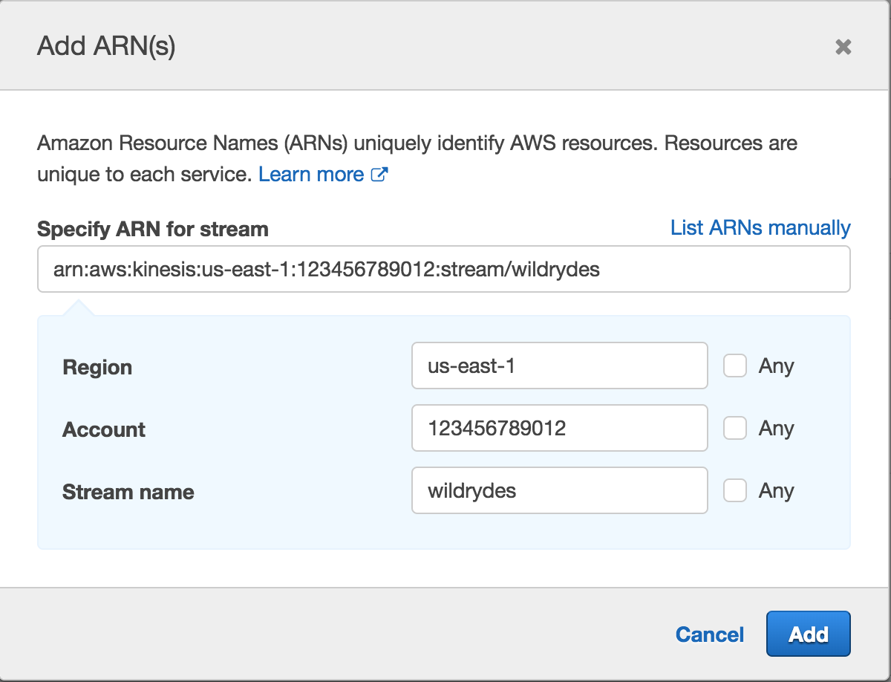
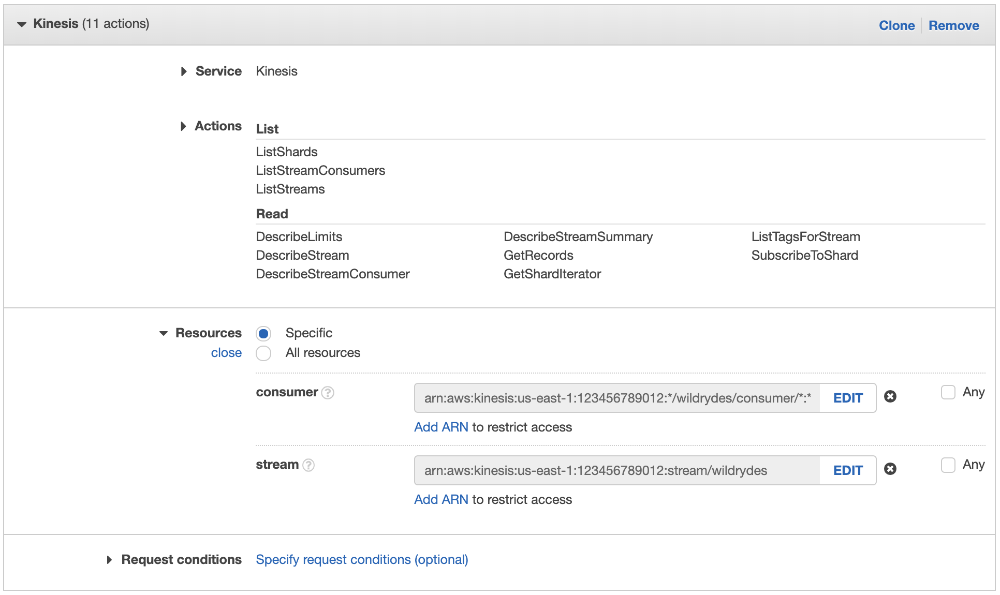
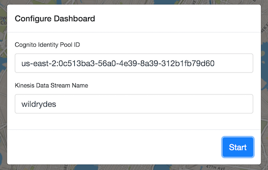
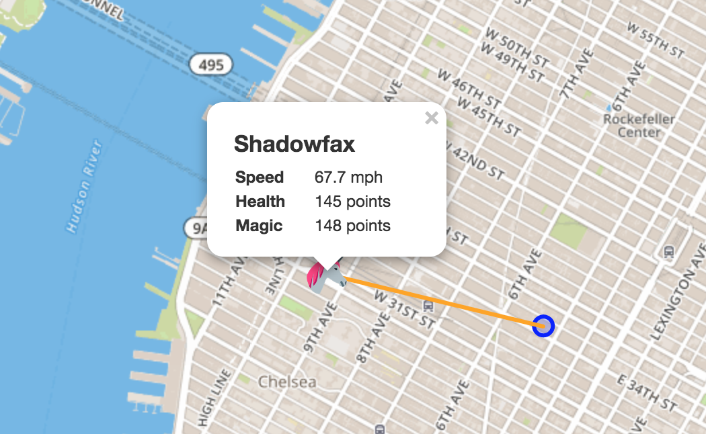

## 실시간 스트리밍 데이터

이 모듈에서는 Amazon Kinesis 스트림을 생성하여 유니콘들의 센서 데이터를 수집 및 저장합니다.
명령 행 클라이언트를 사용하여 Wild Ryde의 유니콘에서 센서 데이터를 생성하고 스트림에서 정보를 읽어옵니다.
마지막으로 유니콘 대시 보드를 사용하여 유니콘을 지도에 표시하고 실시간으로 그들의 상태를 확인합니다. 
다음 모듈에서는 Amazon Kinesis Data Analytics, AWS Lambda 및 Amazon DynamoDB를 이용해 이 데이터를 분석하고 저장하는 기능을 추가합니다.

### 개요

이 모듈의 아키텍처는 Amazon Kinesis 스트림, Producer, Consumer 를 포함합니다.

우리의 Producer는 현재 승객을 태우고 있는 유니콘에 부착된 센서입니다.
이 센서는 현재 위치, 이전 1초간 이동 거리, 마법 점수 및 히트 점수를 매초 생성하여, 와일드 라이드 본사 운영팀이 유니콘들의 건강을 모니터링 할 수 있도록 합니다.

Amazon Kinesis 스트림은 Producer가 전송한 데이터를 저장하고 Consumer가 이러한 데이터를 처리하고 분석할 수있는 인터페이스를 제공합니다. 우리의 Consumer는 스트림을 실시간으로 확인하고 실제 데이터 포인트를 출력하는 간단한 명령 줄 유틸리티로, 실제로 실시간으로 스트림에서 어떤 데이터가 저장되고 있는지 확인할 수 있습니다. 스트림에 데이터를 보내고 받으면 
스트림에서. 스트림에서 데이터가 활성화되면 [유니콘 대시 보드][dashboard]를 통해 실시간으로 유니콘들의 현재 위치와 건강 상태를 확인할 수 있습니다. 

### 구현

:heavy_exclamation_mark: 워크샵을 시작하기 전에 [설정 안내][setup]를 완료했는지 확인하십시오.

#### 1. Amazon Kinesis 스트림 생성

Amazon Kinesis Data Streams 콘솔을 사용하여 **wildrydes** 라는 이름의 새 스트림을 생성하십시오. 이때 샤드는 **1개**만 갖습니다.

**:white_check_mark: 단계별 지침**

1. AWS Management Console로 이동하여 **Services**를 클릭 한 다음 Analytics 하위의 **Kinesis**를 선택하십시오.

1. 소개 화면이 나타나면 **Get Started**를 클릭하십시오.

1. **Create data stream**을 클릭합니다.

1. **Kinesis stream name**에 `wildrydes`를, **Number of shards** 에 1을 입력한 다음 **Create Kinesis stream**을 클릭합니다.

1. 60 초 내에 Kinesis 스트림이 **ACTIVE** 상태가 되며 실시간 스트리밍 데이터 저장 준비가 완료됩니다.

    

#### 2. 스트림에 메시지 생성

[command-line producer](setup.html#producer) 를 사용하여 스트림에 메시지를 생성합니다.

**:white_check_mark: 단계별 지침**

1. Cloud9 환경을 연 탭으로 전환하십시오.

1. 터미널에서 Producer를 실행하여 센서 데이터를 스트림으로 전송하기 시작합니다.

    ```console
    ./producer
    ```
 

    Producer는 스트림으로 초당 하나의 메시지를 보내고 화면에 온점을 출력합니다.

    ```console
    $ ./producer -region us-east-1
    ..................................................
    ```

1. Amazon Kinesis Streams 콘솔에서 **wildrydes**를 클릭하고 **Monitoring** 탭을 클릭합니다.

1. 몇 분 후 **Put Record (success count)** 그래프에 초당 하나의 레코드가 찍히기 시작하는 것을 볼 수 있습니다.


#### 3. 스트림에서 메시지 읽기

**:white_check_mark: 단계별 지침**

1. Cloud9 환경을 연 탭으로 전환하십시오.

1. (+) 버튼을 누르고 **New Terminal**을 클릭하여 새 터미널 탭을 엽니다.

1. Consumer를 실행하여 스트림에서 센서 데이터 읽기를 시작합니다.

    ```console
    ./consumer
    ```
 

    Consumer는 Producer가 보낸 메시지를 인쇄합니다.

    ```json
    {
      "Name": "Shadowfax",
      "StatusTime": "2017-06-05 09:17:08.189",
      "Latitude": 42.264444250051326,
      "Longitude": -71.97582884770408,
      "Distance": 175,
      "MagicPoints": 110,
      "HealthPoints": 150
    }
    {
      "Name": "Shadowfax",
      "StatusTime": "2017-06-05 09:17:09.191",
      "Latitude": 42.265486935100476,
      "Longitude": -71.97442977859625,
      "Distance": 163,
      "MagicPoints": 110,
      "HealthPoints": 151
    }
    ```

#### 4. 유니콘 대시 보드를 위한 자격 증명 풀 만들기

Amazon Cognito 자격 증명 풀 생성하여 인증되지 않은 사용자에게 Kinesis 스트림을 읽을 수 있는 액세스 권한을 부여합니다. 자격 증명 풀 ID를 기록하여 다음 단계에 이용하십시오.

**:white_check_mark: 단계별 지시 사항**

1. AWS Management Console로 이동하여 **Services**를 클릭 한 다음, Security, Identity & Compliance 하위의 **Cognito**를 선택하십시오.

1. **Manage Identity Pools**를 클릭하십시오.

1. **Create new identity pool**를 클릭합니다.

1. **Identity pool name**에 `wildrydes`를 입력하십시오.

1. **Enable access to unauthenticated identities** 확인란을 선택합니다.

1. **Create Pool**를 클릭합니다.

1. **Allow**를 클릭하면 해당 신원 풀의 인증된/인증되지 않은 역할이 생성됩니다.

1. **Go to Dashboard**을 클릭하십시오.

1. 오른쪽 상단에서 **Edit identity pool**을 클릭합니다.

1. 이후 단계에서 사용하기 위해 **Identity pool ID**를 기록하십시오.

    

#### 5. 인증되지 않은 역할에 스트림에 대한 액세스 권한 부여

새 정책을 추가하여 인증되지 않은 역할도 대시보드에 접근하여 유니콘의 위치를 지도상에서 확인할 수 있도록 합니다. 

**:white_check_mark: 단계별 지시 사항**

1. AWS Management Console로 이동하여 **Service**를 클릭 한 다음 Security, Identity & Compliance 하위의 **IAM**을 선택하십시오.

1. 왼쪽 탐색 메뉴에서 **Role**을 클릭하십시오.

1. **Cognito_wildrydesUnauth_Role**을 클릭하십시오.

1. **Add inline policy**를 클릭하십시오.

1. **Choose a service**을 클릭하고 **Kinesis**를 클릭하십시오.

1. **Actions**을 클릭하십시오.

1. **Read** 및 **List** 권한 확인란을 선택합니다.

1. **Resources**을 클릭하여 **wildrydes** 스트림으로 제한합니다.

1. **stream** 옆에 있는 **Add ARN**를 클릭하십시오.

1. **Add ARN (s)** 대화 상자에서 다음 정보를 입력하십시오.

    * **Region**에 사용중인 지역 (예 : us-east-1)
    * **Account**에 [Account ID][find-account-id]
    * **Stream type**에 `*`
    * **Stream name**에 `wildrydes`
    * **Consumer name**에 `*`
    * **Consumer creation timestamp**에 `*`


    

1. **추가**를 클릭하십시오.

1. **스트림** 옆에 있는 **Add ARN**을 클릭하십시오.

1. **Add ARN (s)** 대화 상자에 다음 정보를 입력하십시오.

    * **Region**에 사용중인 지역 (예 : us-east-1)
    * **Account**에 [Account ID][find-account-id]
    * **Stream name**에 `wildrydes`

    <br/>
    

1. **Add**를 클릭하십시오.

    


1. **Review policy**를 클릭합니다.

1. **Name**에 `WildrydesDashboardPolicy`를 입력하십시오.

1. **Create policy**을 클릭합니다.

#### 6. 대시 보드에서 유니콘 상태 보기

[유니콘 대시 보드][dashboard]를 사용하여 실시간 지도에서 유니콘을 봅니다.

**:white_check_mark: 단계별 지시 사항**

1. [유니콘 대시 보드][dashboard]를 엽니다.

1. 4 단계에서 적어 둔 **Cognito Identity Pool ID**를 입력하고 **Start**를 클릭합니다.

    

1. 지도에서 유니콘을 볼 수 있는지 확인하십시오.

    

1. 유니콘을 클릭하면 스트림의 자세한 내용을 볼 수 있습니다.

    

#### 7. Producer 실험

대시 보드와 Consumer를 보면서 Producer를 중지하고 시작하십시오. 다른 유니콘 이름으로 여러 Producer를 시작하십시오.

1. Control + C를 눌러 Producer를 중지하고 메시지가 멈추는 것을 확인하십시오.
   30 초 후에 유니콘이 사라집니다.

1. Producer를 다시 시작하고 메시지가 다시 시작되고 유니콘이 표시되는지 확인하십시오.
   다시 나타납니다.

1. (+) 버튼을 누르고 **New Terminal**을 클릭하여 새 터미널 탭을 엽니다.

1. 새 탭에서 Producer의 다른 인스턴스를 시작하십시오. 구체적인 유니콘 이름을 지정하고 Consumer 아웃풋에서 추가로 지정한 유니콘의 데이터 포인트를 확인하십시오.

    ```console
    ./producer -name Bucephalus
    ```
 

1. 대시 보드를 확인하고 여러 유니콘이 있는지 확인하십시오.

    


### :star: 요약

:key: Amazon Kinesis를 사용하면 실시간으로 수집, 처리 및 분석하기가 쉽습니다.
또한 적시에 통찰력을 얻고 새로운 데이터에 신속하게 대응할 수 있도록 데이터 스트리밍 정보를 조작할 수 있습니다.

:wrench: 이 모듈에서는 Amazon Kinesis 스트림을 생성하여 가상의 유니콘 데이터를 저장하고 시각화했습니다.

### 다음

:white_check_mark: 다음 모듈인 [스트리밍 데이터 통합][streaming-aggregation]으로 진행하십시오. 
이 모듈에서는 Amazon Kinesis Analytics를 이용해 1 분마다 스트림의 데이터를 요약하는 어플리케이션을 빌드합니다.

[dashboard]: https://dataprocessing.wildrydes.com/dashboard.html
[setup]: setup.md
[find-account-id]: https://docs.aws.amazon.com/IAM/latest/UserGuide/console_account-alias.html
[streaming-aggregation]: streaming-aggregation.md