# 모듈 0 : CodeStar 프로젝트

이 모듈에서는 [AWS CodeStar](https://aws.amazon.com/codestar/) 서비스를 사용하여 다음을 포함하는 프로젝트를 만듭니다.

* [AWS CodeCommit](https://aws.amazon.com/codecommit/) Git 리포지토리(Node.js로 작성된 샘플 RESTful API)
* [AWS CodeBuild](https://aws.amazon.com/codebuild/) 빌드 프로젝트
* [AWS CodePipeline](https://aws.amazon.com/codepipeline/) 지속적인 전달 파이프라인

## CodeStar 개요

AWS CodeStar는 AWS에서 소프트웨어 개발 프로젝트를 생성, 관리 및 작업하기위한 클라우드 기반 서비스입니다. AWS CodeStar 프로젝트를 사용하여 AWS에서 애플리케이션을 신속하게 개발, 구축 및 배포 할 수 있습니다. AWS CodeStar 프로젝트는 프로젝트 개발 툴체인을위한 AWS 서비스를 생성하고 통합합니다. 선택한 AWS CodeStar 프로젝트 템플릿에 따라 해당 툴체인에는 소스 제어, 빌드, 배포, 가상 서버 또는 서버리스 리소스 등이 포함될 수 있습니다.

## 환경 설정

각 섹션은 개요와 단계별 지침으로 구성되어 있으며, AWS 관리 콘솔에 익숙한 사용자라면 단계별 지침을 스텝별로 진행하지 않아도 개요만으로 충분히 워크샵을 진행할 수 있습니다.

최신 버전의 Chrome, Firefox 또는 Safari 웹 브라우저를 사용하는 경우 섹션을 펼칠 때까지 단계별 지침이 표시되지 않습니다.

### 지역 선택

이 워크샵은 다음 서비스를 지원하는 모든 AWS 리전에 배포 할 수 있습니다.

- Amazon API Gateway
- Amazon DynamoDB
- Amazon S3
- AWS CodeBuild
- AWS CodePipeline
- AWS CodeStar
- AWS Lambda
- AWS X-Ray

지역을 선택한 후에는이 워크샵에 필요한 모든 리소스를 배포해야합니다. 시작하기 전에 AWS 콘솔의 오른쪽 상단에있는 드롭 다운에서 지역을 선택하십시오.

### 1. CodeStar 프로젝트 만들기

**Goal**: AWS 콘솔에서 **Node.js Lambda Webservice** 템플릿을 사용하여 'uni-api'라는 CodeStar 프로젝트를 만듭니다. 웹 브라우저를 사용하여 CodeStar에 의해 생성 된 API Gateway 엔드 포인트가 응답으로`{ "Output": "Hello World!"}`메시지를 리턴하는지 확인하십시오.  

<strong>CodeStar 프로젝트를 만드는 방법 (자세한 내용으로 확장)</strong>

1. AWS Management Console에서 **Services**를 선택한 다음 개발자 도구에서 **CodeStar**를 선택합니다.

2. 첫 번째 CodeStar 프로젝트가 아닌 경우 4 단계로 건너 뛰어 새 프로젝트를 만드십시오. 이것이 첫 번째 CodeStar 프로젝트 인 경우 아래에 CodeStar 시작 화면이 표시됩니다. 시작하려면 **Start a Project**버튼을 클릭하십시오.

   

3. 이것이 첫 번째 CodeStar 프로젝트 인 경우 CodeCommit 리포지토리, CodePipeline 파이프 라인 및 CodeBuild 프로젝트와 같은 다른 AWS 리소스를 생성 할 수있는 CodeStar 권한을 부여한다는 메시지가 표시됩니다. **Yes, create role**를 클릭하여 계속 진행하십시오.

   

4. 이전에 CodeStar 프로젝트를 만든 경우 프로젝트 목록에 해당 프로젝트가 나열됩니다. 계속하려면 **Create a new project**를 클릭하십시오.

   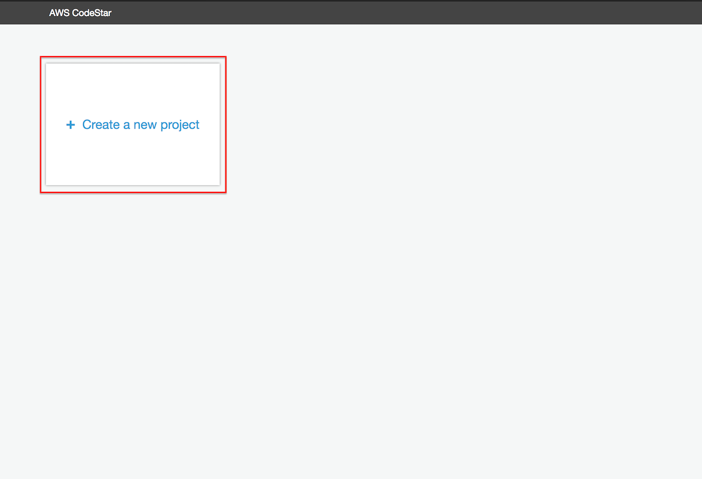

5. CodeStar 프로젝트의 선택 범위를 좁히려면 왼쪽 탐색에서 **Web service**, **Node.js**및 **AWS Lambda**를 선택하십시오. AWS Lambda를 사용하여 프로젝트 옵션을 **Express.js**웹 서비스 프로젝트로 좁힐 수 있습니다. 계속하려면이 상자를 선택하십시오.

   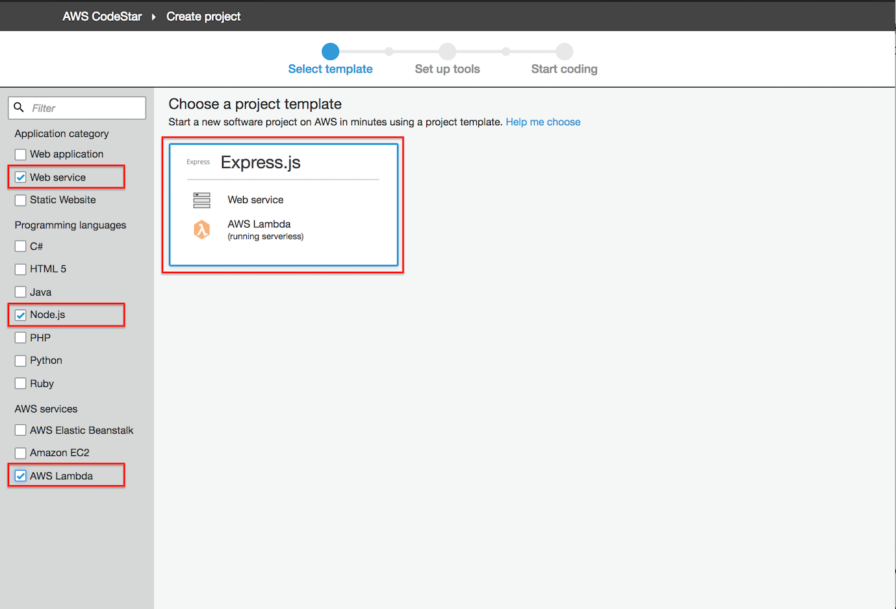

6. **Project name**으로`uni-api`를 입력하고 리포지토리로 **AWS CodeCommit**을 선택한 다음 브라우저 창의 오른쪽 아래 모서리에있는 **Next**버튼을 클릭하십시오.

   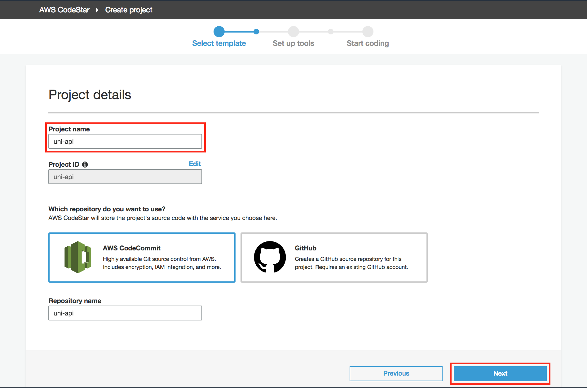

7. 브라우저 창의 오른쪽 하단에있는 **Create Project** 버튼을 클릭하여 계속 진행합니다.

   

8. 아래 그림에없는 IAM 사용자 이름이 표시됩니다. 해당 텍스트 상자에 사용자 **Display Name**및 **Email**을 입력하고 브라우저 창의 오른쪽 아래 모서리에있는 **Next**버튼을 클릭하여 계속하십시오.

   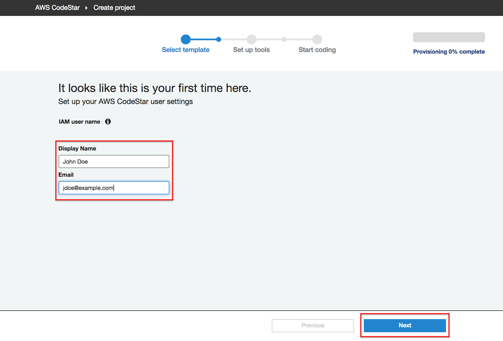

9. 다음 화면은 프로젝트 코드를 편집하는 방법을 묻습니다. 이 모듈의 뒷부분에서이 구성으로 돌아와서 브라우저 창의 오른쪽 아래 모서리에있는 **Skip**버튼을 클릭하여 계속 진행할 수 있습니다.

   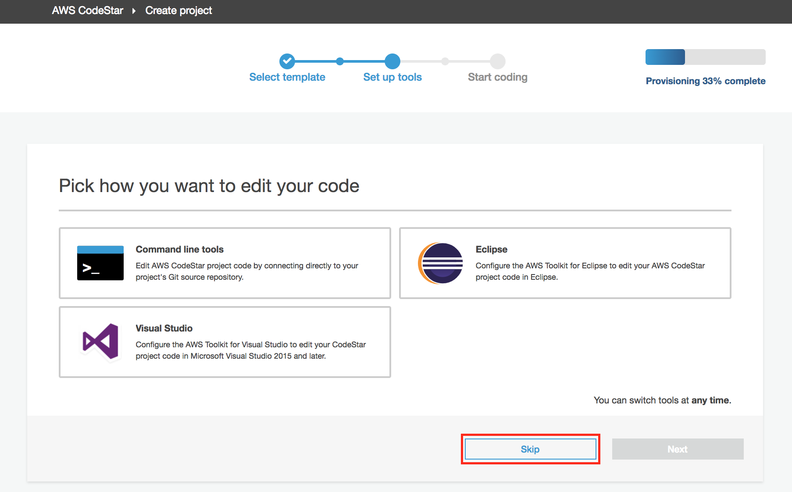

10. 아래 화면은 CodeStar 프로젝트 대시 보드입니다. 새 프로젝트를 만든 후에는 CodeStar가 CodeCommit, CodeBuild, CodePipeline 및이 경우 Lambda 함수 인 프로젝트 템플릿과 관련된 추가 리소스에 대한 리소스를 프로비저닝 할 때 약간의 지연이 발생합니다. 브라우저 창의 오른쪽 상단에있는 진행률 표시 줄이 100 % 완료에 도달하면 프로젝트 작성의 프로비저닝 단계가 완료됩니다.

    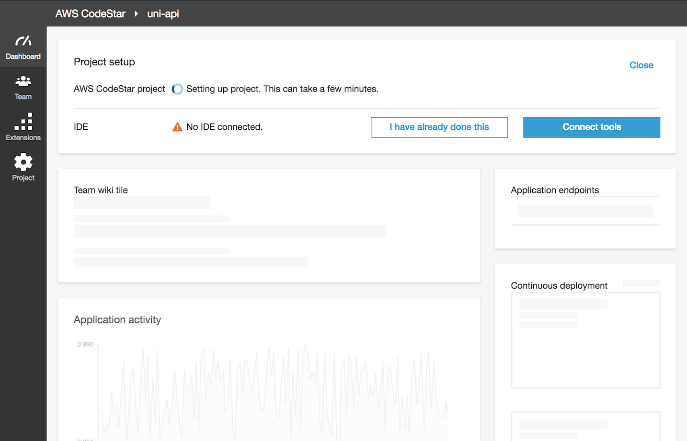

11. 프로비저닝이 완료되면 (CodePipeline 파이프 라인이 처음 실행될 때 약간의 지연이 발생합니다.) 파이프 라인은 세 단계로 구성됩니다.

   * 소스 단계 : 소스 코드는 CodeCommit 리포지토리에서 복사됩니다.
   * 빌드 단계 : CodeBuild 프로젝트는 프로젝트의 buildspec.yml에 정의 된 명령을 실행하여 소스 코드를 배포 가능한 아티팩트 (이 경우 SAM) 아티팩트로 컴파일합니다.
   배포 단계 : CloudFormation은 Lambda 함수 및 API 게이트웨이 환경을 나타내는 SAM 아티팩트를 배포하는 데 사용됩니다.

   이 단계가 완료되면 API Gateway **Application endpoint**가 대시 보드에 나타납니다.

   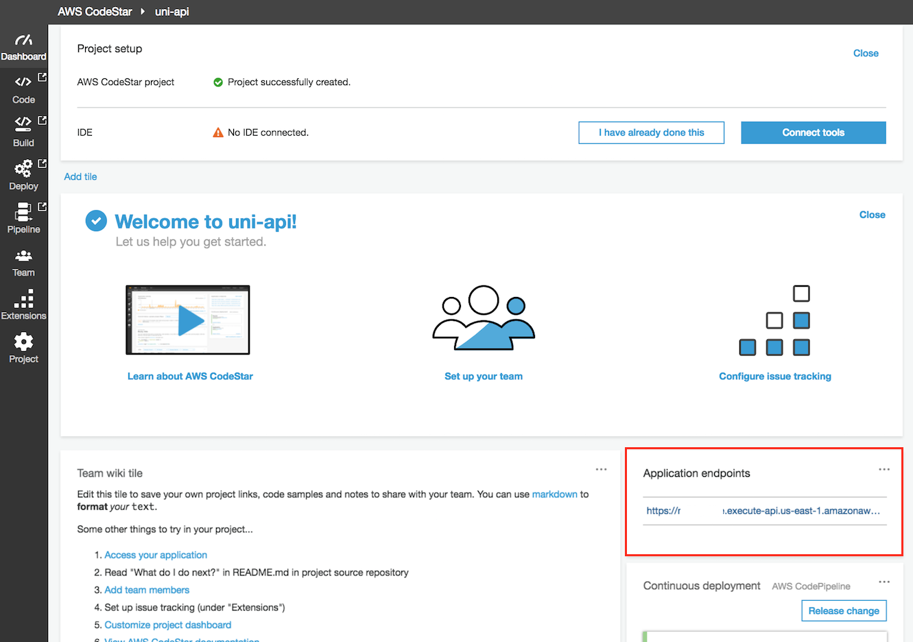

12. 브라우저 창에서 **Application endpoint**를 열고`{ "Output": "Hello World!"}`라는 응답 메시지를 확인하십시오.

   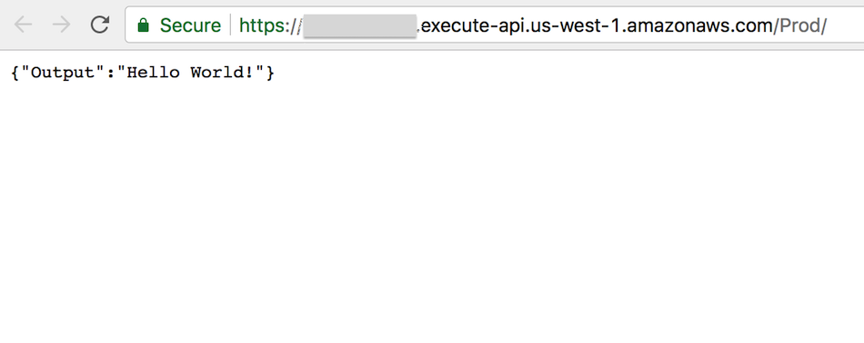

축하합니다! CodeStar를 사용하여 서버리스 웹 서비스 프로젝트를 작성했습니다. 다음 섹션에서는 Git 클라이언트를 사용하여 리포지토리를 워크 스테이션에 복제합니다.

## 복제 CodeCommit Git 리포지토리

**Goal:**`uni-api` 프로젝트의 CodeStar 대시 보드에서 Git 저장소를 로컬 워크 스테이션에 복제하는 CodeCommit 지침을 찾습니다.

<strong>CodeCommit git 리포지토리를 복제하는 방법 (자세한 내용은 확장)</strong>

1. CodeStar 프로젝트 대시 보드 브라우저 창의 오른쪽 상단에서 **Connect Tools**버튼을 클릭하십시오.

   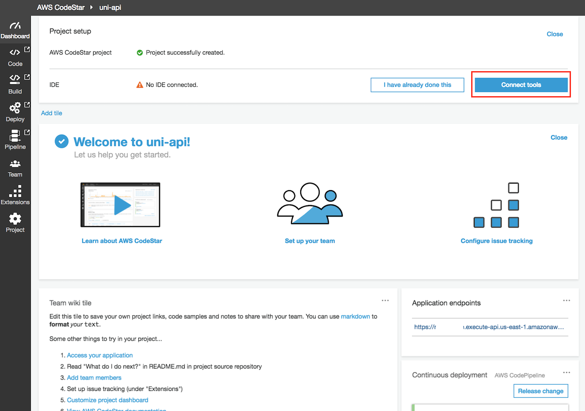
   
   **Commit history** 프로젝트 타일의 왼쪽 하단에서 **Connect**버튼을 클릭 할 수도 있습니다.
   
   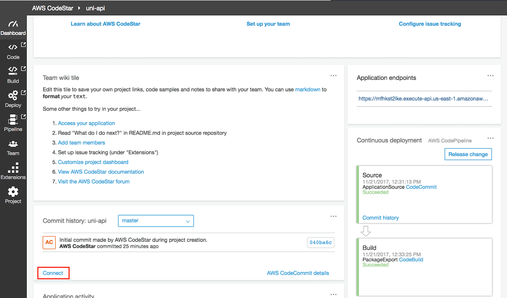
   
2. **Visual Studio**, **Eclipse**또는 **Command line tools**를 사용하여 CodeCommit 리포지토리를 복제하는 지침을 선택할 수 있습니다. **macOS**, **Windows**및 **Linux**운영 체제로의 복제에 대한 지침은 **See instructions**를 클릭하십시오. CodeCommit Git 저장소를 로컬 워크 스테이션에 복제하기위한 지시 사항을 완료하십시오.

   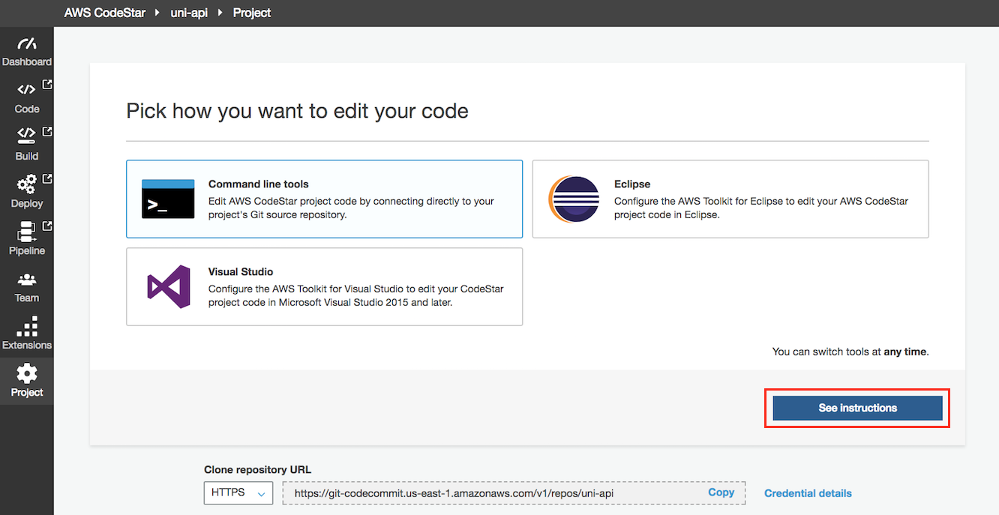

축하합니다! `uni-api` 프로젝트를 로컬 워크 스테이션에 성공적으로 복제했습니다. 향후 모듈에서는이 로컬 버전을 사용하여 소스 코드에 대한 변경 사항을 커밋하고 이를 프로젝트 Git 리포지토리로 푸시하고 프로젝트의 지속적인 전달 파이프 라인의 자동 실행을 트리거합니다.

## 완성

CodeStar 프로젝트를 작성하고 샘플 REST API를 테스트 한 후 프로젝트 Git 저장소를 워크 스테이션에 복제했습니다. 다음 [Serverless Application Model (SAM) Module](../1_ServerlessApplicationModel)에서 SAM 및 워크 스테이션에서 API를 테스트하는 방법에 대해 자세히 알아 봅니다.