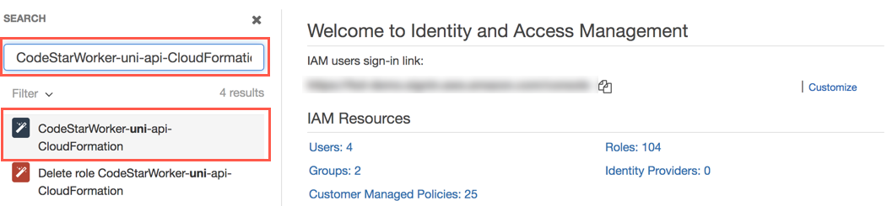
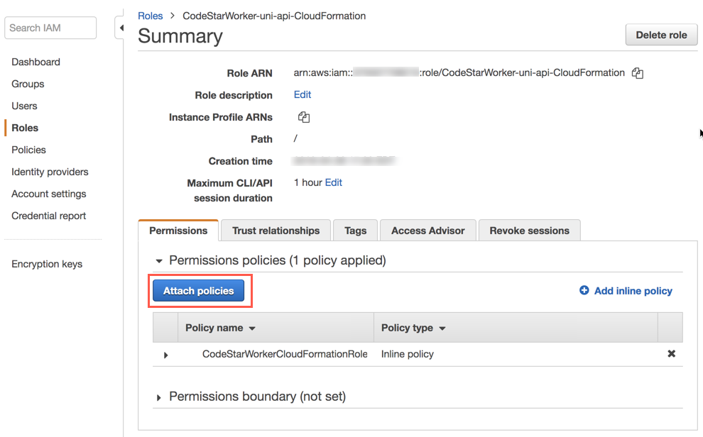
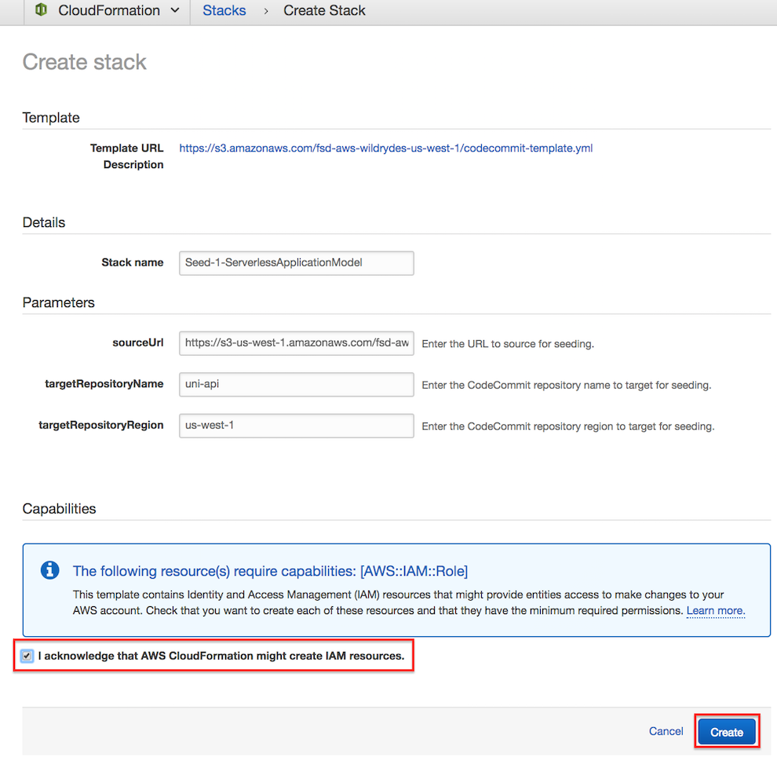
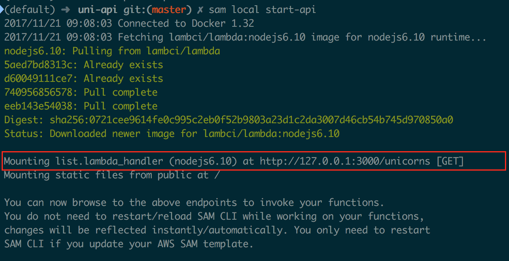
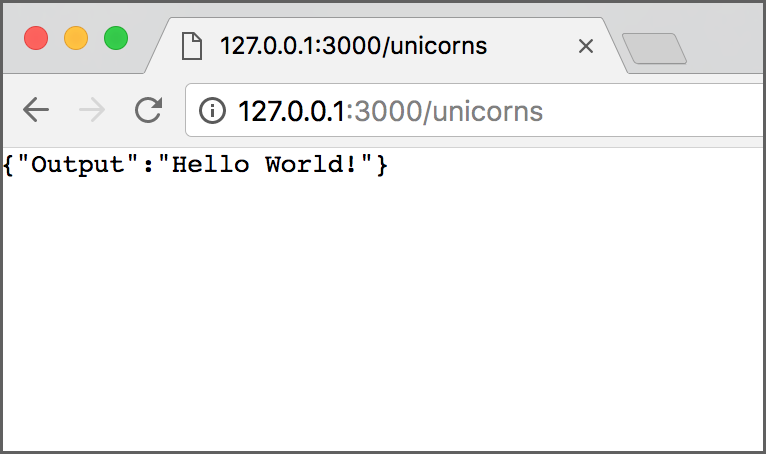
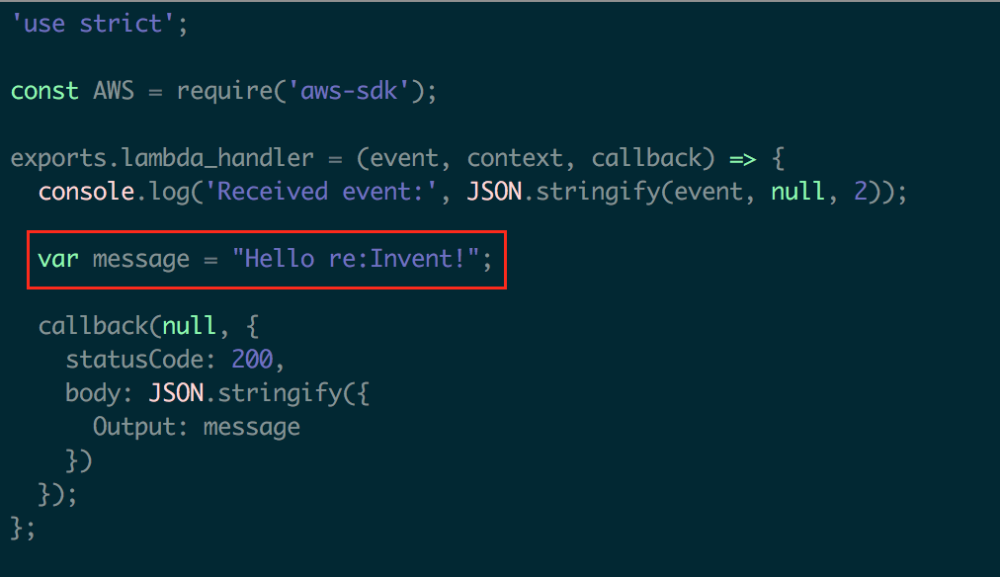
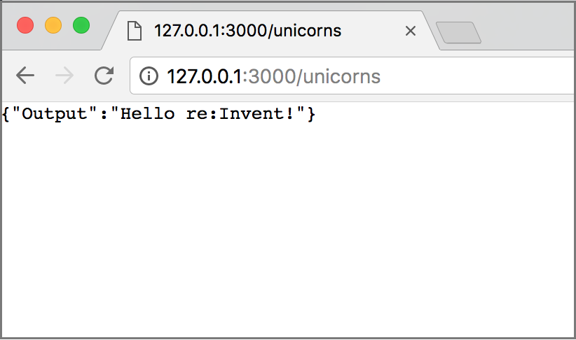

# 모듈 1 : 서버리스 애플리케이션 모델

이 모듈에서는 [SAM (Serverless Application Model)](https://github.com/awslabs/serverless-application-model) 및 이를 사용하여 서버리스 RESTful API를 정의하는 방법에 대해 학습합니다. 또한 [SAM CLI](http://docs.aws.amazon.com/lambda/latest/dg/test-sam-local.html)를 사용하여 API를 로컬에서 개발하고 신속하게 테스트합니다.

## SAM (Serverless Application Model) 개요

AWS SAM은 AWS에서 서버리스 애플리케이션을 정의하는 데 사용되는 모델입니다.

서버리스 애플리케이션은 이벤트에 의해 트리거되는 기능으로 구성된 애플리케이션입니다. 일반적인 서버리스 애플리케이션은 Amazon S3에 객체 업로드, Amazon SNS 알림 및 API 작업과 같은 이벤트에 의해 트리거되는 하나 이상의 AWS Lambda 함수로 구성됩니다. 이러한 기능은 독립형이거나 Amazon DynamoDB 테이블 또는 S3 버킷과 같은 다른 리소스를 활용할 수 있습니다. 가장 기본적인 서버리스 응용 프로그램은 단순히 기능입니다.

AWS SAM은 [AWS CloudFormation](https://aws.amazon.com/cloudformation/)을 기반으로합니다. 서버리스 애플리케이션은 [CloudFormation template](http://docs.aws.amazon.com/AWSCloudFormation/latest/UserGuide/gettingstarted.templatebasics.html)에 정의되어 있으며 [CloudFormation stack](http://docs.aws.amazon.com/AWSCloudFormation/latest/UserGuide/updating.stacks.walkthrough.html)으로 배포됩니다. AWS SAM template은 CloudFormation template입니다.

AWS SAM은 서버리스 애플리케이션의 공통 구성 요소를 설명하는 일련의 리소스를 정의합니다. CloudFormation template 내에 AWS SAM에 의해 정의 된 객체를 포함하려면 템플릿에 `Transform` 섹션에 `AWS::Serverless-2016-10-31` 값이 문서 루트에 포함되어야합니다.

Unicorn API에는 Amazon DynamoDB 데이터베이스에서 데이터를 읽고 쓰는 AWS Lambda 함수를 트리거하는 Amazon API Gateway HTTP 엔드 포인트가 포함되어 있습니다. Unicorn API 용 SAM template은 Wild Rydes 스 테이블에서 유니콘을 나열하고보고 업데이트하기위한 해시 키 및 Lambda 함수가 포함 된 DynamoDB 테이블을 설명합니다.

이 모듈에서는 단순히 환영 메시지를 표시하는 Lambda 함수를 사용합니다. Unicorn API 구성 요소는 [template.yml](uni-api/template.yml) SAM template에 정의되어 있습니다. 다음으로 Lambda 함수 구성 요소를 자세히 살펴 보겠습니다.

### AWS::Serverless::Function

다음은 유니콘을 나열하기위한 SAM template의 code snippet입니다.

```yaml
  ListFunction:
    Type: 'AWS::Serverless::Function'
    Properties:
      FunctionName: 'uni-api-list'
      Runtime: nodejs8.10
      CodeUri: app
      Handler: list.lambda_handler
      Description: List Unicorns
      Timeout: 10
      Events:
        GET:
          Type: Api
          Properties:
            Path: /unicorns
            Method: get
      Role: !GetAtt LambdaExecutionRole.Arn
```

[AWS::Serverless::Function](https://github.com/awslabs/serverless-application-model/blob/master/versions/2016-10-31.md#awsserverlessfunction)에 대해 정의 된 여러 [properties](https://github.com/awslabs/serverless-application-model/blob/master/versions/2016-10-31.md#properties) 리소스가 있으며, 참조할 수 있습니다. 

#### FunctionName

**FunctionName** 속성은 Lambda 함수의 사용자 지정 이름을 정의합니다. 지정하지 않으면 CloudFormation은 CloudFormation 스택 이름, CloudFormation 리소스 이름 및 임의의 ID를 사용하여 이름을 생성합니다.

#### Runtime

위에 표시된 예제 API는**Node.js 8.10**에서 구현됩니다. AWS Lambda에 추가 런타임이 제공됩니다. 전체 목록은 [Lambda Execution Environment and Available Libraries](http://docs.aws.amazon.com/lambda/latest/dg/current-supported-versions.html)를 참조하십시오.

#### CodeUri

**CodeUri** 특성은 SAM template를 기준으로 워크 스테이션에서 기능 코드의 위치를 ​​정의합니다. 이 예제에서는 함수 코드가 SAM template과 관련된 `app` 디렉토리에 있으므로 "**app**"가 속성 값으로 사용됩니다.

#### Handler

**Handler** 속성은 Lambda 함수의 진입점을 정의합니다. Javascript의 경우이 형식은 "**file**.**function**" 으로 형식화됩니다. 여기서 **file** 은 위에 정의 된 **CodeUri** 경로와 관련하여 ".js" 확장자가없는 Javascript 파일 이름입니다. **function**은 파일에서 Lambda 함수와 함께 실행될 함수의 이름입니다.

#### Events

**Events** 특성은 Lambda 함수 호출을 트리거하는 소스를 정의합니다. [Api](https://github.com/awslabs/serverless-application-model/blob/master/versions/2016-10-31.md#api) 이벤트 소스는 Lambda 함수를 API 게이트웨이와 통합하기 위해 정의됩니다. 그러나 엔드 포인트는 SAM이 다양한 [sources](https://github.com/awslabs/serverless-application-model/blob/master/versions/2016-10-31.md#event-source-types)에서 Lamdba 함수 트리거를 지원합니다.

유니콘의 세부 사항을보기위한 **Api** 이벤트 소스는 HTTP GET 메소드를 사용하여 액세스 한 RESTful 리소스`/unicorns/{name}`에 정의되어 있습니다. SAM은 Api 이벤트를 API 게이트웨이 리소스로 변환하고 Lambda 함수를 호출하는 데 사용되는 이벤트에서 URL의 **name** 값을 [pathParameter](http://docs.aws.amazon.com/apigateway/latest/developerguide/getting-started-mappings.html)에 매핑합니다.

#### Role

**Role** 속성은 [Lambda execution policy](http://docs.aws.amazon.com/lambda/latest/dg/intro-permission-model)에서 AWS 리소스에 대한 액세스 권한을 지정하는 IAM 역할을 정의합니다. .html # lambda-intro-execution-role). 각 프로젝트에 대해 CodeStar는 기본 AWS 리소스 세트에 액세스 할 수있는 Lambda 실행 역할을 생성합니다. 이 역할은 추가 정책으로 수정할 수 있습니다.

## Environment Setup

다음 각 섹션은 구현 개요와 자세한 단계별 지침을 제공합니다. 개요는 이미 AWS Management Console에 익숙하거나 연습을 거치지 않고 직접 서비스를 탐색하려는 경우 구현을 완료하기에 충분한 컨텍스트를 제공해야합니다.

최신 버전의 Chrome, Firefox 또는 Safari 웹 브라우저를 사용하는 경우 섹션을 펼칠 때까지 단계별 지침이 표시되지 않습니다.

### 1. CodeStarWorker-uni-api-CloudFormation IAM 역할 업데이트

1. AWS Management Console에서 서비스를 클릭 한 다음 보안, 자격 증명 및 규정 준수에서 IAM을 선택합니다.

2. **Search IAM** 검색 상자를 클릭하십시오.

   

3. 검색 창에`CodeStarWorker-uni-api-CloudFormation`을 입력하고 왼쪽 네비게이션에서**CodeStarWorker-uni-api-CloudFormation** 을 선택하십시오.

   

4. IAM 역할 요약 페이지에서 **Attach policies** 버튼을 클릭합니다.

    

5. 필터 텍스트 상자에`AWSLambdaFullAccess`를 입력하고 **AWSLambdaFullAccess** IAM 역할 왼쪽의 확인란을 선택한 다음 **Attach policy** 를 클릭하십시오.

    

6. IAM 역할 요약 페이지로 돌아와서 **AWSLambdaFullAccess** 정책이 역할에 추가되었습니다.

    

### 2. Seed the `uni-api` CodeCommit Git repository

1. 각 모듈에는 CodeStar 프로젝트의 CodeCommit Git 리포지토리를 시드하는 데 사용되는 해당 소스 코드가 있습니다. CodeCommit Git 리포지토리를 시드하려면 아래에서 해당 지역의 **Launch Stack** 버튼을 클릭하십시오.

    Region| Launch
    ------|-----
    US East (N. Virginia) | [](https://console.aws.amazon.com/cloudformation/home?region=us-east-1#/stacks/create/review?stackName=Seed-1-ServerlessApplicationModel&templateURL=https://s3.amazonaws.com/fsd-aws-wildrydes-us-east-1/codecommit-template.yml&param_sourceUrl=https://s3.amazonaws.com/fsd-aws-wildrydes-us-east-1/uni-api-1-v4.zip&param_targetRepositoryName=uni-api&param_targetRepositoryRegion=us-east-1)
    US West (N. California) | [](https://console.aws.amazon.com/cloudformation/home?region=us-west-1#/stacks/create/review?stackName=Seed-1-ServerlessApplicationModel&templateURL=https://s3.amazonaws.com/fsd-aws-wildrydes-us-west-1/codecommit-template.yml&param_sourceUrl=https://s3-us-west-1.amazonaws.com/fsd-aws-wildrydes-us-west-1/uni-api-1-v4.zip&param_targetRepositoryName=uni-api&param_targetRepositoryRegion=us-west-1)
    US West (Oregon) | [](https://console.aws.amazon.com/cloudformation/home?region=us-west-2#/stacks/create/review?stackName=Seed-1-ServerlessApplicationModel&templateURL=https://s3.amazonaws.com/fsd-aws-wildrydes-us-west-2/codecommit-template.yml&param_sourceUrl=https://s3-us-west-2.amazonaws.com/fsd-aws-wildrydes-us-west-2/uni-api-1-v4.zip&param_targetRepositoryName=uni-api&param_targetRepositoryRegion=us-west-2)
    EU (Ireland) | [](https://console.aws.amazon.com/cloudformation/home?region=eu-west-1#/stacks/create/review?stackName=Seed-1-ServerlessApplicationModel&templateURL=https://s3.amazonaws.com/fsd-aws-wildrydes-eu-west-1/codecommit-template.yml&param_sourceUrl=https://s3-eu-west-1.amazonaws.com/fsd-aws-wildrydes-eu-west-1/uni-api-1-v4.zip&param_targetRepositoryName=uni-api&param_targetRepositoryRegion=eu-west-1)
    EU (Frankfurt) | [](https://console.aws.amazon.com/cloudformation/home?region=eu-central-1#/stacks/create/review?stackName=Seed-1-ServerlessApplicationModel&templateURL=https://s3.amazonaws.com/fsd-aws-wildrydes-eu-central-1/codecommit-template.yml&param_sourceUrl=https://s3-eu-central-1.amazonaws.com/fsd-aws-wildrydes-eu-central-1/uni-api-1-v4.zip&param_targetRepositoryName=uni-api&param_targetRepositoryRegion=eu-central-1)
    Asia Pacific (Sydney) | [](https://console.aws.amazon.com/cloudformation/home?region=ap-southeast-2#/stacks/create/review?stackName=Seed-1-ServerlessApplicationModel&templateURL=https://s3.amazonaws.com/fsd-aws-wildrydes-ap-southeast-2/codecommit-template.yml&param_sourceUrl=https://s3-ap-southeast-2.amazonaws.com/fsd-aws-wildrydes-ap-southeast-2/uni-api-1-v4.zip&param_targetRepositoryName=uni-api&param_targetRepositoryRegion=ap-southeast-2)


1. CloudFormation template은이 모듈에 필요한 필드로 미리 채워져 있습니다. 변경할 필요가 없습니다

1. **I acknowledge that AWS CloudFormation might create IAM resources.** 확인란을 선택하여 CloudFormation이 귀하를 대신하여 IAM 리소스를 생성 할 수있는 권한을 부여합니다.

1. 브라우저 창의 오른쪽 하단에있는 **Create** 버튼을 클릭하여 CloudFormation 스택을 생성하고 CodeCommit 리포지토리를 시드합니다.

    

1. Git 리포지토리에 새로운 소스 코드가 시드되기 때문에 약간의 지연이 있습니다. 성공적으로 완료되면 CloudFormation에 ``CREATE_COMPLETE``. 상태가 표시됩니다.

    

### 2. Fetch CodeCommit Git 리포지토리

CodeCommit Git 리포지토리에 새로운 소스 코드가 시드되었으므로 코드를 수정할 수 있도록 변경 사항을 로컬로 가져와야합니다. 일반적으로 이것은 `git pull` 명령을 사용하여 이루어 지지만, 워크샵에서는 저장소를 새로운 히스토리로 교체했으며 다른 Git 명령이 사용됩니다.

선호하는 Git 클라이언트를 사용하여 로컬`uni-api` Git 저장소에서 명령을 실행하십시오 :

```bash
git fetch --all
git reset --hard origin/master
```

## AWS SAM CLI

[AWS SAM CLI](https://docs.aws.amazon.com/lambda/latest/dg/test-sam-cli.html)는 [Serverless Application Model (SAM)](https://github.com/awslabs/serverless-application-model)으로 작성된 서버리스 애플리케이션을 관리하기위한 AWS CLI 툴입니다. SAM CLI는 기능을 로컬로 테스트하고, SAM template에서 로컬 API 게이트웨이를 시작하고, SAM template을 확인하고, 다양한 이벤트 소스에 대한 샘플 페이로드를 생성하는 데 사용할 수 있습니다.

### 설치

이 모듈을 완료하려면 SAM CLI를 설치해야합니다. SAM CLI가 이미 설치되어 있으면이 섹션을 건너 뛸 수 있습니다.

#### 전제 조건

SAM CLI를 사용하여 서버리스 프로젝트 및 기능을 로컬로 실행하려면 Docker를 설치하고 실행해야합니다. SAM CLI는 `DOCKER_HOST` 환경 변수를 사용하여 도커 데몬에 연결합니다.

* macOS: [Docker for Mac](https://store.docker.com/editions/community/docker-ce-desktop-mac)
* Windows: [Docker Toolbox](https://download.docker.com/win/stable/DockerToolbox.exe)
* Linux: Check your distro's package manager (e.g. yum install docker)


macOS 및 Windows 사용자의 경우 : SAM CLI를 사용하려면 프로젝트 디렉토리 (또는 모든 상위 디렉토리)가 Docker 파일 공유 옵션에 나열되어 있어야 합니다.

docker가 작동하고 CLI에서 docker 명령을 실행할 수 있는지 확인하십시오 (예 :`docker ps`). 컨테이너를 install/fetch/pull 할 필요가 없습니다. SAM CLI가 필요에 따라 자동으로 컨테이너를 수행합니다.


#### Windows, Linux, macOS with pip [권장]

**`sam`** 을 설치하는 가장 쉬운 방법은 [pip](https://pypi.org/project/pip/)를 사용하는 것입니다.

pip를 사용하려면 [Python](https://www.python.org/)을 설치하고 시스템의 환경 경로에 추가해야합니다.

```bash
pip install aws-sam-cli
```

Verify the installation worked:

```bash
sam --version
```

#### Binary release

또한 CLI를 바이너리로 다운로드하여 즉시 사용할 수 있습니다. SAM CLI 저장소의 [Releases](https://github.com/awslabs/aws-sam-cli/releases)에서 찾을 수 있습니다.

#### 대체 설치 : Amazon Linux (EC2)

워크 스테이션에 SAM CLI를 설치할 수없는 경우 Amazon Linux EC2 인스턴스에서 SAM CLI를 사용하는 것이 더 쉬울 수 있습니다. 이 경우 랩톱에서 로컬로 작업을 수행하지 않고 EC2 인스턴스에 원격으로 연결하여 편집 및 테스트를 수행합니다.

1. [Create a keypair](http://docs.aws.amazon.com/AWSEC2/latest/UserGuide/ec2-key-pairs.html)(아직없는 경우).

2. 필요한 종속성이있는 EC2 인스턴스를 시작하려면 아래에서 해당 지역의 **Launch Stack** 버튼을 클릭하십시오. EC2 인스턴스의 VPC 및 서브넷뿐만 아니라 이전 단계에서 생성 한 키 페어를 선택해야합니다.

    Region| Launch
    ------|-----
    US East (N. Virginia) | [](https://console.aws.amazon.com/cloudformation/home?region=us-east-1#/stacks/create/review?stackName=DeveloperInstance&templateURL=https://s3.amazonaws.com/wildrydes-us-east-1/DevOps/CloudFormation/developer-instance.yml)
    US West (N. California) | [](https://console.aws.amazon.com/cloudformation/home?region=us-west-1#/stacks/create/review?stackName=DeveloperInstance&templateURL=https://s3.amazonaws.com/wildrydes-us-west-1/DevOps/CloudFormation/developer-instance.yml)
    US West (Oregon) | [](https://console.aws.amazon.com/cloudformation/home?region=us-west-2#/stacks/create/review?stackName=DeveloperInstance&templateURL=https://s3.amazonaws.com/wildrydes-us-west-2/DevOps/CloudFormation/developer-instance.yml)
    EU (Ireland) | [](https://console.aws.amazon.com/cloudformation/home?region=eu-west-1#/stacks/create/review?stackName=DeveloperInstance&templateURL=https://s3.amazonaws.com/wildrydes-eu-west-1/DevOps/CloudFormation/developer-instance.yml)
    EU (Frankfurt) | [](https://console.aws.amazon.com/cloudformation/home?region=eu-central-1#/stacks/create/review?stackName=DeveloperInstance&templateURL=https://s3.amazonaws.com/wildrydes-eu-central-1/DevOps/CloudFormation/developer-instance.yml)
    Asia Pacific (Sydney) | [](https://console.aws.amazon.com/cloudformation/home?region=ap-southeast-2#/stacks/create/review?stackName=DeveloperInstance&templateURL=https://s3.amazonaws.com/wildrydes-ap-southeast-2/DevOps/CloudFormation/developer-instance.yml)


1. CloudFormation 스택 생성이 완료되면 **DeveloperInstance** 스택 왼쪽의 확인란을 선택하고 스택 목록 아래의 **Outputs** 탭을 클릭하여 EC2 인스턴스 퍼블릭 DNS 이름을 찾습니다. `PublicDnsName` 이라는 출력 키를 찾아 해당 값을 사용하여 EC2 인스턴스에 액세스하십시오.

1. SSH 클라이언트를 사용하여 인스턴스에 연결하십시오. Windows를 사용하는 경우 Putty 또는 Bitvise와 같은 클라이언트를 사용하십시오 (Putty를 사용하여 Windows에서 연결하는 방법은 여기를 참조하십시오 : [Connecting to Your Linux Instance from Windows Using PuTTY](http://docs.aws.amazon.com/AWSEC2/latest/UserGuide/putty.html))

1. Git 저장소는 `/home/ec2-user/uni-api` 시작시 홈 디렉토리에 복제되었습니다.

##### 포트 포워딩 구성 설정

SAM CLI는 포트 3000의 EC2 인스턴스에서 로컬로 HTTP 서버를 시작할 수 있습니다. 랩톱의 브라우저를 통해 해당 HTTP 서버의 내용을 보려면 포트 전달을 구성해야합니다.

Mac OS에서 포트 포워딩

워크 스테이션에서 새 터미널을 열고 다음 명령을 실행하십시오. 명령에서 ***~ /mykeypair.pem***을 당신의 .pem 파일의 위치 및 파일 이름으로 바꾸고 ***ec2-###-##-##-###.compute-1.amazonaws.com***을 당신의 EC2 개발자 인스턴스의 퍼블릭 DNS 이름으로 변경하십시오:

   ```
   ssh -i ~/mykeypair.pem -N -L 3000:localhost:3000 ec2-user@ec2-###-##-##-###.compute-1.amazonaws.com
   ```

##### Windows에서 Putty를 사용한 포트 포워딩

1. putty 구성에서 **Connection** , **SSH** , **Tunnels**를 선택하고 맵핑을 추가하십시오.

   ```
   Source port: 3000
   
   Destination: 127.0.0.1:3000
   ```

   The configuration should look like this:

   

##### Windows에서 Bitvise SSH 클라이언트를 사용한 포트 전달

1. **Profile** 창에서 **C2S** 탭을 선택하고이 구성으로 항목을 만듭니다.

   ```
   Listen Interface: 127.0.0.1
   
   List. Port: 3000
   
   Destination Host: localhost
   
   Dest. Port: 3000
   ```

   C2S 구성은 다음과 유사해야합니다.

   

## SAM CLI 개발

이 섹션에서는 워크 스테이션에서 SAM CLI를 사용하여 Unicorn API를 실행하고 AWS에 배포하지 않고도 변경 사항을 테스트합니다.

### API Gateway를 로컬로 실행

1. **`uni-api`** 디렉토리에서 다음 명령을 실행하십시오.

   ```bash
   sam local start-api
   ```
   
   If port forwarding from an EC2 developer instance, run the following command:

   ```bash
   sam local start-api --host 0.0.0.0
   ```

 
   로컬 API 게이트웨이가 생성되어 HTTP 요청 / 응답 기능을 테스트합니다. 핫 리로드 기능을 통해 기능을 빠르게 개발하고 반복 할 수 있습니다.  **`sam`** 은 SAM template에서 `Api` 이벤트 소스가 정의 된 모든 함수를 자동으로 찾아 정의 된 HTTP 경로에 마운트합니다.

   SAM CLI를 처음 실행하는 경우 Docker 이미지를 다운로드 할 때 지연이 발생합니다. 성공하면 아래 스크린 샷과 유사한 출력이 표시됩니다.

   

1. 브라우저를 열고 주소창에 `http://127.0.0.1:3000/unicorns`를 입력하십시오. 아래 출력이 표시되는지 확인하십시오.

   

축하합니다! SAM CLI를 사용하여 로컬 개발 환경을 시작했습니다. 이 모듈이 완료 될 때까지`sam local start-api` 명령을 실행하는 창을 열어 두십시오.

다음으로 SAM CLI를 사용하여 API 변경을 테스트하는 방법을 살펴 보겠습니다.

### 로컬로 테스트 코드 변경

**Goal** : 환영 메시지를`Hello re:Invent!`로 변경하려면`app/list.js`를 업데이트하십시오. 로컬 API 게이트웨이는 코드 변경의 핫 리로드를 지원합니다. 변경 사항을보기 위해`sam local start-api` 프로세스를 다시 시작할 필요가 없습니다.

<details>
<summary><strong>
코드를 업데이트하고 결과를 확인하기 (자세한 것은 확장)
</strong></summary>

1. 텍스트 편집기에서`app/list.js`를 열고`Hello re:Invent!`를 읽도록 메시지를 업데이트 한 후 변경 사항을 저장하십시오.

   

1. 브라우저를 새로 고치고 아래 출력이 표시되는지 확인하십시오.

   
</details>
<p>

축하합니다! 로컬 개발 환경에서 Lambda 함수의 변경 사항을 성공적으로 테스트했습니다. 이제 SAM CLI 실행 프로세스를 종료 할 수 있습니다.

SAM CLI를 사용한 개발에 대한 자세한 내용은 [AWS Documentation](http://docs.aws.amazon.com/lambda/latest/dg/test-sam-local.html) 및 SAM CLI [GitHub repository](https://github.com/awslabs/aws-sam-local)를 확인하십시오.

## 완성

서버리스 애플리케이션 모델을 사용하여 RESTful 서버리스 API의 로컬 개발 및 테스트를 성공적으로 수행했습니다. 다음 모듈에 앞서`sam local start-api` 명령을 실행하는 창을 닫으십시오.

다음 [Continuous Delivery Pipeline Module](../2_ContinuousDeliveryPipeline)에서는 AWS에 해당 API를 배포하여 AWS CodePipeline 및 AWS CodeBuild를 사용하여이 배포 프로세스를 자동화하는 방법을 배웁니다.