# Module 2: Continuous Delivery Pipeline

이 모듈에서는 [AWS CodePipeline](https://aws.amazon.com/codepipeline/), [AWS CodeBuild](https://aws.amazon.com/codebuild/), 및 [Amazon S3](https://aws.amazon.com/s3/) 을 사용하여 Continuous Delivery 파이프 라인을 구축하여 Unicorn API의 코드 배포 워크 플로를 자동화합니다.

## CodePipeline Overview

CodePipeline은 코드 변경 사항을 빌드, 테스트 및 배포하는 단계를 오케스트레이션합니다. 아래는 CodeStar 프로젝트에 의해 생성 된 CodePipeline의 스크린 샷입니다.

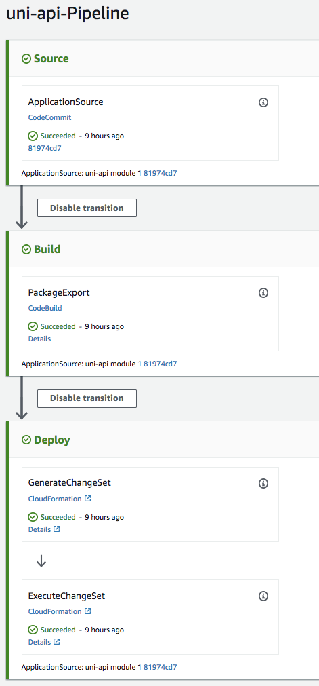

## CodeBuild Overview

CodeBuild는 소스 코드를 컴파일하고 테스트를 실행하며 환경에 배포할 준비가 된 소프트웨어 패키지를 생성합니다.

Unicorn API [buildspec.yml](uni-api/buildspec.yml) 은 프로젝트 및 출력 결과물을 빌드하는 데 사용되는 명령을 정의합니다.


```yaml
version: 0.1

phases:
  build:
    commands:
      - cd app && npm install
      - aws cloudformation package --template template.yml --s3-bucket $S3_BUCKET --output-template template-export.yml

artifacts:
  type: zip
  files:
    - template-export.yml
```

**CloudFormation [package](http://docs.aws.amazon.com/cli/latest/reference/cloudformation/package.html)** 의 명령은 로컬 소스 코드를 참아 S3에 업로드하고, CodeUri로 S3 참조를 사용하도록 수정되었습니다 새로운 CloudFormation 템플릿을 반환합니다.

Unicorn API의 경우 출력 아티팩트는 `template-export.yml` 파일 만 포함하는 zip 아카이브입니다.

## Environment Setup

다음 각 섹션은 구현 개요와 자세한 단계별 지침을 제공합니다. 개요는 이미 AWS Management Console에 익숙하거나 연습을 거치지 않고 직접 서비스를 탐색하려는 경우 구현을 완료하기에 충분한 컨텍스트를 제공해야합니다.

최신 버전의 Chrome, Firefox 또는 Safari 웹 브라우저를 사용하는 경우 섹션을 펼칠 때까지 단계별 지침이 표시되지 않습니다.

### 1. Seed the `uni-api` CodeCommit Git repository

1. 각 모듈에는 워크샵을 지원하기 위해 CodeStar CodeCommit Git Repository를 시드하는 데 사용되는 해당 소스 코드가 있습니다. CodeCommit Git Repository를 Seed 하려면 아래에서 해당 지역의 **Launch Stack** 버튼을 클릭하십시오.

    Region| Launch
    ------|-----
    US East (N. Virginia) | [](https://console.aws.amazon.com/cloudformation/home?region=us-east-1#/stacks/create/review?stackName=Seed-2-ContinuousDelivery&templateURL=https://s3.amazonaws.com/fsd-aws-wildrydes-us-east-1/codecommit-template.yml&param_sourceUrl=https://s3.amazonaws.com/fsd-aws-wildrydes-us-east-1/uni-api-2-v4.zip&param_targetRepositoryName=uni-api&param_targetRepositoryRegion=us-east-1)
    US West (N. California) | [](https://console.aws.amazon.com/cloudformation/home?region=us-west-1#/stacks/create/review?stackName=Seed-2-ContinuousDelivery&templateURL=https://s3.amazonaws.com/fsd-aws-wildrydes-us-west-1/codecommit-template.yml&param_sourceUrl=https://s3-us-west-1.amazonaws.com/fsd-aws-wildrydes-us-west-1/uni-api-2-v4.zip&param_targetRepositoryName=uni-api&param_targetRepositoryRegion=us-west-1)
    US West (Oregon) | [](https://console.aws.amazon.com/cloudformation/home?region=us-west-2#/stacks/create/review?stackName=Seed-2-ContinuousDelivery&templateURL=https://s3.amazonaws.com/fsd-aws-wildrydes-us-west-2/codecommit-template.yml&param_sourceUrl=https://s3-us-west-2.amazonaws.com/fsd-aws-wildrydes-us-west-2/uni-api-2-v4.zip&param_targetRepositoryName=uni-api&param_targetRepositoryRegion=us-west-2)
    EU (Ireland) | [](https://console.aws.amazon.com/cloudformation/home?region=eu-west-1#/stacks/create/review?stackName=Seed-2-ContinuousDelivery&templateURL=https://s3.amazonaws.com/fsd-aws-wildrydes-eu-west-1/codecommit-template.yml&param_sourceUrl=https://s3-eu-west-1.amazonaws.com/fsd-aws-wildrydes-eu-west-1/uni-api-2-v4.zip&param_targetRepositoryName=uni-api&param_targetRepositoryRegion=eu-west-1)
    EU (Frankfurt) | [](https://console.aws.amazon.com/cloudformation/home?region=eu-central-1#/stacks/create/review?stackName=Seed-2-ContinuousDelivery&templateURL=https://s3.amazonaws.com/fsd-aws-wildrydes-eu-central-1/codecommit-template.yml&param_sourceUrl=https://s3-eu-central-1.amazonaws.com/fsd-aws-wildrydes-eu-central-1/uni-api-2-v4.zip&param_targetRepositoryName=uni-api&param_targetRepositoryRegion=eu-central-1)
    Asia Pacific (Sydney) | [](https://console.aws.amazon.com/cloudformation/home?region=ap-southeast-2#/stacks/create/review?stackName=Seed-2-ContinuousDelivery&templateURL=https://s3.amazonaws.com/fsd-aws-wildrydes-ap-southeast-2/codecommit-template.yml&param_sourceUrl=https://s3-ap-southeast-2.amazonaws.com/fsd-aws-wildrydes-ap-southeast-2/uni-api-2-v4.zip&param_targetRepositoryName=uni-api&param_targetRepositoryRegion=ap-southeast-2)


2. CloudFormation 템플릿은이 모듈에 필요한 필드로 미리 채워져 있습니다. 변경할 필요가 없습니다.

3. **I acknowledge that AWS CloudFormation might create IAM resources.** 를 선택하십시오. CloudFormation에 귀하를 대신하여 IAM 리소스를 생성 할 수있는 권한을 부여합니다.


4. 브라우저 왼쪽 하단의 **Create** 버튼을 클릭하여 CloudFormation 스택을 생성하고 CodeCommit Repository를 Seed 하십시오. 

    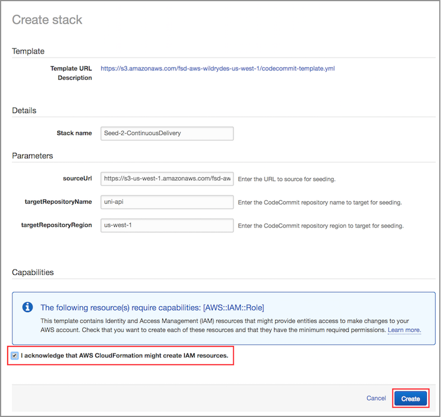

5. Git Repository에 새로운 소스코드가 Seed되기위해선 시간이 조금 필요합니다. 성공적으로 완료되면, CloudFormation 의 Status에 ``CREATE_COMPLETE``가 표시됩니다.

    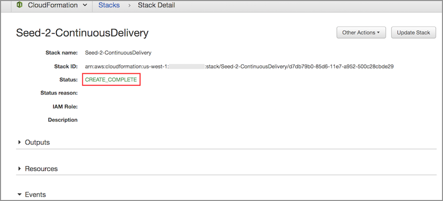

### 2. Fetch CodeCommit Git Repository

CodeCommit Git 리포지토리에 새로운 소스 코드가 Seed 되었으므로 코드를 수정할 수 있도록 변경 사항을 로컬로 가져와야합니다. 일반적으로 이것은 `git pull` 명령을 사용하여 수행 되지만 워크샵에서는 저장소를 새로운 기록으로 교체했으며 다른 Git 명령이 사용됩니다.

선호하는 Git 클라이언트를 사용하여 로컬 **uni-api** 디렉토리 에서 명령을 실행하십시오.

```bash
git fetch --all
git reset --hard origin/master
```

축하합니다. 환경 설정이 완료되었습니다!


## API Enhancement


Wild Rydes stables에서 유니콘을 만들거나 업데이트 할 수있는 기능으로 API를 향상 시키십시오. SAM `template.yml` template에 **AWS::Serverless::Function** 리소스를 추가해야합니다.

### 1. template.yml에 Update Function 추가하기

**Goal**: `template.yml` 파일에 정의되어있는 `AWS::Serverless::Function` 을 사용하여, 새로운 Serverless Function 이름인 **uni-api-update**을 `template.yml` SAM template에 추가합니다. URL 주소 **/unicorns/{name}** 의 HTTP **put** method 가 사용되어 **Api**  이벤트가 트리거될때, 위 함수는 **`app/update.js`** file의 **lambda_handler** method 에 호출(invoke)되야합니다. 함수는  `AWS::Serverless::SimpleTable` templete에 정의되어있는 **TABLE_NAME** 로 정의되어 있는 환경변수를 요구합니다.

 

<details>
<summary><strong>
template.yml의 LambdaExecutionRole IAM 역할을 AmazonDynamoDBFullAccess로 업데이트하는 방법 (자세한 내용은 확장)
</strong></summary>
<p>

텍스트 편집기를 사용하여 `template.yml` 파일을 열고 다음 정의를 따라서 새로운 **AWS::Serverless::Function** 리소스 레이블을에 `UpdateFunction` 추가하십시오.

> 참고 : 공백은 YAML 파일에서 중요합니다. 아래 구성이 template.yml 파일의 CloudFormation Resources와 동일한 공간 들여 쓰기로 추가되었는지 확인하십시오.

1. **FunctionName** 은 `uni-api-update`

2. **Runtime** 은 `nodejs8.10`

3. **CodeUri** 은 `app`

4. **Handler** 은 `update.lambda_handler`

5. **Description** 은 `Update a Unicorn`

6. **Timeout** 은 `10`

7. **Event** 유형은 `Api` 연결되어있는 `/unicorns/{name}` **Path** 와 `put` **Method** 입니다.

8. **Environment** 은 `Table` 자원을 위한 값을 위해 명명된 `TABLE_NAME` 입니다. 

9. **Role** 은 다른 함수에서 복제되었습니다..

   추가 할 구문이 확실하지 않은 경우 ``template.yml`` 아래 Code snippet 을 참조하십시오.

   <details>
   <summary><strong>template.yml additions to support Update function (expand for details)</strong></summary><p>

   ```yaml
     UpdateFunction:
       Type: 'AWS::Serverless::Function'
       Properties:
         FunctionName: 'uni-api-update'
         Runtime: nodejs8.10
         CodeUri: app
         Handler: update.lambda_handler
         Description: Update Unicorn
         Timeout: 10
         Events:
           UPDATE:
             Type: Api
             Properties:
               Path: /unicorns/{name}
               Method: put
         Environment:
           Variables:
             TABLE_NAME: !Ref Table
         Role: !GetAtt LambdaExecutionRole.Arn
   ```
   </details>
   
</details>
<p>

API가 DynamoDB 테이블을 사용하고 있으므로 Lambda 함수가 액세스 할 수있는 권한을 추가해야합니다.

### 2. Update LambdaExecutionRole with DynamoDB access

**Goal**: `template.yml` SAM template 의  **LambdaExecutionRole** resource 중 `AWS::IAM::Role`
의 `ManagedPolicyArns` section에 `arn:aws:iam::aws:policy/AmazonDynamoDBFullAccess` 정책을 포함시킵니다.


<details>
<summary><strong>
template.yml의 LambdaExecutionRole IAM 역할을 AmazonDynamoDBFullAccess로 업데이트하는 방법 (자세한 내용은 확장)
</strong></summary>
<p>

1. 텍스트 편집기를 사용하여 `template.yml` 파일을 열고 `LambdaExecutionRole`라고 라벨이 붙은 **AWS::IAM:Role** recource를 찾으십시오.
 
2. ManagedPolicyArns의 목록에 `arn:aws:iam::aws:policy/AmazonDynamoDBFullAccess` 를 추가하십시오.

   추가 할 구문이 확실하지 않은 경우 ``template.yml`` 아래의 code snippet 을 참조하십시오.

   <details>
   <summary><strong>DynamoDB 액세스를위한 template.yml 변경 사항 (자세한 내용은 확장)</strong></summary><p>

   ```yaml
     LambdaExecutionRole:
       Description: Creating service role in IAM for AWS Lambda
       Type: AWS::IAM::Role
       Properties:
         RoleName: !Sub 'CodeStar-${ProjectId}-Execution${Stage}'
         AssumeRolePolicyDocument:
           Statement:
           - Effect: Allow
             Principal:
               Service: [lambda.amazonaws.com]
             Action: sts:AssumeRole
         Path: /
         ManagedPolicyArns:
           - arn:aws:iam::aws:policy/service-role/AWSLambdaBasicExecutionRole
           - arn:aws:iam::aws:policy/AmazonDynamoDBFullAccess
         PermissionsBoundary: !Sub 'arn:${AWS::Partition}:iam::${AWS::AccountId}:policy/CodeStar_${ProjectId}_PermissionsBoundary'
   ```
   </details>
</details>
<p>

변경 사항으로 SAM 템플릿을 업데이트 했으므로 Git을 사용하여 변경 사항을 커밋하고 원격 리포지토리로 푸시합니다. 그러면 CodePipeline이 AWS에서 변경 사항을 빌드 및 배포하도록 트리거됩니다.

### 3. 로컬 Git 리포지토리로 변경 내용 커밋

1. Git 클라이언트를 사용하여 Git 인덱스에 로컬 변경 사항을 추가하고 메시지로 커밋하십시오. 예를 들면 다음과 같습니다. :

    ```bash
    git add -u
    git commit -m "Add update function"
    ```

1. Git 클라이언트를 사용하여 Git 저장소 업데이트를 origin으로 푸시하십시오. 예를 들면 다음과 같습니다.:

    ```bash
    git push origin
    ```

### 4. CodePipeline 완료 확인

**Goal**: 변경 사항을 CodeCommit Git 리포지토리로 푸시 한 후 AWS CodeStar Console을 사용하여 CodePipeline을 사용하여 변경 사항이 성공적으로 구축 및 배포되었는지 모니터링하고 확인합니다.


<details>
<summary><strong>
CodeStar Console을 사용하여 CodePipeline을 모니터링하는 방법 (자세한 내용은 확장)
</strong></summary>
<p>

1. AWS Management Console에서  **Services** 밑에 있는 Developer Tools의 **CodeStar** 를 선택하십시오. 

1. `uni-api` project 를 선택하십시오.

    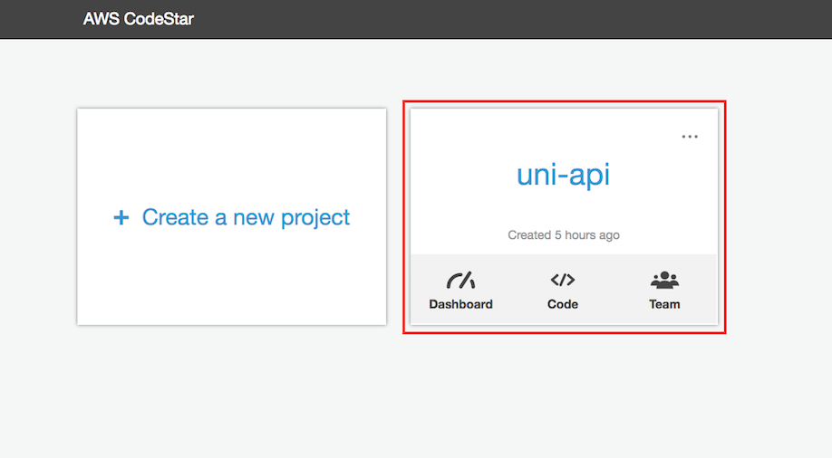

1. 브라우저 창의 오른쪽에있는 연속 배포 파이프 라인에 이제 소스 스테이지가 파란색으로 표시되어 활성 상태임을 나타냅니다.

    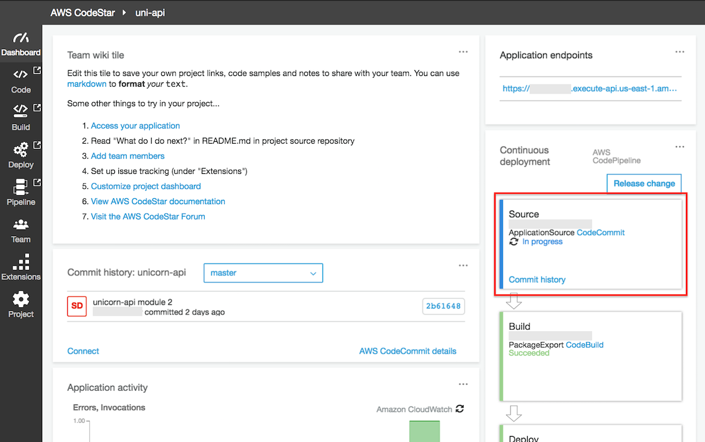

1. 각 스테이지의 색상은 실행중엔 파란색, 완료되면 녹색으로 바뀝니다. 모든 스테이지가 성곡적으로 끝나면 파이프라인은 아래와 같은 화면을 보여줍니다.

    
</details>
<p>

각 단계의 색상은 실행 중 파란색으로 바뀌고 완료되면 녹색으로 바뀝니다. 모든 단계가 성공적으로 실행되면 파이프 라인은 다음 스크린 샷과 같아야합니다.

<details>
<summary><strong>
만약 Build에서 에러가 날 경우 CodeBuild의 메세지를 확인해보십시오. (자세한 내용은 확장)
</strong></summary>
<p>

Amazon Linux또는 Ubuntu의 경우 runtime-versions를 buildspec.yml에서 요구할 수도 있습니다. 

  <details>
   <summary><strong>runtime-versions추가를 위한  buildspec.yml 변경 사항 (자세한 내용은 확장)</strong></summary><p>

    install phase에 runtime-versions에 nodejs: 8 를 추가하세요. 
    완료된 화면은 아래와 같습니다.

   ```yaml
    version: 0.2

    phases:
    install:
        runtime-versions:
            nodejs: 8
        commands:
        - npm install

        # Upgrade AWS CLI to the latest version
        - pip install --upgrade awscli

    pre_build:
        commands:
        # Some unit test keeps failing, and I don't have time to fix it!
        # -Chet
        # (uncomment the below to restore unit tests)
        #- node_modules/mocha/bin/mocha
        
    build:
        commands:
        # Use AWS SAM to package the application using AWS CloudFormation
        - aws cloudformation package --template template.yml --s3-bucket $S3_BUCKET --output-template template-export.yml

        # Do not remove this statement. This command is required for AWS CodeStar projects.
        # Update the AWS Partition, AWS Region, account ID and project ID in the project ARN on template-configuration.json file so AWS CloudFormation can tag project resources.
        - sed -i.bak 's/\$PARTITION\$/'${PARTITION}'/g;s/\$AWS_REGION\$/'${AWS_REGION}'/g;s/\$ACCOUNT_ID\$/'${ACCOUNT_ID}'/g;s/\$PROJECT_ID\$/'${PROJECT_ID}'/g' template-configuration.json

    artifacts:
    type: zip
    files:
        - template-export.yml
        - template-configuration.json

   ```
   </details>
</details>
<p>

## Enhancement Validation

CloudFormation 배포 명령이 완료되면 AWS API Gateway를 사용하여 API를 테스트합니다.

### 1. Add a Unicorn

1. AWS Management Console에서  **Services** 밑에 있는 Application Services의 **API Gateway** 를 선택하십시오. 

1. 왼쪽 메뉴의 `awscodestar-uni-api-lambda` 를 클릭하십시오..

1. API resources 리스트의  `/{name}` 밑의 `PUT` 링크를 클릭하십시오.  .

1. 세부사항에서 , 클라이언트 왼쪽 페널에 있는 `TEST` 를 클릭하십시오. .

    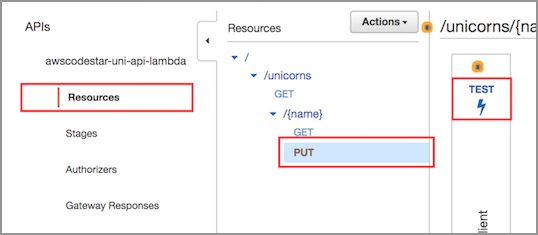

1. 이 테스트 페이지에서 **Path** 필드의 {name}에 `Shadowfox`를 입력하십시오.

1. 테스트 페이지를 아래로 스크롤하여 **Request Body**에 아래 내용을 입력하세요. :

    ```json
    {
      "breed": "Brown Jersey",
      "description": "Shadowfox joined Wild Rydes after completing a distinguished career in the military, where he toured the world in many critical missions. Shadowfox enjoys impressing his ryders with magic tricks that he learned from his previous owner."
    }
    ```

    

1. 스크롤을 내린다음 **Test** 버튼을 클릭하십시오..

1. 테스트 페이지 상단으로 가시면, 오른쪽 페널의 **Status** 코드의 HTTP 응답이 200인지 확인하십시오.

    

축하합니다. API를 사용하여 유니콘을 성공적으로 추가했습니다! 그런 다음 API를 사용하여 유니콘을 나열하고 Shadowfox가 포함되어 있는지 확인하십시오.

### 2. List Unicorns

1. AWS Management Console에서  **Services** 밑에 있는 Developer Tools의 **CodeStar** 를 선택하십시오. 

1. `uni-api` project 를 선택하십시오.

    

1. 대쉬보드 오른쪽 타일의 **Application endpoints** URL을 qhrtkgktpdy. 

    

1. 브라우저에 해당 내용을 붙여넣기한 후 `/unicorns` 을 추가한다음 엔터를 입력하십시오.  예를들면 : `https://xxxxxxxxxx.execute-api.us-east-1.amazonaws.com/Prod/unicorns/`

1. 브라우저의 JSON 결과가`Shadowfox`와 breed 그리고 설명을 포함하고 있는지 확인합니다. 


## API의 Unit Testing 을 해봅시다. 

작동하는 API가 있으므로 버그가 코드에 침입하는 것을 방지하기 위해 수행 할 수있는 단계를 고려해 보겠습니다. 보시다시피 API의 수동 테스트에는 몇 가지 문제가 있습니다. 빌드 프로세스가 완료 될 때까지 기다려야하며 API 게이트웨이 서비스를 사용하여 API가 작동하는지 확인하는 단계를 거쳐야합니다. 이 검증을 수행 할 수있는 자동화 된 프로세스를 보유하는 것이 더 빠르고 안정적이며, 이러한 검사를 빌드 프로세스에 통합하는 것이 더 좋습니다.

위 단계에서 복제 한 저장소에는 Lambda 함수의 기능을 확인하는 일련의 테스트가 이미 포함되어 있으므로 처음부터 작성할 필요가 없습니다. 아래 단계에서는 이러한 테스트를 실행하는 데 필요한 도구를 설치하고, 코드에 발견 된 문제를 수정하고, 앞으로 이러한 문제가 다시 발생하지 않도록 조치를 취합니다.

### 1. 테스트 도구를 설치하고 unit test 를 실행합시다. 

1. 디렉토리를 로컬 uni-api 디렉토리로 변경하십시오 ( 아직없는 경우).

1. Node Package Manager를 사용하여 단위 테스트를 실행하는 데 필요한 개발 도구를 설치하십시오.

    ```
    npm install
    ```

1. 도구가 설치되었으므로 단위 테스트 도구를 실행 해 봅시다. 이 프로젝트의 코드는 Nodejs로 작성되었으므로 Mocha 테스트 프레임 워크 (https://mochajs.org/). 를 사용하고 있습니다. 이것은 이미 `package.json` 파일에 등록 되었으므로 이전 단계에서 자동으로 설치되었습니다.

    ```
    node_modules/.bin/mocha
    ```

    테스트가 실행되면 코드에 문제가 있음을 알게됩니다! 존재하지 않는 유니콘의 데이터를 읽으려고 할 때 Lambda 함수 중 하나가 올바른 응답을 반환하지 않습니다.
    
    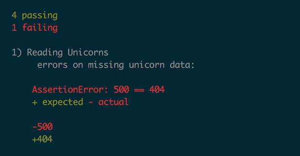

### 2. unit test 실폐 수정

테스트 실행 결과를 살펴 보겠습니다. 테스트 결과 시스템에없는 유니콘을 읽으려고하면 표준 "404"오류 코드를 반환하고 Lambda 코드는 "500"을 반환한다고 예상했습니다.

**Goal**: `app/read.js`의 버그 수정, unit tests 수행, 그리고 테스트 통과 검증.

<details>
<summary><strong>
코드 버그를 수정하고 통과 단위 테스트를 확인하는 방법 (자세한 내용은 확장)
</strong></summary>
<p>

1. 텍스트 편집기를 사용하여 `app/read.js` 열고 response가 어떻게 구성되어있는지 탐색하십시오. 반환 할 상태 코드를 지정하는 경우 재조정 된 항목을 사용하여 200 (ok) 또는 500 (Server error) 코드를 반환하는지 확인합니다.

1. 500 대신 404 (resource not found) 상태 코드를 리턴하도록 코드를 변경하십시오.

   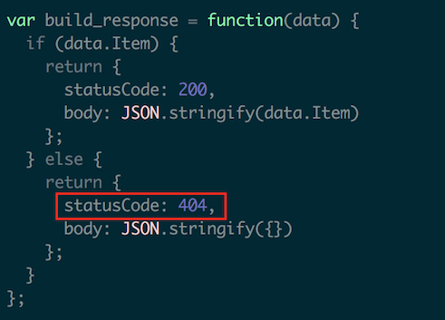

1. 코드를 수정 했으므로 Unit test 도구를 다시 실행하여 동작을 확인하겠습니다.

    ```
    node_modules/.bin/mocha
    ```

1. 테스트 실행에서보고 된 오류가 없는지 확인하십시오.

   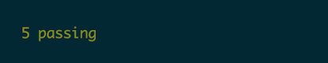

</details>
<p>

축하합니다. 코드 버그가 수정되었습니다. 다음으로 CodePipeline의 일부로 이러한 테스트를 실행하는 방법을 살펴 보겠습니다.


### 3. 빌드하는 동안 테스트가 실행되도록합니다

이 테스트 프레임 워크를 갖추면 코드를 테스트 할 때마다 동일한 일련의 단계가 실행됩니다. 그러나 우리는 여전히 테스트를 수동으로 실행하고 있습니다. 빌드가 수행 될 때마다 이러한 테스트를 실행하도록 CodeBuild 환경을 구성 해 보겠습니다.

1. 텍스트 편집기를 사용하여 `buildspec.yml` 파일을 열고  `pre_build:` section을 찾으십시오. 

1. 우리는 우리의 상대.. Chet이 우리의 unit test를 막았다는 것을 발견했습니다! 왜, Chet놈은 왜?!!!! 이 문제를 해결하려면 빌드중 실행되는 유닛테스트의 `mocha` 명령어 실행 주석을 해제하십시오.

1. Git 클라이언트를 사용하여 Git 인덱스에 로컬 변경 사항을 추가하고 메시지와 함께 이러한 변경 사항을 커미트 한 후 로컬 변경 사항을 저장소로 푸시하십시오. 예를 들면 다음과 같습니다 :

    ```bash
    git add -u
    git commit -m "Enabled unit tests and fixed issues"
    git push
    ```
    
### 4. 빌드 중에 테스트가 실행되는지 확인

1. AWS Management Console에서  **Services** 밑에 있는 Developer Tools의 **CodeStar** 를 선택하십시오. 

1. `uni-api` project 를 선택하십시오.

    

1. "Commit history"타일까지 아래로 스크롤하여 위에서 입력 한 커밋 메시지 (예 : "Enabled unit tests and fixed issues")가 표시되는지 확인하십시오.
    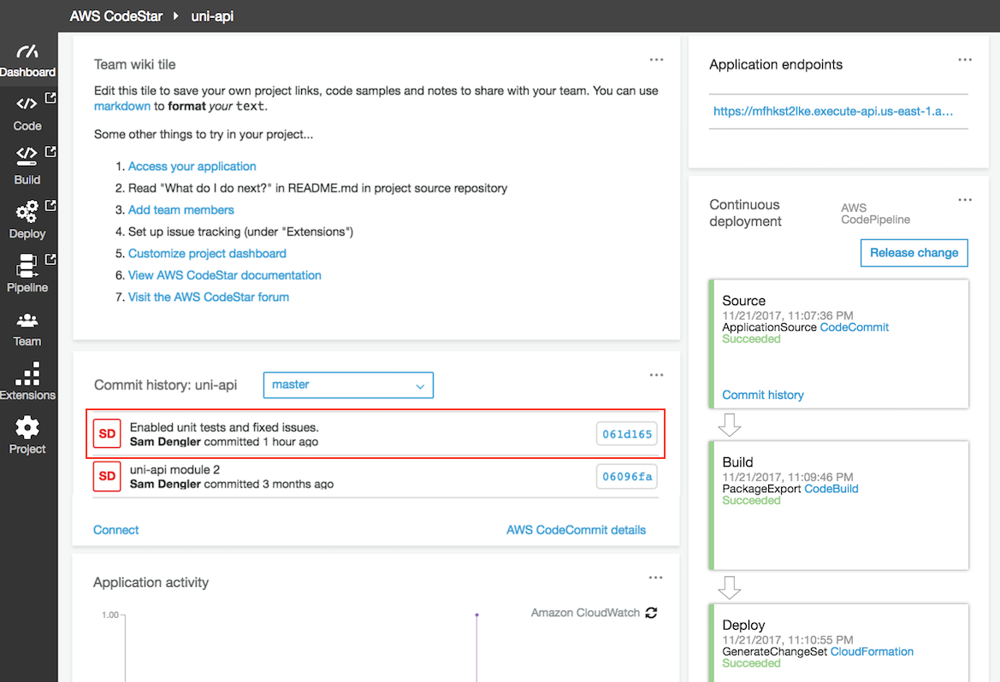

1. "Continuous Deployment" 파이프 라인을 모니터링하여 위 단계에서 코드를 커밋 한 후 가장 최근에 빌드 단계를 실행했는지 확인하십시오. 변경 사항을 커밋 한 경우 변경 사항을 감지하고 실행하는 데 몇 분 정도 걸릴 수 있습니다.

1. 빌드 단계가 완료되면 단계 `CodeBuild` 내부의 링크를 클릭 하여 CodeBuild 프로젝트 및 Build Hitory 를 보십시오.

    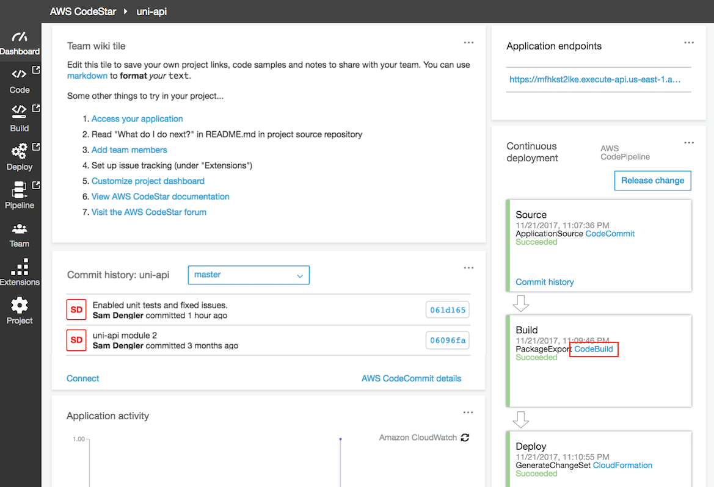

1. "Build History" section 까지 스크롤을 내린 후 가장 최근 빌드 항목을 클릭하여 빌드 세부 사항을보십시오.

    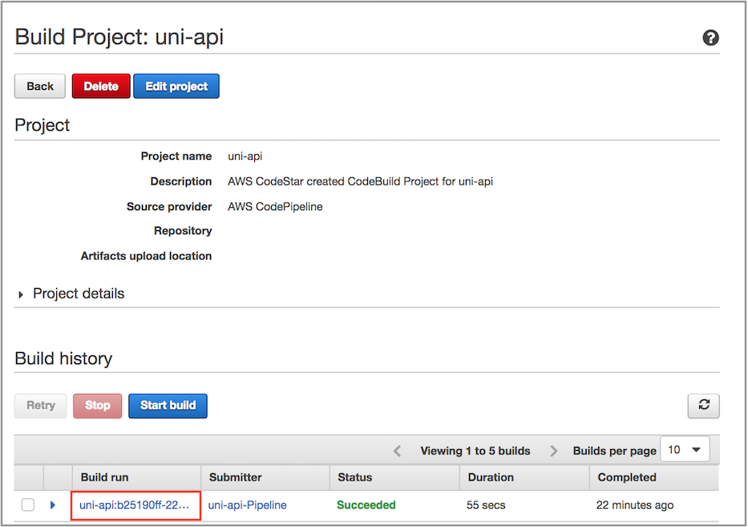

1. Build logs section 까지 스크롤을 내린 후 , build log를 검사하십시오. `Running command mocha`을 레포트 결과가 테스트를 통과했는지 찾으십시오. (`5 passing` 이어야함).

    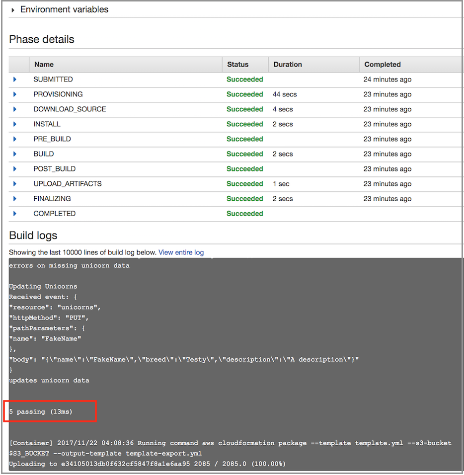

축하합니다. continuous delivery process의 unit tests를 성공적으로 통합했습니다!

## 완료

CodePipeline을 사용하여 Continuous Delivery Pipeline을 성공적으로 사용하여 Unicorn API 배포를 자동화했습니다. 다음 [X-Ray Module](../3_XRay) 에서는 AWS X-Ray를 통합하여 Unicorn API 문제를 해결하는 방법을 보여줍니다.
