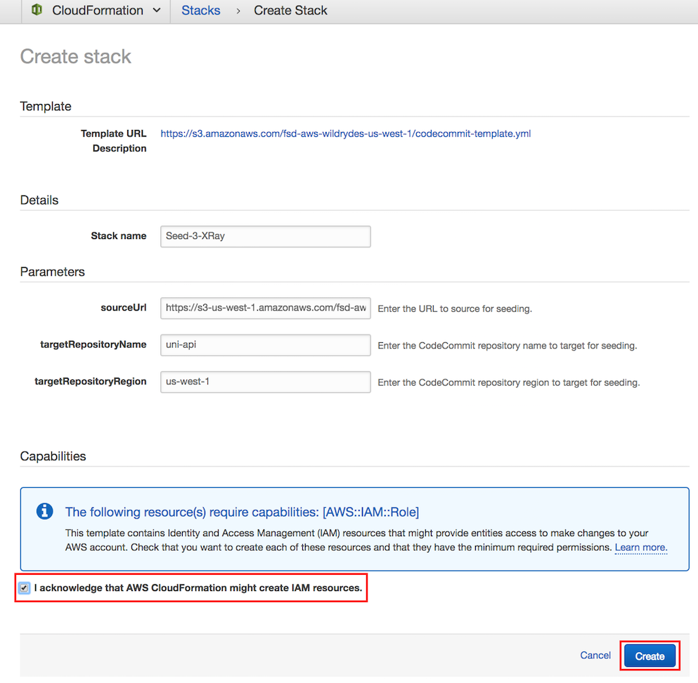
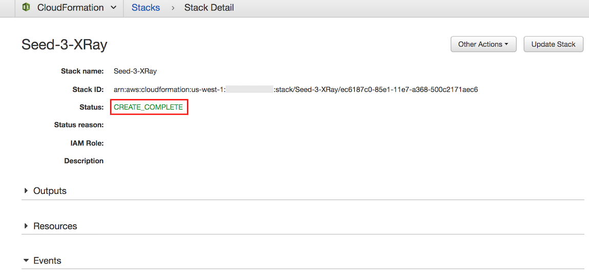
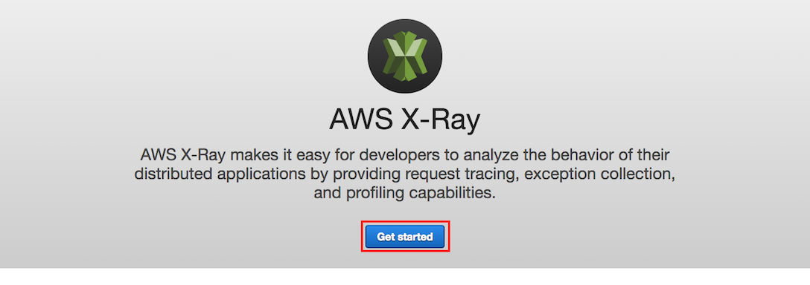
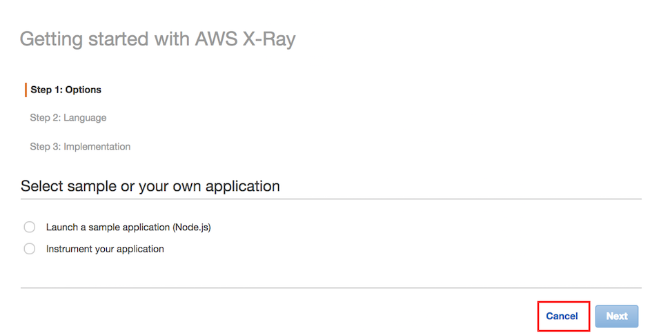
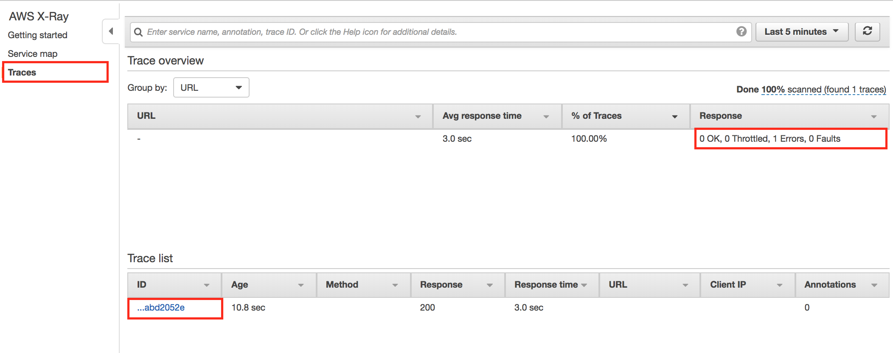
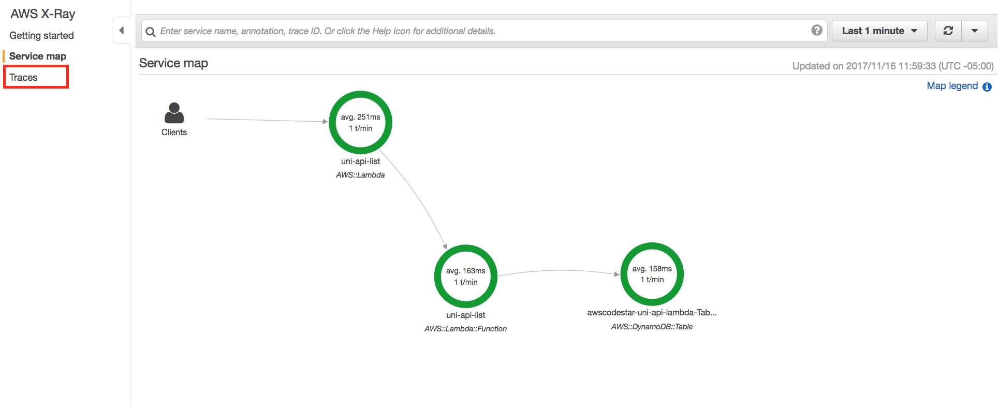
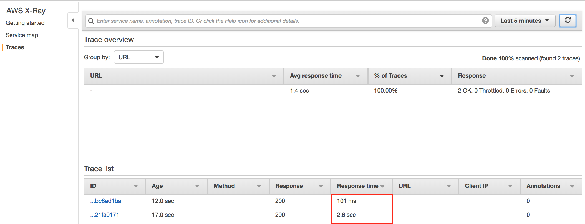

# Module 3: AWS X-Ray Integration

이 모듈에서는 [Module 2: Continuous Delivery Pipeline](../2_ContinuousDeliveryPipeline)구축한 [AWS CodePipeline](https://aws.amazon.com/codepipeline/) 을 통해 코드 변경 사항이 배포된 후 [AWS X-Ray](https://aws.amazon.com/xray/)를 사용하여 Unicorn API를 분석하고 디버깅합니다.


수행할 작업은 3단계로 나뉩니다.

1. **[Environment Setup](#environment-setup)**
2. **Problem 1: [Error Discovery Using X-Ray](#problem-1-error-discovery-using-x-ray)** and **[Resolution](#problem-1-resolution)**
3. **Problem 2: [Performance Discovery Using-X-Ray](#problem-2-performance-discovery-using-x-ray)** and **[Resolution](#problem-2-resolution)**

하지만 먼저 AWS X-Ray에 대한 빠른 소개를 하겠습니다....


## AWS X-Ray Overview

[AWS X-Ray](https://aws.amazon.com/xray/) 사용하면 프로덕션, 분산 애플리케이션을 분석하고 디버깅 할 수 있습니다. X-Ray를 사용하면 성능 문제 및 오류의 근본 원인을 식별하고 해결하기 위해 애플리케이션 및 기본 서비스가 수행되는 방식을 이해할 수 있습니다. X-Ray는 요청이 애플리케이션을 통과 할 때 요청에 대한 종단 간보기를 제공하고 애플리케이션의 기본 구성 요소 맵을 보여줍니다. X-Ray를 사용하여 개발 및 생산중인 응용 프로그램을 모두 분석 할 수 있습니다. 다음으로 X-Ray를 Lambda와 통합하는 방법을 살펴 보겠습니다.


### AWS Lambda와의 AWS X-Ray 통합

AWS X-Ray를 사용하여 요청을 추적하면 서버리스 애플리케이션의 성능에 대한 통찰력을 얻을 수 있으므로 문제의 근본 원인을 정확히 파악할 수 있습니다.

X-Ray를 Lambda와 통합하려면 모듈 2의 Unicorn API에 몇 가지 변경이 필요합니다. 이러한 변경 사항은 모듈 3의 uni-api에 이미 포함되어 있지만 수정 사항에 익숙해 지도록 검토하겠습니다.


#### Lambda 함수에서 활성 추적 활성화

각각의 Lambda 함수는 값이 'Active'인 'Tracing'속성을 추가하여 X-Ray에 대한 활성 추적을 활성화해야합니다.([see more](https://github.com/awslabs/serverless-application-model/blob/master/versions/2016-10-31.md#properties)).


#### Integrate AWS X-Ray SDK with Lambda Function

X-Ray SDK를 Node.js Unicorn API에 통합하기 위해 [aws-xray-sdk](https://www.npmjs.com/package/aws-xray-sdk)  노드 모듈을 [npm](https://www.npmjs.com/)을 사용하여 프로젝트 dependency로 추가합니다. 이것은 이미  `uni-api/app` 디렉토리의 [package.json](uni-api/package.json) 파일에 포함되어 있으며 파이프 라인의 CodeBuild 단계에서 프로젝트에 포함됩니다. 

프로젝트에 [aws-xray-sdk](https://www.npmjs.com/package/aws-xray-sdk) 라이브러리를 추가하면 라이브러리를 어플리케이션 코드에 통합해야합니다. 아래는 X-Ray 통합 전후의 Lambda 함수 초기화 code snippet입니다.

Before:

```javascript
const AWS = require('aws-sdk');
const docClient = new AWS.DynamoDB.DocumentClient();
const tableName = process.env.TABLE_NAME;
```

After:

```javascript
const AWSXRay = require('aws-xray-sdk');
const AWS = AWSXRay.captureAWS(require('aws-sdk'));
const docClient = new AWS.DynamoDB.DocumentClient();
const tableName = process.env.TABLE_NAME;
```

보다시피 Lambda 로의 기본 X-Ray 통합에는 두 가지 변경 만 필요합니다. 를 포함하는 새로운 코드 라인 하나 `aws-xray-sdk` 와 `aws-sdk` 라이브러리를 X-Ray 로 감싸는 두 번째 수정 사항 . 이로 인해 코드를 더 이상 변경하지 않고도 모든 AWS API 호출이 계측을 위해 X-Ray에 의해 랩핑됩니다.


**이제 다시 원래 작업으로 돌아갑시다...**


## Environment Setup

[Problem 1: Error Discovery Using X-Ray](#problem-1-error-discovery-using-x-ray) 와 [Problem 2: Performance Discovery Using-X-Ray](#problem-2-performance-discovery-using-x-ray)를 해결하기 위해선 아래 단계를 사용하여 프로젝트 저장소의 시드를 복제해야 합니다.

**Note:** Lambda 함수가 X-Ray 서비스에 액세스하려면 **LambdaExecutionPolicy** 에 **arn:aws:iam::aws:policy/AWSXRayDaemonWriteAccess** 관리형 정책이 포함되어야합니다.  단순화를 위해서, 이 정책은 **template.yml** file에 포함되어있으며, 내용은 아래와 같습니다.

```
  LambdaExecutionRole:
    Description: Creating service role in IAM for AWS Lambda
    Type: AWS::IAM::Role
    Properties:
      RoleName: !Sub 'CodeStar-${ProjectId}-Execution${Stage}'
      AssumeRolePolicyDocument:
        Statement:
        - Effect: Allow
          Principal:
            Service: [lambda.amazonaws.com]
          Action: sts:AssumeRole
      Path: /
      ManagedPolicyArns:
        - arn:aws:iam::aws:policy/service-role/AWSLambdaBasicExecutionRole
        - arn:aws:iam::aws:policy/AmazonDynamoDBFullAccess
        - arn:aws:iam::aws:policy/AWSXRayDaemonWriteAccess
      PermissionsBoundary: !Sub 'arn:${AWS::Partition}:iam::${AWS::AccountId}:policy/CodeStar_${ProjectId}_PermissionsBoundary'
```


### 1. Seed the `uni-api` CodeCommit Git repository

1. 각 모듈에는 워크샵을 지원하기 위해 CodeStar CodeCommit Git 리포지토리를 시드하는 데 사용되는 해당 소스 코드가 있습니다. CodeCommit Git 리포지토리를 시드하려면 아래에서 해당 지역 의 **Launch Stack** 버튼을 클릭하십시오:

    Region| Launch
    ------|-----
    US East (N. Virginia) | [](https://console.aws.amazon.com/cloudformation/home?region=us-east-1#/stacks/create/review?stackName=Seed-3-XRay&templateURL=https://s3.amazonaws.com/fsd-aws-wildrydes-us-east-1/codestar-template.yml&param_sourceUrl=https://s3.amazonaws.com/fsd-aws-wildrydes-us-east-1/uni-api-3-v4.zip&param_targetProjectId=uni-api&param_targetProjectRegion=us-east-1)
    US West (N. California) | [](https://console.aws.amazon.com/cloudformation/home?region=us-west-1#/stacks/create/review?stackName=Seed-3-XRay&templateURL=https://s3.amazonaws.com/fsd-aws-wildrydes-us-west-1/codestar-template.yml&param_sourceUrl=https://s3-us-west-1.amazonaws.com/fsd-aws-wildrydes-us-west-1/uni-api-3-v4.zip&param_targetProjectId=uni-api&param_targetProjectRegion=us-west-1)
    US West (Oregon) | [](https://console.aws.amazon.com/cloudformation/home?region=us-west-2#/stacks/create/review?stackName=Seed-3-XRay&templateURL=https://s3.amazonaws.com/fsd-aws-wildrydes-us-west-2/codestar-template.yml&param_sourceUrl=https://s3-us-west-2.amazonaws.com/fsd-aws-wildrydes-us-west-2/uni-api-3-v4.zip&param_targetProjectId=uni-api&param_targetProjectRegion=us-west-2)
    EU (Ireland) | [](https://console.aws.amazon.com/cloudformation/home?region=eu-west-1#/stacks/create/review?stackName=Seed-3-XRay&templateURL=https://s3.amazonaws.com/fsd-aws-wildrydes-eu-west-1/codestar-template.yml&param_sourceUrl=https://s3-eu-west-1.amazonaws.com/fsd-aws-wildrydes-eu-west-1/uni-api-3-v4.zip&param_targetProjectId=uni-api&param_targetProjectRegion=eu-west-1)
    EU (Frankfurt) | [](https://console.aws.amazon.com/cloudformation/home?region=eu-central-1#/stacks/create/review?stackName=Seed-3-XRay&templateURL=https://s3.amazonaws.com/fsd-aws-wildrydes-eu-central-1/codestar-template.yml&param_sourceUrl=https://s3-eu-central-1.amazonaws.com/fsd-aws-wildrydes-eu-central-1/uni-api-3-v4.zip&param_targetProjectId=uni-api&param_targetProjectRegion=eu-central-1)
    Asia Pacific (Sydney) | [](https://console.aws.amazon.com/cloudformation/home?region=ap-southeast-2#/stacks/create/review?stackName=Seed-3-XRay&templateURL=https://s3.amazonaws.com/fsd-aws-wildrydes-ap-southeast-2/codestar-template.yml&param_sourceUrl=https://s3-ap-southeast-2.amazonaws.com/fsd-aws-wildrydes-ap-southeast-2/uni-api-3-v4.zip&param_targetProjectId=uni-api&param_targetProjectRegion=ap-southeast-2)


1. CloudFormation 템플릿은이 모듈에 필요한 필드로 미리 채워져 있습니다. 변경할 필요가 없습니다.

1. **I acknowledge that AWS CloudFormation might create IAM resources.** 선택하여서 CloudFormation 에게 당신대신 IAM resources 를 생성할 수 있는 권한을 줍니다.

1. 오른쪽 아래 코너의 **Create** 버튼을 선택하여 CloudFormation 스택을 생성하고 CodeCommit 레포지토리를 seed하십시오.

    

1.Git 리포지토리에 새로운 소스 코드가 시드되면 약간의 지연이 발생합니다. 성공적으로 완료되면 CloudFormation에 Status에 ``CREATE_COMPLETE``표시됩니다.
    


### 2. CodeCommit Git 리포지토리 가져 오기


CodeCommit Git 리포지토리에 새로운 소스 코드가 시드되었으므로 코드를 수정할 수 있도록 변경 사항을 로컬로 가져와야합니다. 일반적으로 이것은 `git pull` 명령을 사용하여 수행 되지만 워크샵에서는 저장소를 새로운 기록으로 교체했으며 다른 Git 명령이 사용됩니다.

선호하는 Git 클라이언트를 사용하여 로컬 **uni-api** Git 저장소 에서 명령을 실행하십시오 .

```bash
git fetch --all
git reset --hard origin/master
```
ㅣ


### 3. CodePipeline Unicorn API 배포 확인

리포지토리가 Seed되면 파이프 라인 실행이 시작됩니다. **Deploy** 단계가 녹색으로 바뀌면서 파이프 라인 완료를 관찰 할 때까지 파이프 라인을 모니터링하십시오 .


</details>


### 4. Exercise List Unicorns API Method

**Goal:** CodeStar Console을 사용하여 응용 프로그램 endpoint를 찾고 브라우저를 사용하여 "/unicorns"목록 리소스를 테스트하십시오.

<details>
<summary><strong>
List Unicorns API를 테스트하는 방법 (자세한 내용은 확장)
</strong></summary>
<p>

1. AWS Management Console 콘솔에서 **Services** 의 Developer Tools 안에 있는 **CodeStar** 를 선택하세요.

1. `uni-api` project 를 선택합니다.

    

1. 대쉬보드의 오른쪽에 있는 **Application endpoints** URL을 복사하세요.

    

1. 윈도우 브라우저에 복사한 URL을 붙여넣기 한 후 `/unicorns` 를 추가한 다음 엔터를 치십시오. 예 : `https://xxxxxxxxxx.execute-api.us-east-1.amazonaws.com/Prod/unicorns/`
</details>
<p>

브라우저는 다음과 같은 오류를 반환해야합니다. REST API에 방문을 등록하려면 브라우저를 여러 번 새로 고치십시오.

   ```json
   {
     "message": "Internal server error"
   }
   ```

오 안돼! 이 버전의 Unicorn API에 버그가 나왔습니다. X-Ray를 사용하여 발생한 오류를 식별 해 봅시다.


## Problem 1. Error Discovery Using X-Ray

그렇습니다, 당신의 코드는 버그를 가지고 있습니다.  하지만 문제 없습니다! AWS X-Ray 를 사용하여 조사해봅시다!

**Goal:** AWS X-Ray를 사용하여 Service Map을 보고 추적하여 error를 발생하는 원인을 판별할때까지 파고들어봅니다.

<details>
<summary><strong>
AWS X-Ray를 사용하여 코드 버그를 찾는 방법 (자세한 내용은 확장)</strong></summary>
<p>

1. AWS Management Console의 **Services** 아래있는 Developer Tools의 **X-Ray**를 선택하세요.

   만약 X-Ray를 처음 방문했다면, 다음 Getting Started 페이지를 따라서 진행하세요. 아니면 Step 4로 바로진행합니다.

1. **Get started** 를 누르십시오.

    

1. **Cancel** 를 누르십시오.

    

1. The X-Ray Console 은 다음 스크린샷과 같은 Service map 을 열것입니다 :


**Important**
> X-Ray가 API 호출을 수집하고 처리하는 데 약간의 지연이있을 수 있습니다. 위의 그림이 보이지 않으면 브라우저 창을 새로 고쳐보십시오.


### Service Map

이 이미지는 클라이언트와, 당신의 브라우저, 연결된 **AWS::Lambda** resource, 웜업된 Lambda function을 표현현하여 보여줍니다. 
두번째 연결된 표현은 **AWS::Lambda::Function**의 `list.lambda_handler`를 호출하는 것을 말하며,`template.yml` template의 핸들러에 정의되어있습니다.
세번째 연결된 **AWS::DynamoDB::Table**은 Unicorn Stable이 사용하는 DynamoDB table에 쿼리를 보내는 것을 표현합니다.

주황색 원형인  **AWS::Lambda** 와 **AWS::Lambda::Function** 는 그들의 서비스사이에 HTTP 호출이 발생할때 에러가 생긴다는 것을 나타냅니다.


### Traces

1. 왼쪽 탐색 메뉴에서 , **Traces** 클릭하세요. 

1. **Trace Overview** 페이지를 보면 , (이 시나리오에 해당) 응답 목록에 1개의 에러가 있습니다.   **Trace Overview**의 **Trace List** 중, 리스트의 첫번째 Trace 를 클리갛여  **Trace Detail** page 를 오픈합니다.

   

1. **Trace Detail**은, HTTP calls의 **Timeline**, API Gateway뿐만아니라 X-Ray가 추적하는 다른 분산 시스템까지 확장하여 보여줍니다. 
**Trace Detail** 의 Lambda function리스트중 DynamoDB Tables 위에 있는 빨간 경고 아이콘은 **Fault**를 나타냅니다.

   

1. 경고 아이콘을 클릭하여 추적 세그먼트 세부 사항을보십시오 (아래):

   

1.  **Segment Detail**안 에서 , **Exceptions** 텝을 클릭하여 재가된 `list.js`의 에러의 원인이된 코드라인 에러를 봅니다.  (이 예제에서는 **line 17** ).

1.  대화 상자를 닫으 려면 **Close** 버튼을 클릭하십시오.
</details>
<p>

축하합니다. X-Ray를 사용하여 오류를 발견했습니다! 버그를 찾아 수정 해 봅시다.


## Problem 1: Resolution

**Goal:**  `app/list.js`의 문제가 되는 에러코드를 찾아 수정하고, 커밋과 푸쉬하여 원격 git repository에 해당사항을 반영합니다.  나중에, Code Star console 을 사용하여 성공적인 배포를 검증하고, 당신의 브라우저를 사용하여 에러가 해결이되었는지 확인합니다..

<details>
<summary><strong>
버그 수정 및 푸시 코드 변경 방법 (자세한 내용은 확장)
</strong></summary>
<p>


### 1. Fix Code Bug

1.  당신의 워크스테이션에서, `app/list.js` file 을 열고X-Ray trace에서 확인된 라인을 탐색합니다. 아래의 code snippet과 유사해야합니다:

    ```
    docClient.scan(params, function(error, data) {
     // Comment or Delete the following line of code to remove simulated error
     err = Error("something is wrong");
    ```

1. 버그수정을 위해 해당 라인을 주석처리하거나 삭제하세요.

1. `app/list.js` file 을 저장합니다.


### 2. Commit the change to local Git repository

1. 당신의 Git클라이언트를 사용하여 로컬 변경사항을 추가하여 메세지와 함께 커밋하세요. 예를들면 다음과 같습니다:

    ```
    git add -u
    git commit -m "Fix bug"
    ```

1. 당신의 Git클라이언트를 사용하여 Git 저장소의 변경사항을 원격으로 푸쉬하십시오. 예를들면 다음과 같습니다:

    ```
    git push origin
    ```


### 3. Validate CodePipeline Unicorn API Deployment


CodeStar 프로젝트의 CodeCommit git 리포지토리에 변경 사항을 적용한 후 CodePipeline을 사용하여 변경 사항이 성공적으로 빌드 및 배포되었는지 확인합니다.

1. AWS Management Console 에서  **Services** 의 Developer Tools의  **CodeStar** 를 선택하세요. 

1. `uni-api` project를 선택하세요.

    

1. 브라우저 오른쪽의 continuous deployment pipeline의 Source 스테이지가 파란색이 보이는 것은 활성화 상태를 의미합니다. 

    

1. 각 단계의 색상은 실행 중 파란색으로 바뀌고 완료되면 녹색으로 바뀝니다. 모든 단계가 성공적으로 실행되면 파이프 라인은 다음 스크린 샷과 같아야합니다.

    
    
    
    
### 4. Excercise Unicorn API List Resource

1. AWS Management Console 의 **Services** 아래 Developer Tools **CodeStar** 를 선택하세요.

1.  `uni-api` project 를 클릭합니다.

    

1. 대쉬보드 오른쪽 아래 **Application endpoints**의 URL을 복사하세요.

    

1. 브라우저 주소창에 해당 내용을 붙여넣고 `/unicorns` 를 뒤에 추가한뒤 엔터를 치세요. 예를 들면: `https://xxxxxxxxxx.execute-api.us-east-1.amazonaws.com/Prod/unicorns/`

1. 당신의 브라우저가 아직 에러를 리턴 할 수도 있습니다. 가볍게 당신의 브라우저를 여러번 리프레쉬하여 REST API 여러번 요청하세요..

당신의 브라우저는 더이상 에러를 리턴하지 않아야합니다.  브라우저를 여러번 새로고침하여 여러 REST API요청 하세요.

   ```json
   [ ]
   ```

> 당신의 Stable에 Unicon을 추가 한 경우 위의 결과는 인벤토리 목록을 반환해야합니다.

</details>
<p>

버그가 수정되었으며 이제 API가 오류없이 응답합니다. X-Ray를 사용하여 결과를 확인합시다.


### Validation Using X-Ray

오류를 제거 했으므로 AWS X-Ray traces가 어떻게 보이는지 살펴 보겠습니다.


**Goal:**  AWS X-Ray를 사용하여 Service Map을 보고 오류가 해결되었는지 확인합니다.

<details>
<summary><strong>
X-Ray에서 오류가 해결되었는지 확인하는 방법 (자세한 내용은 확장)
</strong></summary>
<p>

1. AWS Management Console에서 **Services** 의 Developer Tools 아래 **X-Ray** 를 선택하세요.  The X-Ray Console은 아래 이미지와 비슷한 **Service Map** 을 보여줄 것입니다. 



**Important**
> X-Ray가 API 호출을 수집하고 처리하는 데 약간의 지연이있을 수 있습니다. 위의 그림이 보이지 않으면 브라우저 창을 새로 고쳐보십시오.
</details>
<p>

축하합니다! AWS X-Ray를 사용하여 결과를 검증했습니다.

**그러나 그렇게 빠르지 않습니다!** 브라우저를 새로 고쳤을 때 응답하는 데 시간이 오래 걸렸습니까? (확인이 안될 경우 다시 새로 고침) 음.. 수정되었으나 성능 문제가있는 것 같습니다. X-Ray를 사용하여 조사합시다!


## Problem 2. Performance Discovery Using X-Ray

뭐 좋습니다, 당신의 코드는 조금 느립니다. 하지만 문제 없어요. AWS X-Ray trace를 살펴보면 추적 세그먼트 및 하위 세그먼트의 지속 시간을 볼 수 있습니다. AWS X-Ray를 사용하여 진행 상황을 살펴 보겠습니다.

**Goal:** AWS X-Ray Console을 사용하여 애플리케이션의 지연을 식별하기 위해 X-Ray 추적으로 파고들어봅니다.

<details>
<summary><strong>
AWS X-Ray를 사용하여 성능 지연을 감지하는 방법 (자세한 내용은 확장)
</strong></summary>
<p>

1. AWS Management Console에서 **Services** 를 클릭 한 다음  Developer Tools 에서 **X-Ray** 를 선택하십시오.

1. 왼쪽 탐색에서 **Traces**를 선택하세요.

1. **Trace list**는 **Response time**이 5초 또는 그 이상 걸리는것을 알려줍니다. (이 화면은 6.8 초).  첫번째 trace를 클릭합니다.

   

1. **Trace Detail** HTTP calls의 **Timeline**, API Gateway뿐만아니라 X-Ray가 추적하는 다른 분산 시스템까지 확장하여 보여줍니다. **Trace Detail** 의 세부사항 중 **Return From Stable** 이라는 실행시간 5초 이상의 긴 타임라인이 있습니다.  개발자가 하위 세그먼트를 사용하고 레이블을 지정 했으므로 지연을 유발하는 코드 부분을 빠르게 찾을 수 있습니다.

   

</details>
<p>

이제 delay를 찾아서 제거합시다!


## Problem 2: Resolution

**Goal:** `app/list.js`에서 delay를 유발한 코드를 찾아서 수정하고 고칩니다. 그리고 변경된 사항을 commit하고 push하여 origin git repository에 반영합니다. 그런 뒤, Code Star console을 사용하여 성공적으로 배포가 됬는지 확인하고 브라우저를 사용하여 에러가 해결되었는지 확인합니다. 

<details>
<summary><strong>
코드를 수정하고 코드를 다시 푸시하는 방법 (자세한 내용은 확장)
</strong></summary>
<p>


### 1. 코드 버그 수정

1.   `app/list.js` file 을 열고 **Return From Stables** 를 찾으세요, 아래 code snippet과 같은 내용을 찾을 수 있습니다.:

    '''javascript
    // Comment or Delete the following line of code to remove simulated delay
    const isDelayed = true;

    AWSXRay.captureAsyncFunc('Return From Stables', (subsegment) => {
    ```

1.  실행시 느려지는것을 막기위해 `const isDelayed = true;`를 지우거나 주석처리합니다.

1. Save the `app/list.js` file.


### 2. local Git repository 변경사항 커밋

1. Git client를 사용하여, Git의 로컬 변경점을 index에 추가한 후 메세지와 함께 커밋합니다.  예를 들면:

    ```bash
    git add -u
    git commit -m "Remove delay"
    ```

1. Git client를 사용하여 원격 오리진 git repository에 변경사항을 푸쉬합니다.  예를 들면:

    ```bash
    git push origin
    ```


### 3. CodePipeline Unicorn API 배포 검증

변경된 코드를 CodeStar project의 CodeCommit git repository에 푸쉬한 다음, 변경점이 성동적으로 빌드되고 배포되는것을 CodePipeline을 통해 확인합니다.

1. AWS Management Console choose의 **Services** 의 Developer Tools의 **CodeStar**를 선택합니다.

1. `uni-api` project를 선택합니다.

    

1. 브라우저 창의 오른쪽에있는 continuous deployment pipeline에 이제 Source 스테이지가 파란색으로 표시되어 활성 상태임을 나타냅니다.

    

1. 각 단계의 색상은 실행 중 파란색으로 바뀌고 완료되면 녹색으로 바뀝니다. 모든 단계가 성공적으로 실행되면 파이프 라인은 다음 스크린 샷과 같아야합니다.

    


### 4. 활성 Unicorn API List Resource

1. AWS Management Console choose의 **Services** 의 Developer Tools의 **CodeStar**를 선택합니다.

1. `uni-api` project를 선택합니다.

    

1. 대시 보드 오른쪽 의  **Application endpoints** URL을 복사하세요.

    

1. 브라우저에 복사한 값을 붙여넣기 한 후 `/unicorns` 를 뒤에 추가하여 엔터를 칩니다. 예를 들면: `https://xxxxxxxxxx.execute-api.us-east-1.amazonaws.com/Prod/unicorns/`


브라우저가 훨씬 빨리 답변을 반환해야합니다. 여러 REST API 요청을 등록하려면 브라우저를 여러 번 새로 고치십시오.

```json
[ ]
```

> Stable에 Unicon을 추가했다면 위의 결과는 인벤토리 목록을 반환해야 합니다.

</details>
<p>

버그가 수정되었으며 이제 API가 지연없이 응답합니다. X-Ray를 사용하여 결과를 검증합시다!


###  X-Ray를 이용한 검증

오류와 지연을 제거 했으므로 이제 AWS X-Ray 추적이 어떻게 보이는지 확인할 수 있습니다.

**Goal:** AWS X-Ray를 사용하여 trace를보고 지연이 해결되었는지 확인합니다.

<details>
<summary><strong>
X-Ray에서 지연이 해결되었는지 확인하는 방법 (자세한 내용은 확장)
</strong></summary>
<p>

1. AWS Management Console choose의 **Services** 의 Developer Tools의 **X-Ray**를 선택합니다.

1. 왼쪽 탐색창의 **Traces**를 클릭합니다. .

1. **Trace list**는, **Response time** 이 낮아진것을 보여줍니다.처음 함수가 실행될때, Lambda Code가 처음 시작할때는 몇초간의 페널티가 생기지만, 후속 실행되는  (브라우저를 통해서) 새로고침에서는 1초 미만의 응답시간이 표시됩니ㅏㄷ. 

   

</details>
<p>

축하합니다! AWS X-Ray를 사용하여 결과를 검증했습니다.

## Completion

AWS X-Ray를 성공적으로 통합했으며, 오류, 지연 시간을 식별하고 해결에 도움이되는 방법을 시연했습니다. 그런 다음 [Cleanup Guide](../9_CleanUp)를 사용하여 생성 한 리소스를 정리하십시오.

<!--
  In the next [Multiple Environments Module](../4_MultipleEnvironments), you will enhance the pipeline by adding a Beta stage to the pipeline, and incorporate testing in the Beta stage before deploying to Prod.
-->
