# Module 4: 다중환경 CI/CD Pipeline

이번 모듈에서는, [Module 2](../2_ContinuousDeliveryPipeline/README.md)의 [AWS CodePipeline](https://aws.amazon.com/codepipeline/)에 통합테스트 및 베타 테스트를 추가하여 더욱 강화합니다.  

## Integration Tests Overview

pipline에 통합 테스트를 추가하기 위해 두 번째 테스트 응용 프로그램이 Unicorn API 프로젝트에 도입되었습니다. Unicorn API와 마찬가지로 테스트 애플리케이션은 Lamdba 함수와 SAM CloudFormation template (`test-template.yml`)로 구성됩니다.  Unicorn API에 대한 Lambda 함수 및 SAM template 업데이트 외에도, [AWS CodeBuild](https://aws.amazon.com/codebuild/) `buildspec.yml`는 original application deployment를 미러하는 두번째 명령 셋트를 포함하도록 수정되었습니다. 이 명령은 테스트 종속성을 설치하고 테스트 SAM template을 패키지화하며 테스트 출력 SAM template을 추가 아티팩트로 포함합니다.

통합 테스트는 API testing 라이브러리인, [hippie](https://github.com/vesln/hippie)를 사용하며, 여기에는 HTTP 요청을 쉽게 설명 할 수있는 DSL이 포함되어 있습니다.   `int-test/test.js`에는 활성화된 Unicorn API REST resources의 연속적인 요청이 정의되어있습니다. 이것들은 모두 Promises Javascript 로 연결되어있습니다.  아래 code snippet은 연결된 Promises들이 테스트케이스를 실행시키는 것을 보여줍니다. 만약 모든 테스트케이스가 성공적으로 통과되면, 함수들은 CodePipeline **Job Id**를 주입하여 success callback을 보내 CodePipeline에 전환신호를 보냅니다. 만약 어떤 테스트가 실패한다면 실패 callback을 보내고 CodePipeline은 정지합니다. 

```javacript
exports.lambda_handler = (event, context, callback) => {
  var api = event.api_url + '/unicorns/';
  var unicorn = build_unicorn();

  Promise.resolve()
    .then(result => {
      return list_unicorns(api, unicorn);
    })
    .then(result => {
      return update_unicorn(api, unicorn);
    })
    .then(result => {
      return view_unicorn_found(api, unicorn);
    })
    .then(result => {
      return view_unicorn_not_found(api, unicorn);
    })
    .then(result => {
      return remove_unicorn(api, unicorn);
    })
    .then(result => {
      console.log('SUCCESS');
      complete_job(event.job_id, result, callback);
    })
    .catch(reason => {
      console.log('ERROR: ' + reason.test_name + ' | ' + reason.message);
      fail_job(event.job_id, reason, context.invokeid, callback);
    });
};
```

 `test.js` 스크립트는 정의와 API 통합테스트에 중점을 둡니다. `int-test/setup.js` 스크립트는 CloudFormation Stack을 쿼리하여 `test.js`의 테스트를 위해 전송할 API URL을 자동으로 검색합니다. API URL이 검색되면 
 `setup.js` 스크립트는 `test.js` Lambda Function을 비동기 호출하고, CodePipeline의 **Job Id** 과 **API URL**을 주입합니다. 아래 code snippet을 보세요.

```javacript
exports.lambda_handler = (event, context, callback) => {
  var job_id = event["CodePipeline.job"].id;
  var stack_name = event["CodePipeline.job"].data.actionConfiguration.configuration.UserParameters;

  get_api_url(stack_name).then(function(api_url) {
    return invoke_test(job_id, api_url);
  }).catch(function(err) {
    fail_job(job_id, err, context.invokeid, callback);
  });
};
```

## CodePipeline Overview

이 모듈에서는 모듈 2에서 빌드 한 CodePipeline을 빌드 단계와 생산 단계 사이에 주문 된 두 개의 새 단계로 업데이트합니다. Prod 단계와 마찬가지로 새로운 Test 단계에는 CodeBuild의 테스트 출력 SAM 템플릿 아티팩트를 사용하여 CloudFormation 변경 세트를 생성 및 실행하여 Lambda 함수를 새로운 CloudFormation 스택으로 배포하는 두 가지 작업이 포함됩니다.

테스트 단계에 이어 테스트를위한 새로운 환경에서 Unicorn API 용 새 CloudFormation 스택을 생성하는 두 가지 작업이 포함 된 베타 단계를 추가합니다. CloudFormation을 배포 한 후 세 번째 작업은 테스트 애플리케이션에서 Lambda 함수를 호출하여 Beta Unicorn API에 대한 통합 테스트를 수행합니다. 테스트에 통과하면 파이프 라인이 Prod 스테이지로 전환되어 Prod 환경에서 Unicorn API 변경을 완료합니다.

다음은 완료시 CodePipeline을 묘사 한 이미지입니다.

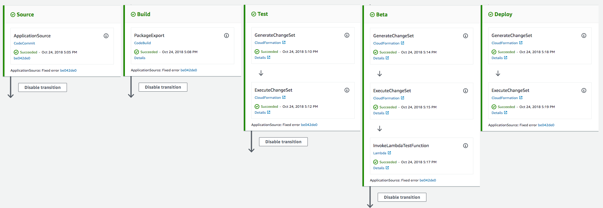

## Environment Setup

다음 각 섹션은 구현 개요와 자세한 단계별 지침을 제공합니다. 개요는 이미 AWS Management Console에 익숙하거나 연습을 거치지 않고 직접 서비스를 탐색하려는 경우 구현을 완료하기에 충분한 컨텍스트를 제공해야합니다.

최신 버전의 Chrome, Firefox 또는 Safari 웹 브라우저를 사용하는 경우 섹션을 펼칠 때까지 단계별 지침이 표시되지 않습니다.

### 1. Seed the `uni-api` CodeCommit Git repository

1. 각 모듈에는 워크샵을 지원하기 위해 CodeStar CodeCommit Git 리포지토리를 시드하는 데 사용되는 해당 소스 코드가 있습니다. CodeCommit Git 리포지토리를 시드하려면 아래에서 해당 지역 의 **Launch Stack** 버튼을 클릭하십시오:

    Region| Launch
    ------|-----
    US East (N. Virginia) | [](https://console.aws.amazon.com/cloudformation/home?region=us-east-1#/stacks/create/review?stackName=Seed-4-MultipleEnvironments&templateURL=https://s3.amazonaws.com/fsd-aws-wildrydes-us-east-1/codecommit-template.yml&param_sourceUrl=https://s3.amazonaws.com/fsd-aws-wildrydes-us-east-1/uni-api-4-v4.zip&param_targetRepositoryName=uni-api&param_targetRepositoryRegion=us-east-1)
    US West (N. California) | [](https://console.aws.amazon.com/cloudformation/home?region=us-west-1#/stacks/create/review?stackName=Seed-4-MultipleEnvironments&templateURL=https://s3.amazonaws.com/fsd-aws-wildrydes-us-west-1/codecommit-template.yml&param_sourceUrl=https://s3-us-west-1.amazonaws.com/fsd-aws-wildrydes-us-west-1/uni-api-4-v4.zip&param_targetRepositoryName=uni-api&param_targetRepositoryRegion=us-west-1)
    US West (Oregon) | [](https://console.aws.amazon.com/cloudformation/home?region=us-west-2#/stacks/create/review?stackName=Seed-4-MultipleEnvironments&templateURL=https://s3.amazonaws.com/fsd-aws-wildrydes-us-west-2/codecommit-template.yml&param_sourceUrl=https://s3-us-west-2.amazonaws.com/fsd-aws-wildrydes-us-west-2/uni-api-4-v4.zip&param_targetRepositoryName=uni-api&param_targetRepositoryRegion=us-west-2)
    EU (Ireland) | [](https://console.aws.amazon.com/cloudformation/home?region=eu-west-1#/stacks/create/review?stackName=Seed-4-MultipleEnvironments&templateURL=https://s3.amazonaws.com/fsd-aws-wildrydes-eu-west-1/codecommit-template.yml&param_sourceUrl=https://s3-eu-west-1.amazonaws.com/fsd-aws-wildrydes-eu-west-1/uni-api-4-v4.zip&param_targetRepositoryName=uni-api&param_targetRepositoryRegion=eu-west-1)
    EU (Frankfurt) | [](https://console.aws.amazon.com/cloudformation/home?region=eu-central-1#/stacks/create/review?stackName=Seed-4-MultipleEnvironments&templateURL=https://s3.amazonaws.com/fsd-aws-wildrydes-eu-central-1/codecommit-template.yml&param_sourceUrl=https://s3-eu-central-1.amazonaws.com/fsd-aws-wildrydes-eu-central-1/uni-api-4-v4.zip&param_targetRepositoryName=uni-api&param_targetRepositoryRegion=eu-central-1)
    Asia Pacific (Sydney) | [](https://console.aws.amazon.com/cloudformation/home?region=ap-southeast-2#/stacks/create/review?stackName=Seed-4-MultipleEnvironments&templateURL=https://s3.amazonaws.com/fsd-aws-wildrydes-ap-southeast-2/codecommit-template.yml&param_sourceUrl=https://s3-ap-southeast-2.amazonaws.com/fsd-aws-wildrydes-ap-southeast-2/uni-api-4-v4.zip&param_targetRepositoryName=uni-api&param_targetRepositoryRegion=ap-southeast-2)


1. CloudFormation 템플릿은이 모듈에 필요한 필드로 미리 채워져 있습니다. 변경할 필요가 없습니다.

1. **I acknowledge that AWS CloudFormation might create IAM resources.** 선택합니다. (CloudFormation에 귀하를 대신하여 IAM 리소스를 생성 할 수있는 권한을 부여한다는 내용입니다.)

1. 브라우저 창의 오른쪽 하단에 있는 **Create** 버튼을 클릭하여 CloudFormation 스택을 생성하고 CodeCommit 리포지토리를 시드하십시오.

    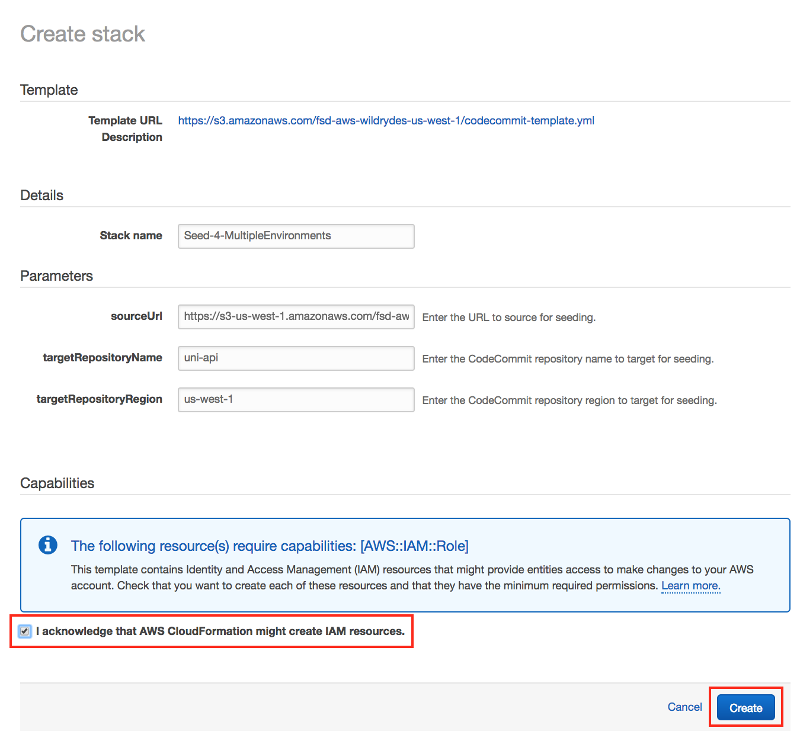

1. Git 리포지토리에 새로운 소스 코드가 시드되면 약간의 지연이 발생합니다. 성공적으로 완료되면 CloudFormation에 Status가  ``CREATE_COMPLETE``로 표시됩니다.

    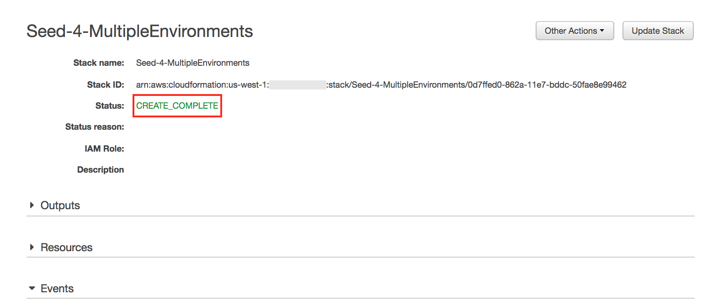

### 2. Fetch CodeCommit Git Repository

CodeCommit Git 리포지토리에 새로운 소스 코드가 시드되었으므로 코드를 수정할 수 있도록 변경 사항을 로컬로 가져와야합니다. 일반적으로 이것은 `git pull` 명령을 사용하여 수행 되지만 워크샵에서는 저장소를 새로운 기록으로 교체했으며 다른 Git 명령이 사용됩니다.

선호하는 Git 클라이언트를 사용하여 로컬 **uni-api** Git 저장소 에서 명령을 실행하십시오 .


* `git fetch --all`
* `git reset --hard origin/master`

### 3. 테스트 스테이지 추가

#### 3a. CodePipeline 수정

1. AWS Management Console에서 **Services** 를 선택한 다음 개발자 도구 에서 **CodeStar** 를 선택하세요.

1. `uni-api` 를 선택합니다.

    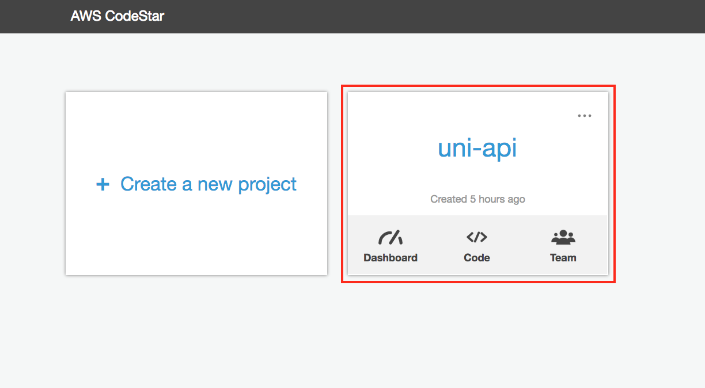

1. 브라우저 오른쪽 **Continuous deployment** 타일의 아래쪽 **AWS CodePipeline details** 클릭하세요. 

    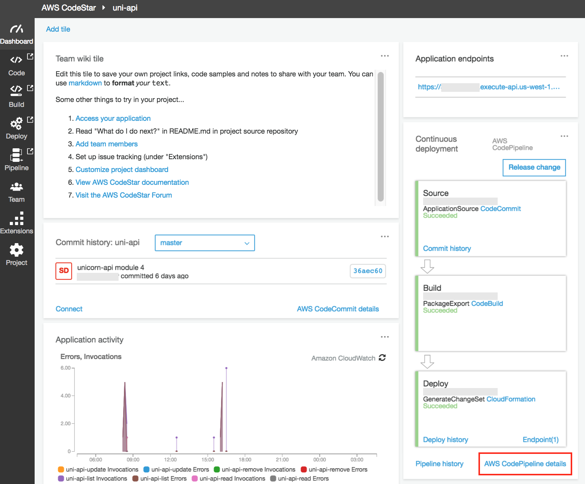

1. CodePipeline 페이지의, **Edit**를 클릭하세요.

#### 3b. Test Stage 추가

1. pipeline의 Build stage의 아래있는 **+Stage** 선택하세요.

   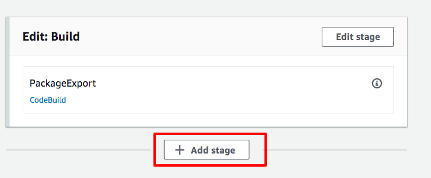

1.  **Stage Name**에 `Test` 를 입력하세요.

#### 3c. Test Stage의 GenerateChangeSet Action 추가 

1. `Test` 아래 `+ Add action group`를 선택하세요.

1. In the **Add action group** 다이얼로그의,  **Action name**에 `GenerateChangeSet` 를 입력하세요.

1. **Action provider**에 `AWS CloudFormation` 선택하세요.

1. **Input artifacts** 에 `uni-api-BuildArtifact`를 선택하세요.
1. **Action mode**의 `Create or replace a change set`을 선택하세요.
1. **Stack name**에 `awscodestar-uni-api-lambda-test`을 입력하세요. 

1. **Change set name**에 `pipeline-changeset` 입력하세요. 

1. **Template**의 Artifact name 에 `uni-api-BuildArtifact` **File name**에 `test-template-export.yml`를 입력하세요. ( **Template file path**에 `uni-api-BuildArtifact::test-template-export.yml`완성되어있습니다. )

1. **Template configuration** 을 활성화합니다. 
1. **Artifact name**에 `uni-api-BuildArtifact`를 선택 **file name** 에 `template-configuration.json`를 입력하세요.  ( **Template configuration file path**에 `uni-api-BuildArtifact::test-template-configuration.json`완성되어있습니다. )


1. **Capabilities**에 `CAPABILITY_NAMED_IAM`를 선택하세요. 

1. **Role name**에 돋보기를 선택하시면  `CodeStarWorker-uni-api-CloudFormation` 의 arn이 나옵니다. 해당 내용을 선택하세요.

1. **Advanced** 섹션을 확장한다음 Parameter에 `{"ProjectId":"uni-api", "CodeDeployRole":"arn:aws:iam::YOUR_ACCOUNT_NUMBER:role/CodeStarWorker-uni-api-CodeDeploy"}`를 입력하여 덮어쓰세요. **YOUR_ACCOUNT_NUMBER** 엔 당신의 AWS계정넘버를 입력하세요..


1. **Save**를 선택합니다.

   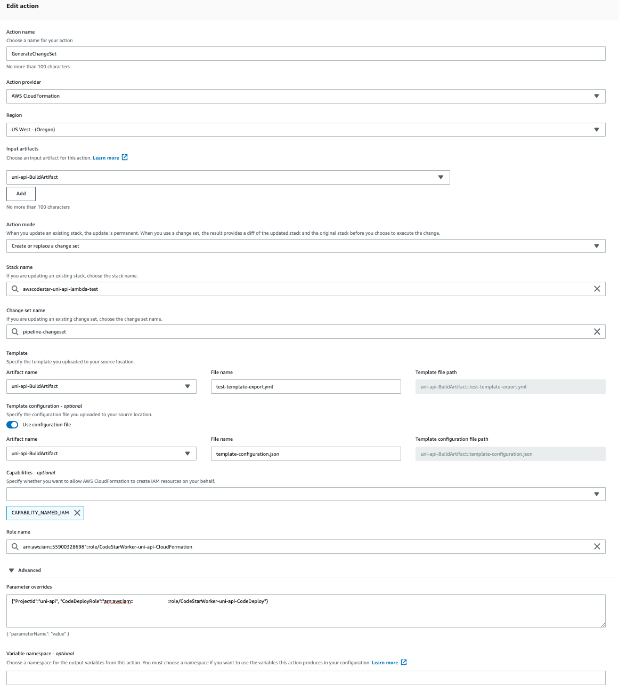

#### 3. Test Stage의 ExecuteChangeSet Action 추가 

1. `GenerateChangeSet`아래 `+ Add action group`를 선택합니다.

   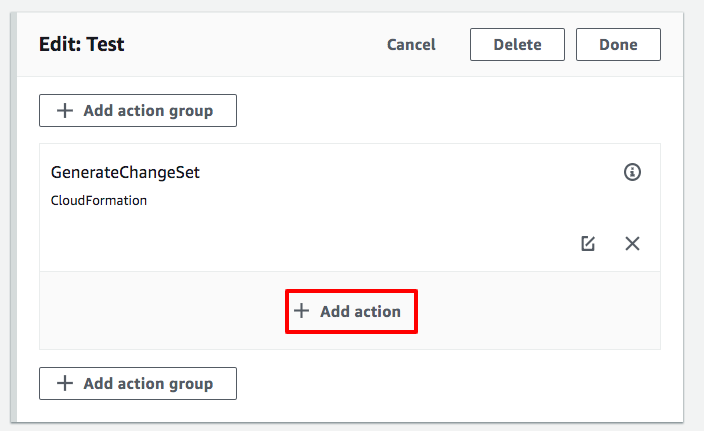

1. **Add action group** 다이얼로그의, **Action name** 에`ExecuteChangeSet`를 입력합니다. 

1. **Action provider**의 `AWS CloudFormation`를 선택합니다.

1. **Input artifacts**를 `uni-api-BuildArtifact`를 선택합니다.

1. **Action mode**의 `Execute a change set`를 선택합니다. 

1. **Stack name**의 `awscodestar-uni-api-lambda-test`를 입력합니다. 

1. **Change set name**에 `pipeline-changeset`를 입력합니다. 

   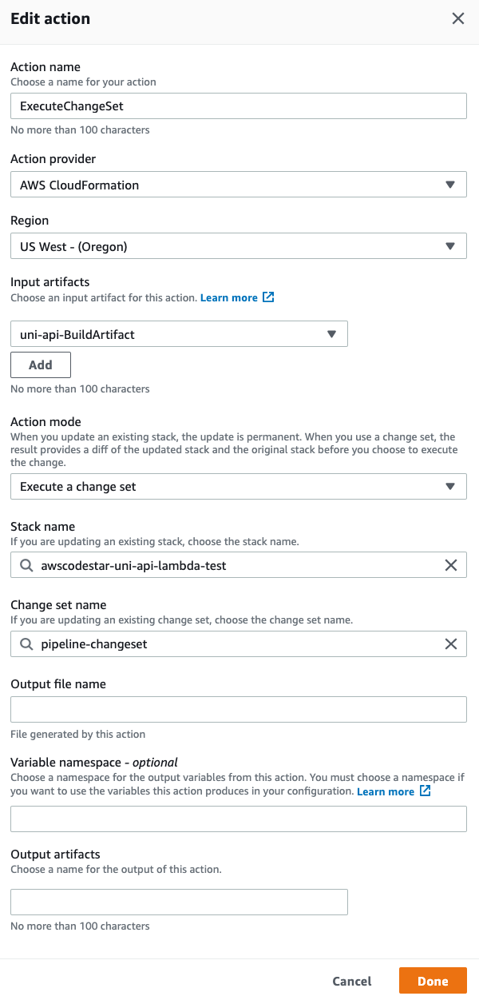

1. **Save**를 선택합니다. 

1. 오른쪽 상단의 **Done** 을 누릅니다.

#### 3e. CodePipeline 변경사항 저장

파이프 라인은 새 테스트 단계를 추가 한 후 다음 스크린 샷과 같아야합니다.

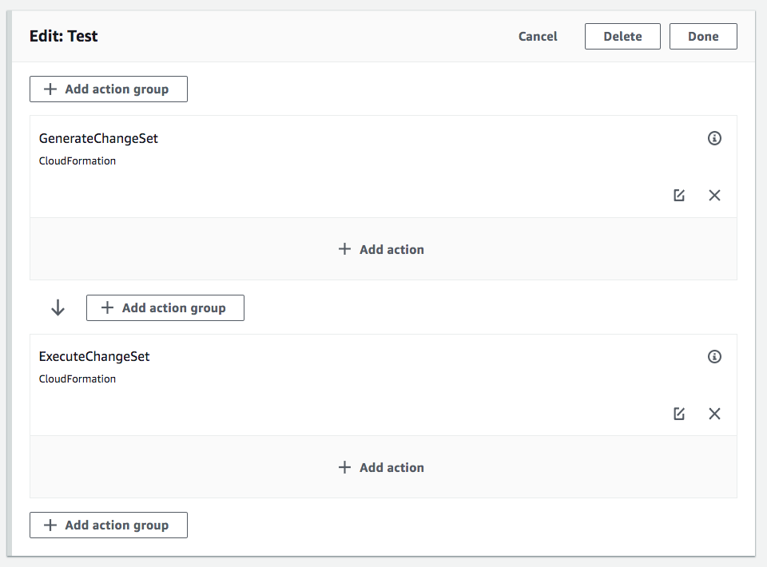

1. pipeline을 스크롤하여 위쪽의 `Save`를 선택합니다.

1. Save Pipeline Changes dialog가 표시되면 `Save`를 선택합니다. 


## Test Stage Validation

테스트 단계 추가가 완료되었습니다. 이제 파이프 라인 실행을 트리거 한 다음 파이프 라인 완료를 모니터링하여 테스트 단계가 작동 중인지 확인합니다.

### 1. Release Change

1. **Release change** 버튼을 선택하여 파이프 라인을 시작하십시오.

1. 대화상자가 표시되면 **Release** 를 선택하세요.

### 2. CodePipeline Completion 확인

1. AWS Management Console에서 **Services** 를 선택한 다음 개발자 도구 에서 **CodePipeline** 를 선택하세요.

1. pipelines 리스트의 `uni-api-Pipeline`를 선택하세요.

1. 각 단계의 색상은 실행 중 파란색으로 바뀌고 완료되면 녹색으로 바뀝니다. 모든 단계가 성공적으로 실행되면 파이프 라인은 다음 스크린 샷과 같아야합니다.

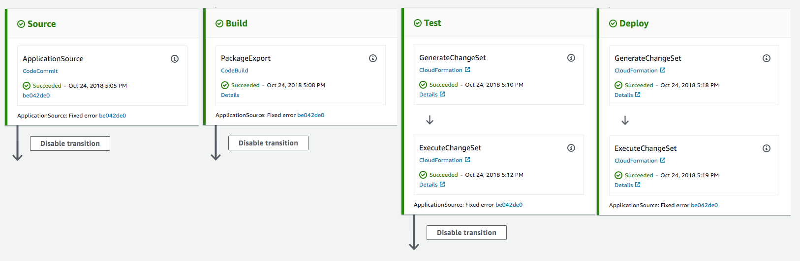

## Beta Stage Addition

### 1. Beta Stage 추가하기.

#### 1a. CodePipeline 수정

1. AWS Management Console에서 **Services** 를 선택한 다음 개발자 도구 에서 **CodeStar** 를 선택하세요.


1. `uni-api` project 를 선택합니다. 

    

1. 브라우저 창의 오른쪽에 있는 **Continuous deployment** 아래에 **AWS CodePipeline details** 링크를 클릭합니다.

    

1. CodePipeline 페이지의 **Edit**를 클릭합니다.

#### 1b. Beta Stage 추가

1. pipeline의 Test stage 아래있는 `+Stage` 선택합니다.

   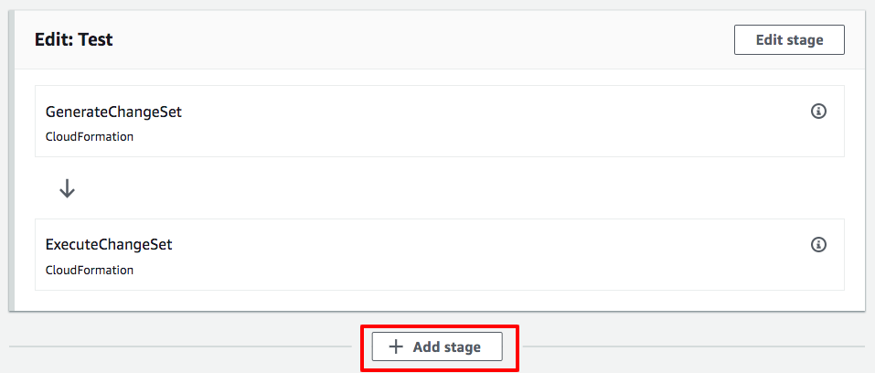

1. **Stage Name**에 `Beta` 를 입력합니다.

#### 1c. Beta Stage의 GenerateChangeSet 추가 

1. `Beta`아래 `+ Add action group`을 선택합니다.  .

1. **Add action** dialog의 **Action name**에 `GenerateChangeSet`를 입력합니다.

1. **Action provider**의 `AWS CloudFormation`을 선택합니다.
1. **Input artifacts**의 `uni-api-buildartifact`를 선택합니다.

1. **Action mode**의 `Create or replace a change set`을 선택합니다. 

1. **Stack name**에 `awscodestar-uni-api-lambda-beta` 를 입력합니다. 

1. **Change set name**에 `pipeline-changeset`를 입력합니다. 

1. **Template**의 Artifact name 에 `uni-api-BuildArtifact` **File name**에 `test-template-export.yml`를 입력하세요. ( **Template file path**에 `uni-api-BuildArtifact::test-template-export.yml`완성되어있습니다. )

1. **Template configuration** 을 활성화합니다. 
1. **Artifact name**에 `uni-api-BuildArtifact`를 선택 **file name** 에 `template-configuration.json`를 입력하세요.  ( **Template configuration file path**에 `uni-api-BuildArtifact::test-template-configuration.json`완성되어있습니다. )


 
1. **Role name**에 `CodeStarWorker-uni-api-CloudFormation`를 입력합니다. 

1. **Advanced** 섹션을 확장한 후 **Parameter overrides**에  `{"ProjectId":"uni-api", "CodeDeployRole":"arn:aws:iam::YOUR_ACCOUNT_NUMBER:role/CodeStarWorker-uni-api-CodeDeploy", "CustomSuffix": "-beta" }`를 입력합니다. 

1. **Input artifacts #1**에 `uni-api-BuildArtifact` 를 입력합니다. 

1. **Save**를 선택합니다.

   

#### 1d. Beta Stage의 ExecuteChangeSet 추가

1. `GenerateChangeSet`아래 `+ Add action group` 를 선택합니다.

   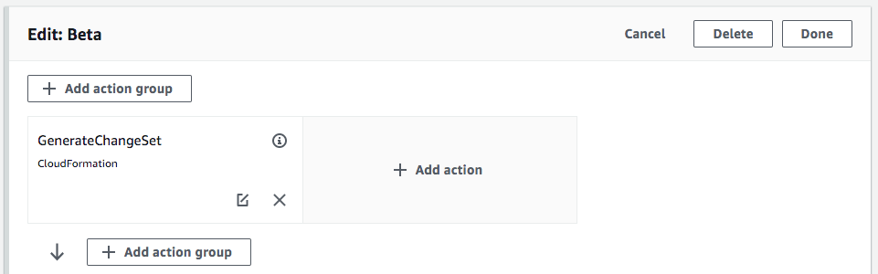

1. **Add action** dialog의 , **Action name**에 `ExecuteChangeSet`을 입력하세요.

1.  **Action provider**의 `AWS CloudFormation`를 선택하세요.

1. **Action mode**의 `Execute a change set`를 선택하세요. 
1. **Input artifacts**의 `uni-api-buildartifact`를 선택하세요.
1. **Stack name**에 `awscodestar-uni-api-lambda-beta` 를 입력하세요. 

1. **Change set name**에 `pipeline-changeset` 를 입력하세요. 

1. **Save**를 선택하세요. 

   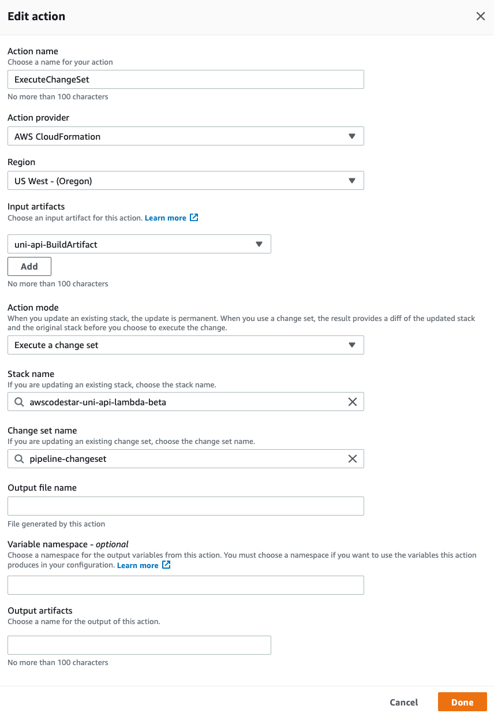

#### 1e. Beta Stage Invoke 추가

1. `ExecuteChangeSet`아래 `+ Add action group` 를 선택하세요.

   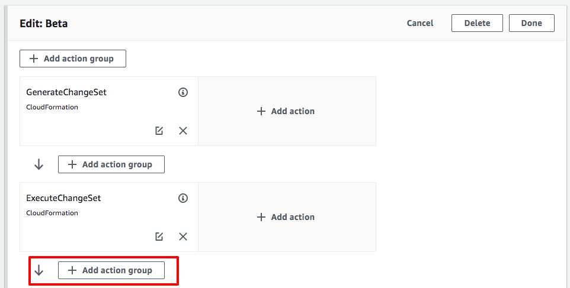

1. **Add action** dialog의 , **Action name**에 `InvokeLambdaTestFunction` 입력하세요. .

1. **Action provider**의 `AWS Lambda` 선택하세요.

1. **Function name**에 `uni-api-test-setup` 를 입력하세요.

1. **User parameters**에 `awscodestar-uni-api-lambda-beta` 를 입력하세요.

1. **Save**를 선택하세요.

1. stage의 위 오른쪽 구석의 **Done** 을 선택하세요.
 
   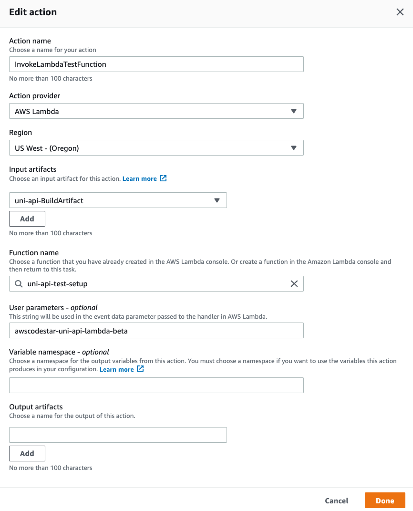

#### 1f. CodePipeline 변경사항 저장

The pipeline은 새 테스트 단계를 추가 한 후 다음 스크린 샷과 같아야합니다.

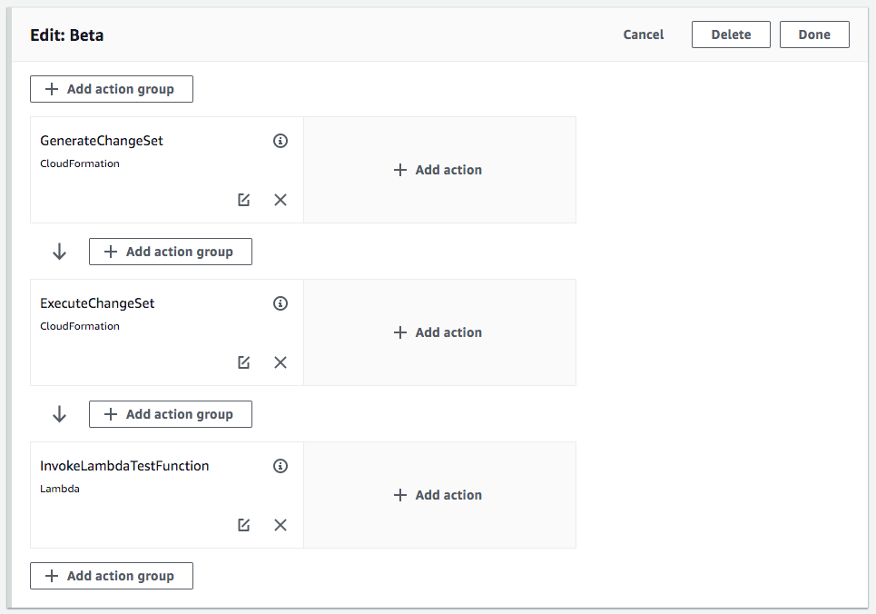

1. pipeline의 스크롤을 위쪽으로 올려 `Save`를 선택하세요.

1. Save Pipeline Changes dialog가 표시되면 `Save`를 선택하세요.

## Beta Stage 검증

베타 단계 추가가 완료되었습니다. 이제 현재 변경 사항의 릴리스를 트리거하여 베타 단계가 작동하는지 확인합니다.

### 1. Release Change

1. **Release change** 을 눌러서 pipeline을 시작하세요.

1. 대화상자가 표시되면 **Release** when prompted by the dialog box.
를 선택하세요.

### 2. Confirm CodePipeline Completion

1. AWS Management Console에서 **Services** 를 선택한 다음 개발자 도구 에서 **CodePipeline** 를 선택하세요.

1. pipelines 리스트의 `uni-api-Pipeline` 를 선택하세요.

1. 각 단계의 색상은 실행 중 파란색으로 바뀌고 완료되면 녹색으로 바뀝니다. 다음 이미지와 같이 `Beta` 스테이지 의 `InvokeLambdaTestFunction` 작업이 실패해서 빨간색으로 표시되었습니다.

   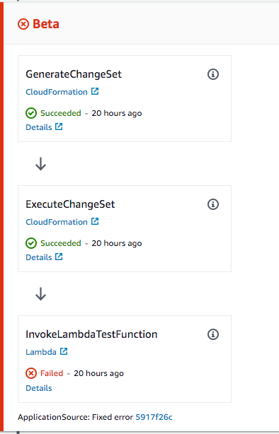

1. 실패한 작업의 세부 사항을 보려면 실패한 조치에서 **Details**  링크를 선택 하십시오.

   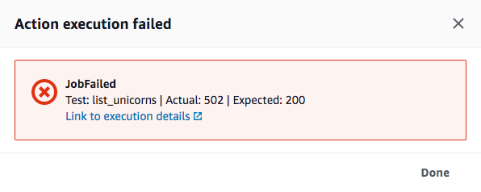

 `test_list_unicorns`통합 테스트에 실패했습니다! 다음으로 버그를 찾아 수정하겠습니다.

## Remediation

### 1. Fix Code Bug

1.  워크 스테이션에서 `uni-api/app/list.js` 파일을 열고 17번 행으로 이동하세요.아래의 code snippet을 참조하세요:

   ```
   docClient.scan(params, function(error, data) {
     // Comment or Delete the following line of code to remove simulated error
     error = Error("something is wrong");
   ```

1. Line 17 을 주석처리하거나 삭제하여 버그를 고치십시오.

1. `uni-api/app/list.js` 파일을 저장합니다..

### 2. Commit the change to local Git repository

1. Git 클라이언트를 사용하여 Git 인덱스에 로컬 변경 사항을 추가하고 메시지로 커밋하십시오. 예를 들면:

    ```
    git add -u
    git commit -m "Fix bug"
    ```

1. Git 클라이언트를 사용하여 Git 저장소 업데이트를 오리진으로 푸시하십시오. 예를 들면:

    ```
    git push origin
    ```

## Remediation Validation

1. AWS Management Console에서 **Services** 를 선택한 다음 개발자 도구 에서 **CodePipeline** 를 선택하세요.

1. pipelines의 `uni-api-Pipeline` 을 선택하세요..

1. 각 단계의 색상은 실행 중 파란색으로 바뀌고 완료되면 녹색으로 바뀝니다.  `Beta`스테이지의 `InvokeLambdaTestFunction` 가 통과하였습니다. 왜냐하면 스테이지가 녹색이잖아요. 아래 이미지를 참조하세요;.

   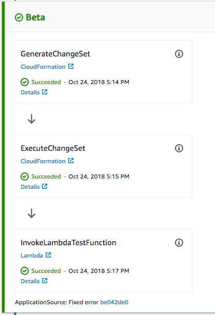

모든 단계가 성공적으로 실행되면 파이프 라인은 다음 스크린 샷과 같아야합니다.

   

## Completion

축하합니다!!!! 다중 환경 CI / CD 파이프 라인 모듈을 성공적으로 완료했습니다!