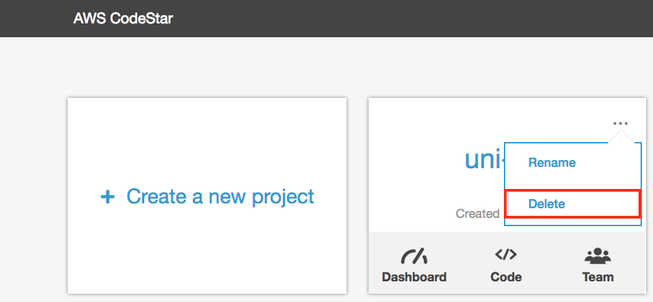
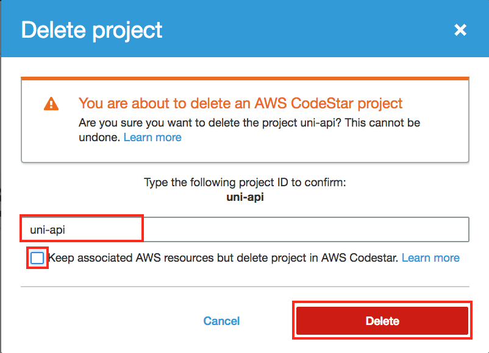

# Workshop Cleanup

이 페이지는 이전 모듈 중에 생성 된 리소스를 정리하는 지침을 제공합니다.

## Resource Cleanup Instructions

### 1. CodeStar Project 삭제

1. AWS Management Console 의 **Services** 의 Developer Tools 아래 **CodeStar** 를 선택합니다.

1.  `uni-api` project에서  **...** icon 을 선택하고 **Delete**를 선택합니다..

    

1.  `uni-api`의 project ID를 확인란에 입력하고, CloudFormation resources 삭제 체크박스를 **Unselect** 한 후 , **Delete**를 선택합니다..

    

### 1. CloudFormation CodeCommit Seed Stacks 삭제

1. AWS Management Console 의 **Services** 의 Developer Tools 아래 **CloudFormation** 를 선택합니다.

1. 다음 CloudFormation 스택 각각에 대해 다음 단계를 반복하십시오.:

    * **Seed-1-ServerlessApplicationModel**
    * **Seed-2-ContinuousDelivery**
    * **Seed-3-XRay**
    *  **Seed-4-MultipleEnvironments**

    a. 스택의 왼쪽 확인란을 클릭합니다.
    
    b. 스택 목록 위에서 작업 드롭 다운 메뉴를 선택하십시오.
    
    c. **Delete Stack** 선택합니다.
    
    d. **Yes, Delete** 선택합니다.

### 1. CodeStar Project S3 Bucket 삭제

1. AWS Management Console 의 **Services** 의 Developer Tools 아래 **S3** 를 선택합니다.

1.  `uni-api`의 filter-checkbox를 선택합니다.

1. 해당 포맷=> format: `aws-codestar-{AWS::Region}-{AWS::AccountId}-uni-api-pipe`과 일치하는 S3버켓을 선택합니다.

1. Bucket 목록 상단의 **Delete Bucket** 을 클릭하십시오.

1. Bucket이름을 입력하여 삭제를 확인하고 **Confirm**를 선택하십시오.
