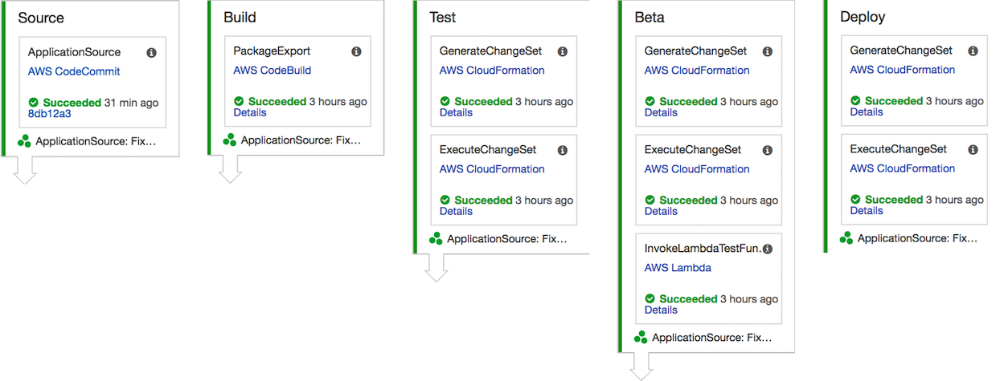

# Serverless 데브 옵스 워크샵

이 워크샵에서는 사용자가 Wild Rydes Unicorn Stable을 관리할 수 있는 RESTful API를 배포합니다. [SAM (Serverless Application Model)](https://github.com/awslabs/serverless-application-model)을 사용하여 API 인터페이스, 비즈니스 로직 및 데이터베이스를 AWS 계정에 배포합니다. RESTful API를 사용하면 Wild Rydes의 유니콘을 list, create, view, update, 및 delete 할 수 있습니다.

애플리케이션 아키텍처는 [AWS Lambda](https://aws.amazon.com/lambda/), [Amazon API Gateway](https://aws.amazon.com/api-gateway/) 및 [Amazon DynamoDB](https://aws.amazon.com/dynamodb/)를 사용합니다. API는 DynamoDB를 unicorns 데이터의 영구 데이터 저장소로 사용하여 Lambda 및 API Gateway를 사용하여 구축됩니다.

API 아키텍처에 대한 설명은 아래 다이어그램을 참조하십시오.

DevOps Continuous Delivery Pipeline은 [AWS CodePipeline](https://aws.amazon.com/codepipeline/), [AWS CodeBuild](https://aws.amazon.com/codebuild/) 및 [Amazon S3](https://aws.amazon.com/s3/)을 포함합니다. CodePipeline은 코드 변경 사항을 빌드, 테스트 및 배포하는 단계를 오케스트레이션합니다. CodeBuild는 소스 코드를 컴파일하고 테스트를 실행하며 환경에 배포할 준비가 된 소프트웨어의 패키지를 생성합니다.

<!--
See the screenshot below for a depiction of the continuous delivery pipeline that you will build at the completion of Module 4.

-->

작업을 시작하려면 [CodeStar Project](0_CodeStar) 모듈 페이지를 방문하여 워크샵을 시작하십시오.

## 전제 조건

### AWS 계정

이 워크숍을 마치려면 AWS IAM, S3, DynamoDB, Lambda, API Gateway, CodePipeline 및 CodeBuild 리소스를 생성 할 수있는 AWS 계정이 필요합니다. 이 워크샵은 한 번에 한 명의 참가자가 하나의 AWS 계정을 사용한다고 가정합니다. 다른 참가자와 계정을 공유할 경우 특정 리소스에 대한 이름 충돌이 발생합니다. 리소스 이름에 접미사를 사용하거나 별개의 리전을 사용하여이 문제를 해결할 수 있지만, 이러한 내용은 워크샵 지침에 포함되지 않습니다.

계정 생성기간이 12개월 미만인 경우, 이 워크샵에 필요한 일부 리소스를 프리티어로 사용하실 수 있습니다. 자세한 내용은 [AWS Free Tier page](https://aws.amazon.com/free/)를 참조하십시오.

### AWS 명령 줄 인터페이스

이 워크숍의 첫 번째 모듈을 완료하려면 로컬 컴퓨터에 AWS CLI(Command Line Interface)를 설치해야 합니다. CLI를 사용하여 객체를 S3 웹 사이트 버킷으로 복사합니다.

[AWS CLI Getting Started](http://docs.aws.amazon.com/cli/latest/userguide/cli-chap-getting-set-up.html) 안내서에 따라 시스템에 CLI를 설치하고 구성합니다.

### 브라우저

웹 응용 프로그램 UI를 테스트할 때는 최신 버전의 Chrome 또는 Firefox를 사용하는 것이 좋습니다.

### 텍스트 에디터

Configuration 파일을 약간 업데이트하려면 로컬 텍스트 편집기가 필요합니다.

## 모듈

이 워크샵은 여러 모듈로 나뉩니다. 다음으로 진행하기 전에 각 모듈을 완료해야 합니다.

0. [CodeStar Project](0_CodeStar)
1. [Serverless Application Model (SAM)](1_ServerlessApplicationModel)
2. [Continuous Delivery Pipeline](2_ContinuousDeliveryPipeline)
3. [AWS X-Ray Integration](3_XRay)

<!--
4. [Multiple Environment CI/CD Pipeline](4_MultipleEnvironments)
-->

워크샵을 완료한 후에는 [cleanup guide](9_CleanUp)에 따라 생성된 모든 리소스를 삭제할 수 있습니다.