# 모듈 : AWS Step Functions 으로 서버리스 이미지 처리 워크 플로우 생성 

이 모듈에서는 AWS Step Functions을 사용하여 여러 AWS Lambda 함수를 오케스트레이션하여 이미지 처리 워크 플로우를 구축해봅니다. 

Wild Rydes 팀은 가입 후 라이더가 셀카를 업로드하도록 하여 앱에 새로운 기능을 추가하려고합니다. 그리고 이를 통해 다음과 같이 개선합니다. 

1. 유니콘이 픽업 중에 탑승자를 쉽게 식별 할 수 있도록 하여 높은 고객 경험을 제공합니다. 또한 보안을 강화하여 악의적인 사람이 라이더가 되어 유니콘을 타지 못하게 할 수 있습니다.
1. 동일한 사용자가 여러 계정에 가입하여 신규 사용자 프로모션을 남용하지 못하게 합니다.


사용자가 자신의 사진을 업로드 할 때는 몇 가지 확인 및 처리 단계를 수행해야합니다.

1. 사진이 앱/유니콘이 라이더를 식별하는 데 사용할 수 있는 깨끗한 얼굴인지 확인합니다.
1. 사용자가 아직 가입하지 않았는지 확인하기 위해 기존의 컬렉션과 비교합니다. 
1. 앱에 표시 할 사진용 썸네일로 사진의 크기를 조정합니다.  
1. 사용자의 얼굴을 컬렉션에 색인하여 나중에 인식하는게 사용할 수 있도록 합니다. 
1. 사용자 프로필과 함께 사진 메타 데이터를 저장합니다. 

서버리스 환경에서는 위의 각 단계를 AWS Lambda 함수로 쉽게 구현할 수 있습니다. 그러나 이전 단계가 완료된 후 다음 Lambda 함수를 호출하도록 하는 흐름을 어떻게 관리하고 추적할 수 있을까요? Lambda 함수 중 하나가 시간 초과되어 다시 시도해야하는 경우 어떻게 할까요? 일부 Lambda 함수는 병렬로 실행하여 종단 간 처리 지연 시간을 줄일 수 있는데, 실행중인 Lambda 함수를 병렬로 조정하고 완료 될 때까지 어떻게 대기시킬 수 있을까요? AWS Step Functions를 사용하면 이러한 문제를 매우 쉽게 해결할 수 있으며 감사 흐름 및 시각화 기능을 제공하여 각 흐름에서 발생한 상황을 추적 할 수 있습니다.

## 아키텍처 개요
이 모듈의 아키텍처는 **Amazon Rekognition**의 얼굴 감지 기능을 활용하고 **Amazon S3**에 저장된 업로드 된 이미지의 크기를 조정하고 **Amazon DynamoDB**를 사용하여 사용자 프로필로 이미지 메타 데이터를 저장하는 여러 AWS Lambda 함수로 구성됩니다. 이러한 Lambda 함수의 오케스트레이션은 **AWS Step Functions** 상태 시스템에서 관리합니다.

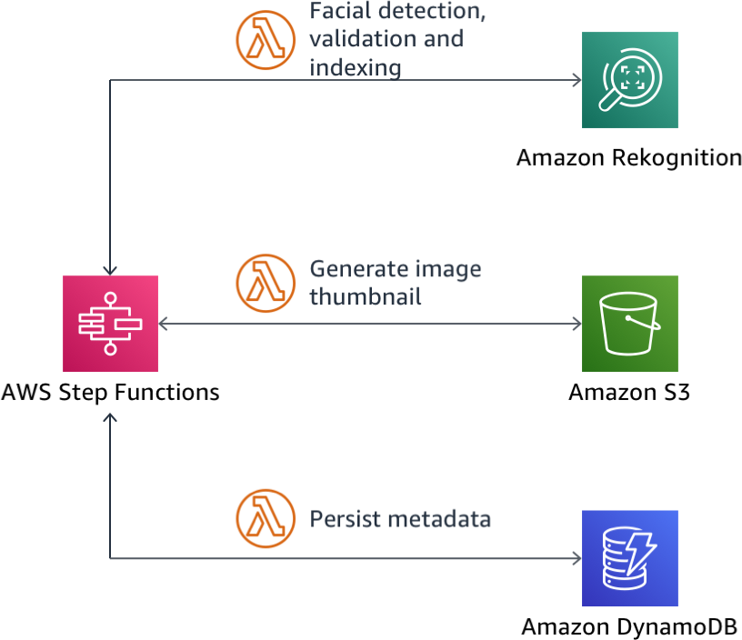

다음은 **AWS Step Functions**에서 시각화한대로 구축할 워크플로의 흐름도입니다.

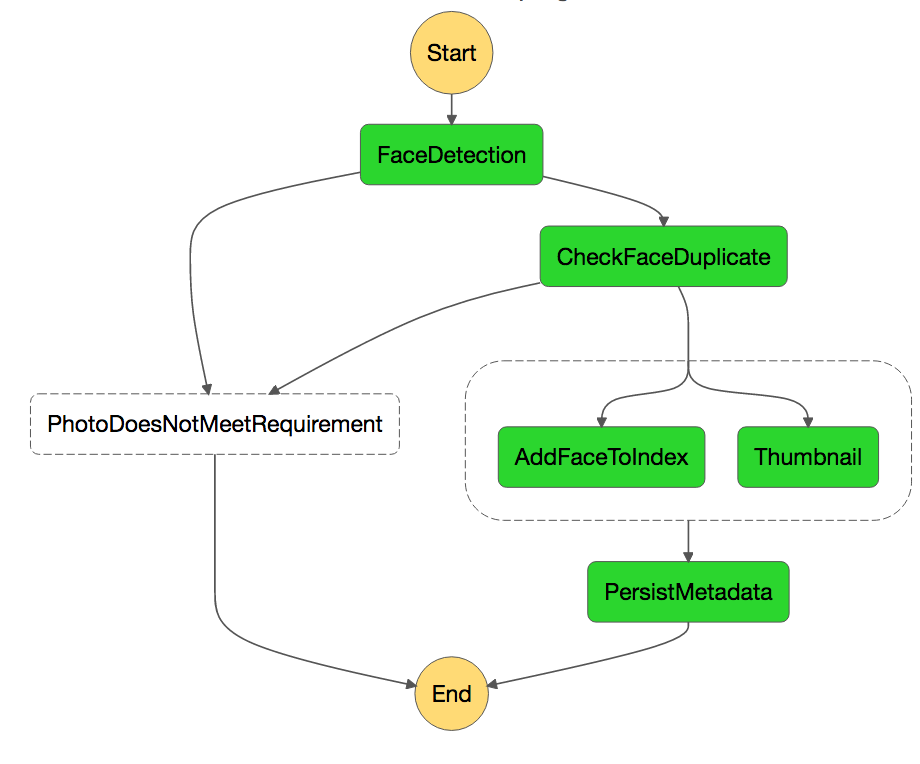

이 모듈에서는 AWS Step Functions 관리 콘솔에서 처리 워크 플로를 수동으로 시작합니다. 실제 애플리케이션에서 애플리케이션이 Step Functions 상태 머신을 트리거하도록 호출하거나 Amazon CloudWatch Events 또는 S3 이벤트 알림을 통해 Amazon S3 업로드 이벤트에 의해 트리거되도록 Amazon API Gateway를 구성 할 수 있습니다.

## 구현 지침

다음 각 섹션은 구현 개요와 자세한 단계별 지침을 제공합니다. 이 개요는 이미 AWS Management Console에 익숙하거나 연습을 거치지 않고 직접 서비스를 탐색하려는 경우 구현을 완료하기에 충분한 컨텍스트를 제공할 수 있어야 합니다. 

최신 버전의 Chrome, Firefox 또는 Safari 웹 브라우저를 사용하는 경우 섹션을 펼칠 때까지 단계별 지침이 표시되지 않습니다.
 
</p></details>
 
### 1. Amazon Rekognition에서 컬렉션 생성
얼굴 컬렉션은 인덱스된 얼굴 이미지를 검색 가능한 벡터로 저장하기위한 Amazon Rekognition의 컨테이너입니다.

AWS Command Line Interface를 사용하여 Amazon Rekognition에서 `rider-photos` 라는 컬렉션을 생성합니다. 

<details>
<summary><strong>단계별 지침 (expand for details)</strong></summary><p>

1. 터미널 창에서 다음 명령을 실행하고 `REPLACE_WITH_YOUR_CHOSEN_AWS_REGION` 부분을 선택한 지역의 지역 문자열로 바꿉니다.([Rekognition 지역](http://docs.aws.amazon.com/general/latest/gr/rande.html#rekognition_region) 참조)

		aws rekognition create-collection --region REPLACE_WITH_YOUR_CHOSEN_AWS_REGION --collection-id rider-photos
	
	예 :
	
		aws rekognition create-collection --region us-east-1 --collection-id rider-photos
		aws rekognition create-collection --region us-west-2 --collection-id rider-photos
		aws rekognition create-collection --region eu-west-1 --collection-id rider-photos
	
	
2. 명령어 수행이 정상적으로 완료되면, 서비스에서 다음과 같은 결과를 받아야합니다. : 

	```JSON
	{
    	"CollectionArn": "aws:rekognition:us-west-2:012345678912:collection/rider-photos",
    	"StatusCode": 200
	}
	```
</p></details>


### 2. AWS CloudFormation을 사용하여 Amazon S3, AWS Lambda 및 Amazon DynamoDB 리소스 배포

다음 AWS CloudFormation 템플릿은 이러한 리소스를 생성합니다.

* 두 개의 Amazon S3 버킷 :
	* **RiderPhotoS3Bucket**은 라이더가 업로드 한 사진을 저장합니다
	* 몇 가지 테스트 이미지가 **RiderPhotoS3Bucket** 버킷에 복사됩니다.
	* **ThumbnailS3Bucket**은 라이더 사진의 크기가 조정 된 썸네일을 저장합니다.
* 라이더 프로필과 함께 라이더 사진의 메타 데이터를 저장하는 하나의 Amazon DynamoDB 테이블 **RiderPhotoDDBTable**
* 처리 단계를 수행하는 AWS Lambda 함수
* Step Functions 상태 머신에 람다 함수를 호출하는 IAM 역할 **StateMachineRole**

선택한 지역의 링크를 클릭하십시오 :

Region| Code | Launch
------|------|-------
US East (Ohio)| <span style="font-family:'Courier';">us-east-2</span> | [](https://console.aws.amazon.com/cloudformation/home?region=us-east-2#/stacks/new?stackName=wildrydes-step-module-resources&templateURL=https://s3-us-east-2.amazonaws.com/wildrydes-us-east-2/ImageProcessing/setup-sam.yaml)
US East (N. Virginia) | <span style="font-family:'Courier';">us-east-1</span> | [](https://console.aws.amazon.com/cloudformation/home?region=us-east-1#/stacks/new?stackName=wildrydes-step-module-resources&templateURL=https://s3.amazonaws.com/wildrydes-us-east-1/ImageProcessing/setup-sam.yaml)
US West (Oregon) | <span style="font-family:'Courier';">us-west-2</span> | [](https://console.aws.amazon.com/cloudformation/home?region=us-west-2#/stacks/new?stackName=wildrydes-step-module-resources&templateURL=https://s3-us-west-2.amazonaws.com/wildrydes-us-west-2/ImageProcessing/setup-sam.yaml)
EU (Ireland) | <span style="font-family:'Courier';">eu-west-1</span> | [](https://console.aws.amazon.com/cloudformation/home?region=eu-west-1#/stacks/new?stackName=wildrydes-step-module-resources&templateURL=https://s3-eu-west-1.amazonaws.com/wildrydes-eu-west-1/ImageProcessing/setup-sam.yaml)
Asia Pacific (Mumbai) | <span style="font-family:'Courier';">ap-south-1</span> | [](https://console.aws.amazon.com/cloudformation/home?region=ap-south-1#/stacks/new?stackName=wildrydes-step-module-resources&templateURL=https://s3-ap-south-1.amazonaws.com/wildrydes-ap-south-1/ImageProcessing/setup-sam.yaml)
Asia Pacific (Seoul) | <span style="font-family:'Courier';">ap-northeast-2</span> | [](https://console.aws.amazon.com/cloudformation/home?region=ap-northeast-2#/stacks/new?stackName=wildrydes-step-module-resources&templateURL=https://s3-ap-northeast-2.amazonaws.com/wildrydes-ap-northeast-2/ImageProcessing/setup-sam.yaml)
Asia Pacific (Tokyo) | <span style="font-family:'Courier';">ap-northeast-1</span> | [](https://console.aws.amazon.com/cloudformation/home?region=ap-northeast-1#/stacks/new?stackName=wildrydes-step-module-resources&templateURL=https://s3-ap-northeast-1.amazonaws.com/wildrydes-ap-northeast-1/ImageProcessing/setup-sam.yaml)
Asia Pacific (Sydney) | <span style="font-family:'Courier';">ap-southeast-2</span> | [](https://console.aws.amazon.com/cloudformation/home?region=ap-southeast-2#/stacks/new?stackName=wildrydes-step-module-resources&templateURL=https://s3-ap-southeast-2.amazonaws.com/wildrydes-ap-southeast-2/ImageProcessing/setup-sam.yaml)

<details>
<summary><strong>AWS CloudFormation 시작 지침 (expand for details)</strong></summary><p>

1. 선택한 지역에 대해 위의 **Launch Stack** 링크를 클릭합니다. 

1. 템플릿 선택 페이지에서 **Next**을 클릭합니다.

1. 세부 사항 지정 페이지에서 모든 기본값을 그대로두고 **Next**을 클릭합니다.

1. 옵션 페이지에서 모든 기본값을 그대로두고 **Next**을 클릭합니다.

1. Review (검토) 페이지에서 확인란을 클릭하여 **"create IAM resources"**, **"create IAM resources with custom names"** 및 **"CAPABILITY_AUTO_EXPAND"** 에 대한 AWS CloudFormation 권한을 부여합니다.

1. 변환 섹션에서 **"Create Stack"** 을 클릭합니다.

1. `wildrydes-step-module-resources` 스택이 `CREATE_COMPLETE` 상태에 도달 할 때까지 기다립니다.

1. `wildrydes-step-module-resources` 스택이 선택된 상태에서 **Outputs** 탭을 클릭합니다. 이러한 리소스는 이후 단계에서 참조될 예정입니다.

</p></details>

> 나중에 쉽게 액세스 할 수 있도록 CloudFormation 스택의 **Outputs** 탭 내용을 별도의 텍스트 편집기로 복사해 놓으면 유용합니다. 

### 3. 초기 AWS Step Functions 상태 머신 생성

라이더가 사진을 업로드 한 후 처리 파이프 라인에서 가장 먼저해야 할 일은 사진에 인식 가능한 얼굴이 있는지 확인하기 위해 얼굴 감지 알고리즘을 실행하는 것입니다 (사진에 얼굴이 없거나 여러명일 경우 식별이 어려움) 또한 라이더를 인식하고 얼굴에 선글라스를 착용했는지 (라이더를 식별하기가 더 어려워 짐) 등을 확인합니다. 
이러한 유효성 검사에 실패하면 사용자에게 알리고 워크 플로를 종료하게 됩니다.

**Amazon Rekognition** 딥 러닝 기반 이미지 분석 API를 활용하여이 확인을 구현하는 AWS Lambda 함수는 이전 단계에서 AWS CloudFormation에 의해 이미 배포되었습니다. Lambda 함수의 ARN는 **Outputs** 섹션의 `FaceDetectionFunctionArn` 을 확인하십시오.

유효성 검사가 실패 할 때 호출되는 AWS Lambda 함수는 AWS CloudFormation에서 배포 한 `NotificationPlaceholderFunction`  입니다. 이 단계의 목적은 사용자에게 사진 유효성 검사 실패 및 오류 이유를 알리고 다른 사진을 업로드 할 수 있도록하는 것입니다. 현재는 실제로 메시지를 보내는 대신 메시지를 준비하는 스탭 구현을 실습합니다.

이제 초기 얼굴 감지 단계로 AWS Step Functions 상태 머신을 생성 할 수 있습니다.

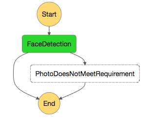

<details>
<summary><strong>단계별 지침 (expand for details)</strong></summary><p>

1. AWS Step Functions 상태 머신 흐름은 JSON 문서로 정의됩니다. 자주 사용하는 텍스트 편집기에서 `rider-photo-state-machine.json`이라는 파일을 만듭니다.

1. 다음을 복사하여 JSON 파일에 붙여 넣습니다.

	```JSON
	{
	  "Comment": "Rider photo processing workflow",
	  "StartAt": "FaceDetection",
	  "States": {
	    "FaceDetection": {
	      "Type": "Task",
	      "Resource": "REPLACE_WITH_FaceDetectionFunctionArn",
	      "ResultPath": "$.detectedFaceDetails",
	      "End": true,
	      "Catch": [
	        {
	          "ErrorEquals": [
	            "PhotoDoesNotMeetRequirementError"
	          ],
	          "ResultPath": "$.errorInfo",
	          "Next": "PhotoDoesNotMeetRequirement"
	        }
	      ]
	    },
	    "PhotoDoesNotMeetRequirement": {
	      "Type": "Task",
	      "Resource": "REPLACE_WITH_NotificationPlaceholderFunctionArn",
	      "End": true
	    }
	  }
	}

	```
	
	위의 JSON은 [Amazon States Language](https://states-language.net/spec.html)를 사용하여 상태 머신을 정의합니다. 구조를 이해하기 위해 참고하시기 바랍니다. 
	
	이 상태 머신이 시작되면 AWS Step Functions 인터프리터는 시작 상태를 식별하여 실행을 시작합니다. 해당 상태를 실행 한 다음 상태가 종료 상태로 표시되어 있는지 확인합니다. 만약 그렇다면, 머신은 종료되고 결과를 반환합니다. 상태가 종료 상태가 아닌 경우 인터프리터는 "다음" 필드를 찾아 다음에 실행할 상태를 결정합니다. 터미널 상태 (성공, 실패 또는 종료 상태)에 도달하거나 런타임 오류가 발생할 때까지이 프로세스를 반복합니다.
	
	`FaceDetection` state의`ResultPath` 파라미터는 상태의 출력이 처음 상태로 전달 된 원래 입력과 AWS Lambda 함수의 output을 나타내는 추가 `detectedFaceDetails` 필드의 합집합이 되도록 합니다.
	
	`FaceDetection` 상태의 `Catch` 파라미터는 AWS Lambda 함수에 의해 발생 된 사용자 지정 오류 유형과 일치한 오류 유형에 따라 실행 흐름을 변경할 수 있습니다.


1. JSON의 `REPLACE_WITH_FaceDetectionFunctionArn`을 얼굴 감지 AWS Lambda 함수의 ARN으로 바꿉니다.
	> 얼굴 감지 AWS Lambda 함수의 ARN을 찾으려면 AWS CloudFormation 콘솔에서 `wildrydes-step-module-resources` 스택으로 이동하여 **Outputs** 섹션에서 `FaceDetectionFunctionArn`을 찾으십시오)

1. JSON의 `REPLACE_WITH_NotificationPlaceholderFunctionArn`을 유효성 검사 실패 메시지를 생성하는 AWS Lambda 함수의 ARN으로 바꿉니다.
	> 알림 메시지를 생성하는 AWS Lambda 함수의 ARN을 찾으려면 AWS CloudFormation 콘솔에서`wildrydes-step-module-resources` 스택으로 이동하여 **Outputs** 섹션에서`NotificationPlaceholderFunctionArn`을 찾으십시오)

1. AWS Management Console에서 **Services** 를 선택한 다음 **Step Functions** 을 선택합니다.

1. 이전에 AWS Step Functions를 사용하지 않은 경우 시작 페이지가 표시 될 수 있습니다. 이 경우 **Get Started** 를 클릭하면 새 상태 머신을 생성하는 페이지가 나타납니다. 그렇지 않으면 **Create a State Machine** 버튼을 클릭하십시오.

1. 상태 머신 이름으로`RiderPhotoProcessing`을 입력하십시오.

1. `rider-photo-state-machine.json` 파일의 JSON을 **코드** 편집기 부분에 붙여 넣습니다.

1. 워크 플로를 시각화하려면 &#x21ba; 표시를 클릭합니다. 

	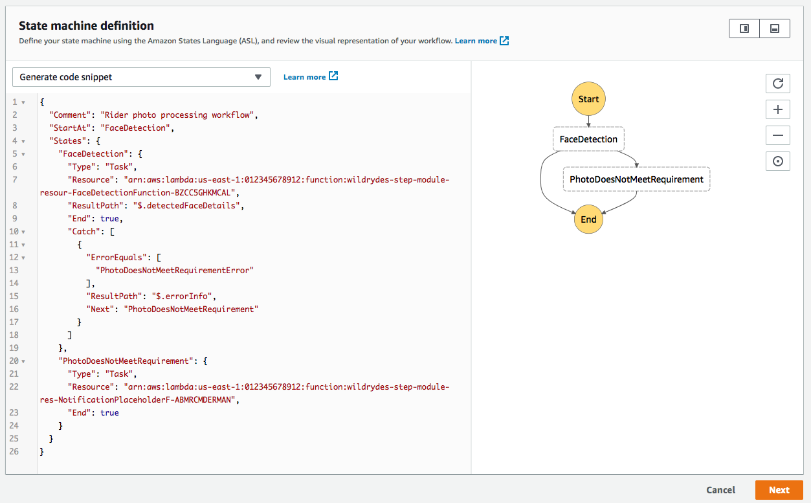

1. **Next**를 클릭합니다.

1. **IAM role for executions**의 경우 **Choose an existing role**을 선택하고 이전 단계에서 CloudFormation에서 생성 한 IAM 역할을 선택합니다.

	> IAM 역할의 이름에는 접두사  `wildrydes-step-modules-resources`(CloudFormation 스택 이름)가 있어야 합니다. IAM 역할의 전체 이름을 확인하려면 CloudFormation 콘솔의 새 탭을 열고 ** Output ** 섹션에서 `StateMachineRole` 을 확인합니다. 

	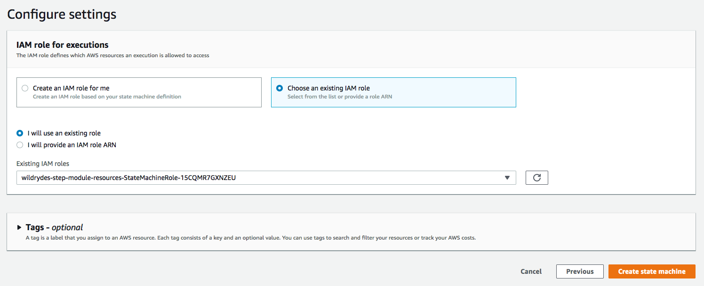

1. **Create State Machine**을 클릭하여 상태 머신을 만듭니다.

1. **Start execution** 버튼을 클릭하여 새 실행을 클릭합니다.

1. 여기서 처리 할 AWS Step Functions 상태 머신으로 전달 된 입력 데이터를 지정합니다.

   Step Functions 상태 머신의 각 실행에는 고유 한 ID가 있습니다. 실행을 시작할 때 하나를 지정하거나 서비스에서 하나를 생성하도록 할 수 있습니다. "enter your execution id here" 라는 텍스트 필드에서 실행 ID를 지정하거나 비워 둘 수 있습니다.
   
   입력 데이터에 다음 JSON을 입력하십시오. `s3Bucket` 필드를 자신의 값으로 대체하십시오.
   
   `s3Bucket` 필드에 대해서는`wildderdes-step-module-resources` 스택의 **Outputs** 섹션에서`RiderPhotoS3Bucket`을 찾으십시오.

   `userId` 필드는 나중의 처리 단계에서, userId가 프로파일 사진과 연관된 사용자를 기록하는 데 사용됩니다. 
   
	```JSON
	{
	  "userId": "user_a", 
	  "s3Bucket": "REPLACE_WITH_YOUR_BUCKET_NAME",
	  "s3Key": "1_happy_face.jpg"
	} 
	```
	> 이를 통해 이미지를 업로드 한 userId와 Amazon S3 버킷 및 사진이 있는 키를 이미지 처리 워크 플로에 전달합니다.
	
	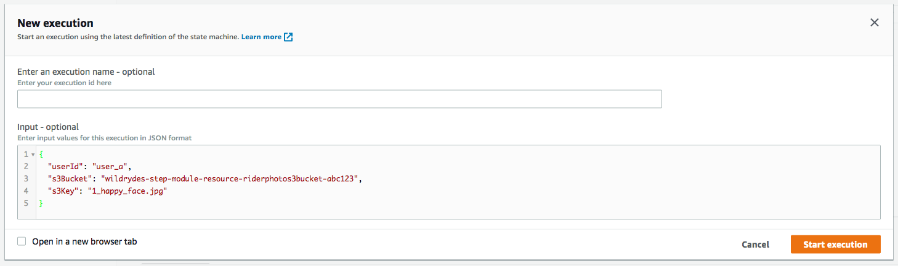

1. 이제 상태 머신 실행이 작동하는 것을 볼 수 있습니다. 콘솔에서 다른 탭을 열어서 이 실행에 대해서 볼 수 있는 정보를 확인합니다. 

	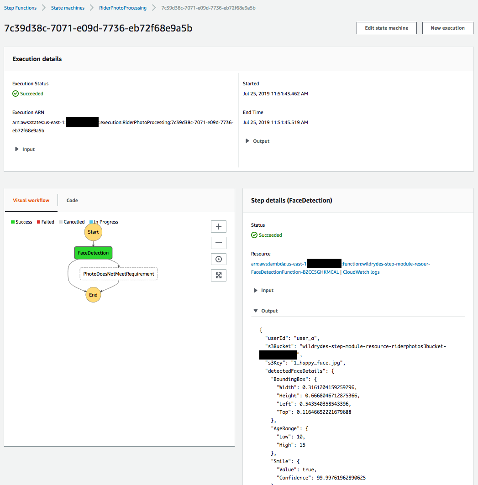

1. 선글라스를 착용 한 사진의 s3 키를 전달하여 다른 실행을 만들어봅니다. 실행이 어떻게 다른지 확인해봅니다. 

	```JSON
	{
	  "userId": "user_b",
	  "s3Bucket": "REPLACE_WITH_YOUR_BUCKET_NAME",
	  "s3Key": "2_sunglass_face.jpg"
	} 
	```
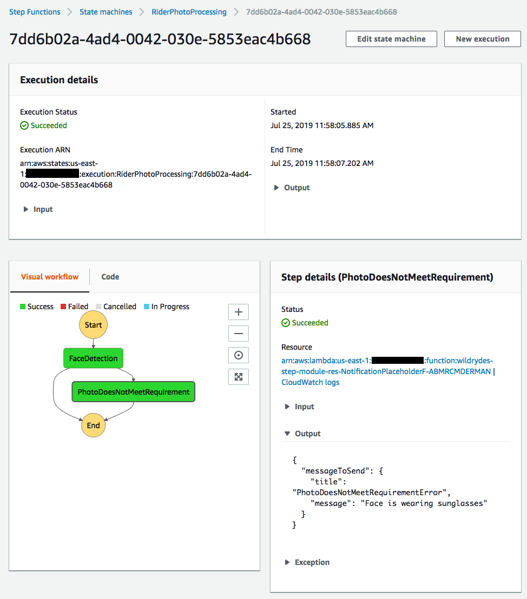
</p></details>

### 4. 중복 방지 단계를 추가하고 색인에 얼굴 추가

업로드 된 사진이 기본 얼굴 감지 검사를 통과 한 경우 다음 단계에서는 동일한 사용자가 여러 번 가입하지 못하도록 얼굴이 이미 컬렉션에 저장되지 않았는지 확인해야합니다.이 섹션에서는`FaceSearchFunction` AWS Lambda 함수를 활용하여 상태 머신에 **CheckFaceDuplicate** 단계를 추가합니다.

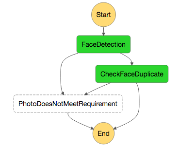

<details>
<summary><strong>단계별 지침 (expand for details)</strong></summary><p>

1. `rider-photo-state-machine.json` 파일을 편집하여 워크 플로우에 새로운 단계를 추가합니다.

   먼저, `PhotoDoesNotMeetRequirement` 상태 다음에 새로운 상태`CheckFaceDuplicate`를 추가하십시오. 그런 다음 AWS CloudFormation output에서 확인한  `REPLACE_WITH_FaceSearchFunctionArn`을 `FaceSearchFunctionArn`으로 바꿉니다.

	```JSON
	,
    "CheckFaceDuplicate": {
      "Type": "Task",
      "Resource": "REPLACE_WITH_FaceSearchFunctionArn",
      "ResultPath": null,
      "End": true,
      "Catch": [
        {
          "ErrorEquals": [
            "FaceAlreadyExistsError"
          ],
          "ResultPath": "$.errorInfo",
          "Next": "PhotoDoesNotMeetRequirement"
        }
      ]
    }
	```
1. `FaceDetection`상태에서 상태 머신의 종료 상태로 표시되는 라인을 찾습니다.

	```JSON
	     	 "End": true,

	```
	그리고 이 부분을 다음과 같이 변경합니다. 
	
	```JSON
	     	 "Next": "CheckFaceDuplicate",

	```
	이는 `FaceDetection` 상태가 성공적으로 실행되었을때 그 결과를 AWS Step Functions에 알리고 프로세스의 다음 단계인 `CheckFaceDuplicate` 상태를 실행합니다.
	
1. 이 시점에서`rider-photo-state-machine.json` 파일은 다음과 같아야합니다 (AWS Lambda ARN은 예입니다)  : 
	<details>
	<summary><strong>(expand to see)</strong></summary><p>

	```JSON
	{
	  "Comment": "Rider photo processing workflow",
	  "StartAt": "FaceDetection",
	  "States": {
	    "FaceDetection": {
	      "Type": "Task",
	      "Resource": "arn:aws:lambda:us-west-2:012345678912:function:wild-ryde-step-module-FaceDetectionFunction-4AYSKX2EGPV0",
	      "ResultPath": "$.detectedFaceDetails",
	      "Next": "CheckFaceDuplicate",
	      "Catch": [
	        {
	          "ErrorEquals": [
	            "PhotoDoesNotMeetRequirementError"
	          ],
	          "ResultPath": "$.errorInfo",
	          "Next": "PhotoDoesNotMeetRequirement"
	        }
	      ]
	    },
	    "PhotoDoesNotMeetRequirement": {
	      "Type": "Task",
	      "Resource": "arn:aws:lambda:us-west-2:012345678912:function:wild-ryde-step-module-NotificationPlaceholderFunct-CDRLZC8BRFWP",
	      "End": true
	    },
	    "CheckFaceDuplicate": {
	      "Type": "Task",
	      "Resource": "arn:aws:lambda:us-west-2:012345678912:function:wild-ryde-step-module-FaceSearchFunction-1IT67V4J214DC",
	      "ResultPath": null,
	      "End": true,
	      "Catch": [
	        {
	          "ErrorEquals": [
	            "FaceAlreadyExistsError"
	          ],
	          "ResultPath": "$.errorInfo",
	          "Next": "PhotoDoesNotMeetRequirement"
	        }
	      ]
	    }
	  }
	}
	```
	</p></details>

1. AWS Step Functions 콘솔로 돌아가서 `RiderPhotoProcessing` 상태 머신을 선택하고 **Edit state machine** 버튼을 클릭하십시오.

	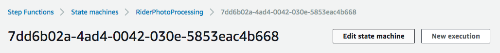

1. 업데이트 된 JSON 정의를 편집기에 복사하여 붙여 넣은 후 **Save**을 클릭합니다.

	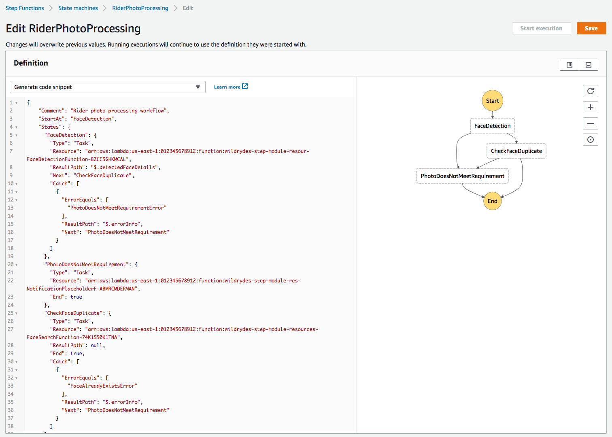

1. IAM 역할의 권한을 확인하라는 IAM 경고가 나타납니다. **Save anyway**을 클릭합니다.

	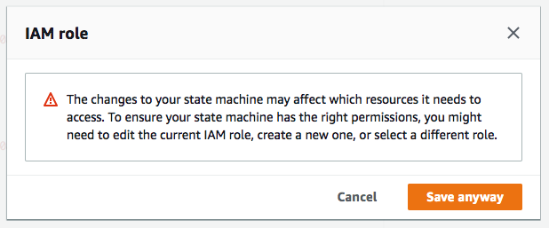

1. **Start execution**을 클릭합니다.

1. 이전에 사용한 테스트 입력으로 새 상태 머신을 테스트하십시오.


	```JSON
	{
	  "userId": "user_a",
	  "s3Bucket": "REPLACE_WITH_YOUR_BUCKET_NAME",
	  "s3Key": "1_happy_face.jpg"
	} 
	```
	사진의 얼굴을 Rekognition 컬렉션에 색인화하는 단계를 아직 추가하지 않았으므로 이 시점에서 `CheckFaceDuplicate` 단계는 항상 성공합니다.

</p></details>

### 5. 병렬 처리 단계 추가

업로드 된 사진이 `FaceDetection` 및 `CheckFaceDuplicate` 단계를 모두 통과하면 이제 라이더의 얼굴을 인덱싱하고 앱에 표시 할 사진 크기를 조정할 수 있습니다. 이 두 단계는 서로에게 의존적이지 않기 때문에 병렬로 실행할 수 있습니다. 이러한 단계를 실행하기 위해 AWS Step Functions에 Parallel 상태를 추가합니다.

얼굴 인덱스를 수행하고 썸네일을 생성하는 두 AWS Lambda 함수의 ARN은 각각 AWS CloudFormation 출력`IndexFaceFunctionArn` 및`ThumbnailFunctionArn`에서 찾을 수 있습니다.

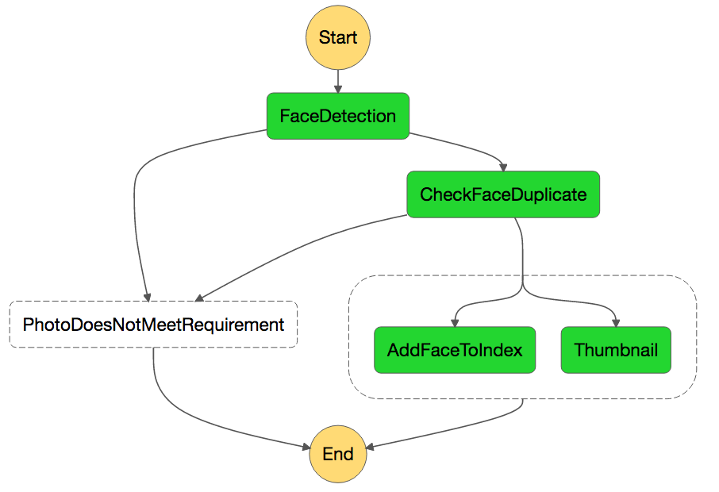

<details>
<summary><strong>단계별 지침 (expand for details)</strong></summary><p>

1. `rider-photo-state-machine.json` 파일을 편집하여 워크 플로에 병렬 단계 (하위 단계 두 개)를 추가합니다.

   먼저, `CheckFaceDuplicate` 상태 다음에 새로운 상태`ParallelProcessing`을 추가합니다. 또한 다음을 확인하십시오.
   
   * AWS CloudFormation Output을 참고하여 `REPLACE_WITH_IndexFaceFunctionArn` 을`IndexFaceFunctionArn`로 바꿉니다.
   * AWS CloudFormation Output을 참고하여 `REPLACE_WITH_ThumbnailFunctionArn`을`ThumbnailFunctionArn`으로 바꿉니다.
   
   

	```JSON
    ,
    "ParallelProcessing": {
      "Type": "Parallel",
      "Branches": [
        {
          "StartAt": "AddFaceToIndex",
          "States": {
            "AddFaceToIndex": {
              "Type": "Task",
              "Resource": "REPLACE_WITH_IndexFaceFunctionArn",
              "End": true
            }
          }
        },
        {
          "StartAt": "Thumbnail",
          "States": {
            "Thumbnail": {
              "Type": "Task",
              "Resource": "REPLACE_WITH_ThumbnailFunctionArn",
              "End": true
            }
          }
        }
      ],
	   "ResultPath": "$.parallelResult",
      "End": true
    }
	```
	
1. `CheckFaceDuplicate` 상태에서 상태 머신의 종료 상태로 표시되는 라인을 찾으십시오. 

	```JSON
	     	 "End": true,

	```
	그리고 다음과 같이 수정합니다. 
	
	```JSON
	     	 "Next": "ParallelProcessing",

	```
	`CheckFaceDuplicate`상태가 성공적으로 실행되면, AWS Step Functions 에게 프로세스의 다음 단계로 `ParallelProcessing` 상태를 계속 실행합니다.

1. 이 시점에서`rider-photo-state-machine.json` 파일은 다음과 같아야합니다 (AWS Lambda ARN은 예입니다).
	
	<details>
	<summary><strong>(expand to see)</strong></summary><p>

	```JSON
	{
	  "Comment": "Rider photo processing workflow",
	  "StartAt": "FaceDetection",
	  "States": {
	    "FaceDetection": {
	      "Type": "Task",
	      "Resource": "arn:aws:lambda:us-west-2:012345678912:function:wild-ryde-step-module-FaceDetectionFunction-4AYSKX2EGPV0",
	      "ResultPath": "$.detectedFaceDetails",
	      "Next": "CheckFaceDuplicate",
	      "Catch": [
	        {
	          "ErrorEquals": [
	            "PhotoDoesNotMeetRequirementError"
	          ],
	          "ResultPath": "$.errorInfo",
	          "Next": "PhotoDoesNotMeetRequirement"
	        }
	      ]
	    },
	    "PhotoDoesNotMeetRequirement": {
	      "Type": "Task",
	      "Resource": "arn:aws:lambda:us-west-2:012345678912:function:wild-ryde-step-module-NotificationPlaceholderFunct-CDRLZC8BRFWP",
	      "End": true
	    },
	    "CheckFaceDuplicate": {
	      "Type": "Task",
	      "Resource": "arn:aws:lambda:us-west-2:012345678912:function:wild-ryde-step-module-FaceSearchFunction-1IT67V4J214DC",
	      "ResultPath": null,
	      "Next": "ParallelProcessing",
	      "Catch": [
	        {
	          "ErrorEquals": [
	            "FaceAlreadyExistsError"
	          ],
	          "ResultPath": "$.errorInfo",
	          "Next": "PhotoDoesNotMeetRequirement"
	        }
	      ]
	    },
	    "ParallelProcessing": {
	      "Type": "Parallel",
	      "Branches": [
	        {
	          "StartAt": "AddFaceToIndex",
	          "States": {
	            "AddFaceToIndex": {
	              "Type": "Task",
	              "Resource": "arn:aws:lambda:us-west-2:012345678912:function:wild-ryde-step-module-IndexFaceFunction-15658V8WUI67V",
	              "End": true
	            }
	          }
	        },
	        {
	          "StartAt": "Thumbnail",
	          "States": {
	            "Thumbnail": {
	              "Type": "Task",
	              "Resource": "arn:aws:lambda:us-west-2:012345678912:function:wild-ryde-step-module-ThumbnailFunction-A30TCJMIG0U8",
	              "End": true
	            }
	          }
	        }
	      ],
	      "ResultPath": "$.parallelResult",
	      "End": true
	    }
	  }
	}
	```
	</p></details>

1. AWS Step Functions 콘솔로 돌아가서 **Edit state machine**  버튼을 클릭하여 `RiderPhotoProcessing` 상태 머신을 업데이트합니다.

1. 업데이트 된 JSON 정의를 붙여 넣고 미리보기 패널에서 새로 고침 버튼을 클릭하여 변경 사항을 시각화합니다.

	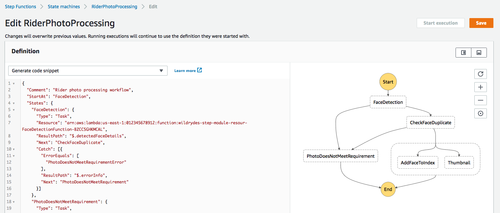

1. **Save** 버튼을 클릭하여 상태 머신을 저장합니다.

1. **Start execution** 버튼을 클릭하여 이전에 사용한 테스트 입력으로 새 상태 머신을 테스트합니다.

	```JSON
	{
	  "userId": "user_a",
	  "s3Bucket": "REPLACE_WITH_YOUR_BUCKET_NAME",
	  "s3Key": "1_happy_face.jpg"
	} 
	```

1. 마지막 단계가 성공하면 AWS CLI를 사용하여 Rekognition 컬렉션에 인덱스 된 얼굴 목록을 확인할 수 있습니다 ( `REPLACE_WITH_YOUR_CHOSEN_AWS_REGION` 부분을 선택한 지역의 지역 문자열로 교체).

	```
	aws rekognition list-faces --collection-id rider-photos --region REPLACE_WITH_YOUR_CHOSEN_AWS_REGION
	```
	
	> 테스트 할 때`delete-faces` 명령이 유용 할 수 있습니다.

	```
	aws rekognition delete-faces --collection-id rider-photos --face-ids REPLACE_WITH_ID_OF_FACE_TO_DELETE --region REPLACE_WITH_YOUR_CHOSEN_AWS_REGION
	```

1. Amazon S3 콘솔을 사용하여 AWS CloudFormation에서 생성 한 Amazon S3 버킷을 확인하여 크기가 조정 된 축소판 이미지를 저장할 수도 있습니다. 버킷에서 크기가 조정 된 축소판 이미지를 찾아야합니다.

> S3 버킷의 이름은 AWS CloudFormation Output `ThumbnailS3Bucket` 에서 찾을 수 있습니다. S3 콘솔에서 간단히 `wildrydes-step-module-resources-thumbnails3bucket` 을 검색 할 수도 있습니다.

1. 다른`userId` 이지만 동일한 s3key 및 s3bucket 매개 변수로 새 워크 플로우를 시작하면 어떻게 될까요? 

</p></details>

### 6. 메타 데이터 지속성 단계 추가

이미지 처리 워크 플로의 마지막 단계는 프로필 사진의 메타 데이터를 사용자 프로필과 함께 유지하는 것입니다.

메타 데이터를 유지하는 AWS Lambda 함수의 ARN은 AWS CloudFormation Output `PersistMetadataFunctionArn` 에서 찾을 수 있습니다.


<details>
<summary><strong>단계별 지침 (expand for details)</strong></summary><p>

1. `rider-photo-state-machine.json` 파일을 편집하여 최종 지속성 단계를 추가하십시오.
 
   먼저, `ParallelProcessing` 상태 다음에 새로운 상태 `PersistMetadata` 를 추가하십시오. 또한 다음을 확인하십시오.
   
   * AWS CloudFormation Output 에서 `REPLACE_WITH_PersistMetadataFunctionArn` 을 `PersistMetadataFunctionArn` 로 바꿉니다.

	```JSON
	    ,
	    "PersistMetadata": {
	      "Type": "Task",
	      "Resource": "REPLACE_WITH_PersistMetadataFunctionArn",
	      "ResultPath": null,
	      "End": true
	    }

	```

1. `ParallelProcessing` 상태에서 상태 머신의 종료 상태로 표시되는 라인을 찾으십시오.

	```JSON
	     	 "End": true

	```
	그리고 다음과 같이 수정합니다.
	
	```JSON
	     	 "Next": "PersistMetadata"

	```
	> **Note** : 병렬 상태의 개별 분기 수준이 아니라 `ParallelProcessing` 에서 `"End"` 줄을 편집해야합니다.

	이는 `ParallelProcessing` 상태가 성공적으로 실행되면 AWS Step Functions에 알리고 프로세스의 다음 단계로 `PersistMetadata` 상태를 실행합니다.

1. 이 시점에서 `rider-photo-state-machine.json` 파일은 다음과 같아야합니다 (AWS Lambda ARN은 예입니다).
	<details>
	<summary><strong>(expand to see)</strong></summary><p>

	```JSON
	{
	  "Comment": "Rider photo processing workflow",
	  "StartAt": "FaceDetection",
	  "States": {
	    "FaceDetection": {
	      "Type": "Task",
	      "Resource": "arn:aws:lambda:us-west-2:012345678912:function:wild-ryde-step-module-FaceDetectionFunction-4AYSKX2EGPV0",
	      "ResultPath": "$.detectedFaceDetails",
	      "Next": "CheckFaceDuplicate",
	      "Catch": [
	        {
	          "ErrorEquals": [
	            "PhotoDoesNotMeetRequirementError"
	          ],
	          "ResultPath": "$.errorInfo",
	          "Next": "PhotoDoesNotMeetRequirement"
	        }
	      ]
	    },
	    "PhotoDoesNotMeetRequirement": {
	      "Type": "Task",
	      "Resource": "arn:aws:lambda:us-west-2:012345678912:function:wild-ryde-step-module-NotificationPlaceholderFunct-CDRLZC8BRFWP",
	      "End": true
	    },
	    "CheckFaceDuplicate": {
	      "Type": "Task",
	      "Resource": "arn:aws:lambda:us-west-2:012345678912:function:wild-ryde-step-module-FaceSearchFunction-1IT67V4J214DC",
	      "ResultPath": null,
	      "Next": "ParallelProcessing",
	      "Catch": [
	        {
	          "ErrorEquals": [
	            "FaceAlreadyExistsError"
	          ],
	          "ResultPath": "$.errorInfo",
	          "Next": "PhotoDoesNotMeetRequirement"
	        }
	      ]
	    },
	    "ParallelProcessing": {
	      "Type": "Parallel",
	      "Branches": [
	        {
	          "StartAt": "AddFaceToIndex",
	          "States": {
	            "AddFaceToIndex": {
	              "Type": "Task",
	              "Resource": "arn:aws:lambda:us-west-2:012345678912:function:wild-ryde-step-module-IndexFaceFunction-15658V8WUI67V",
	              "End": true
	            }
	          }
	        },
	        {
	          "StartAt": "Thumbnail",
	          "States": {
	            "Thumbnail": {
	              "Type": "Task",
	              "Resource": "arn:aws:lambda:us-west-2:012345678912:function:wild-ryde-step-module-ThumbnailFunction-A30TCJMIG0U8",
	              "End": true
	            }
	          }
	        }
	      ],
	      "ResultPath": "$.parallelResult",
	      "Next": "PersistMetadata"
	    },
	    "PersistMetadata": {
	      "Type": "Task",
	      "Resource": "arn:aws:lambda:us-west-2:012345678912:function:wild-ryde-step-module-PersistMetadataFunction-9PDCT2DT7K70",
	      "ResultPath": null,
	      "End": true
	    }
	  }
	}	
	```
	</p></details>

1. AWS Step Functions 콘솔로 돌아가서 **Edit state machine** 버튼을 클릭하여 `RiderPhotoProcessing` 상태 머신을 업데이트하십시오.

1. 업데이트 된 JSON 정의를 붙여 넣고 미리보기 패널에서 새로 고침 버튼을 클릭하여 변경 사항을 시각화합니다.

	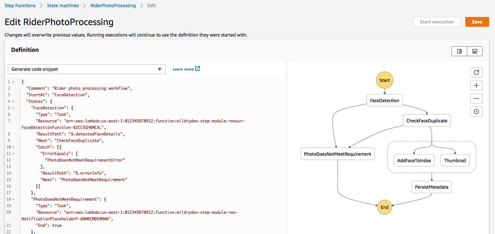

1. **Save** 버튼을 클릭하여 상태 머신을 저장합니다.

1. **Start execution** 버튼을 클릭하여 테스트 입력으로 새 상태 머신을 테스트하십시오.

	```JSON
	{
	  "userId": "user_a",
	  "s3Bucket": "REPLACE_WITH_YOUR_BUCKET_NAME",
	  "s3Key": "1_happy_face.jpg"
	} 
	```
	
	이전 상태 머신을 테스트 할 때 이미 색인이 생성 된 이미지를 참조하면 다음과 같이 `CheckFaceDuplicate` 단계가 실패합니다.
	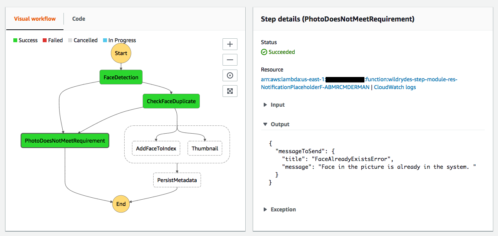

	`aws rekognition list-faces` 및 `aws rekognition delete-faces` 명령을 사용하여 테스트 중에 이전 색인화 된 얼굴을 정리할 수 있습니다. 또는 다른 사진을 `RiderPhotoS3Bucket` 에 업로드하고 새 사진의 s3 키를 사용하여 테스트 할 수 있습니다.

</p></details>

## 구현 검증

1. 제공된 다른 테스트 이미지로 최종 상태 머신 (`RiderPhotoProcessing-4`)을 테스트합니다.

	선글라스 사진 :

	```JSON
	{
	  "userId": "user_b",
	  "s3Bucket": "REPLACE_WITH_YOUR_BUCKET_NAME",
	  "s3Key": "2_sunglass_face.jpg"
	} 
	```

	여러 얼굴이 나온 사진 :
	
	```JSON
	{
	  "userId": "user_c",
	  "s3Bucket": "REPLACE_WITH_YOUR_BUCKET_NAME",
	  "s3Key": "3_multiple_faces.jpg"
	} 
	```
	
	얼굴이 나오지 않은 사진 :

	```JSON
	{
	  "userId": "user_d",
	  "s3Bucket": "REPLACE_WITH_YOUR_BUCKET_NAME",
	  "s3Key": "4_no_face.jpg"
	} 
	```
	
1. S3에 필요한 사진을 업로드하고 실행을 테스트하십시오. 같은 사람의 사진이 둘 이상인 경우 둘 다 업로드하고 각 사진에 대해 워크 플로우를 실행하십시오 (테스트 입력에서 다른 `userId` 필드를 사용해야합니다). **CheckFaceDuplicate** 단계로 인해 같은 얼굴이 두 번 이상 색인 생성되지 않는지 확인하십시오.

1. Amazon DynamoDB 콘솔로 이동하여 "wildrydes-step-module-resources-RiderPhotoDDBTable"로 시작하는 이름을 가진 테이블을 찾습니다 (CloudFormation 스택 Output 에서 ​​테이블 이름을 찾을 수도 있음). 테이블 항목을 확인하십시오.
	
	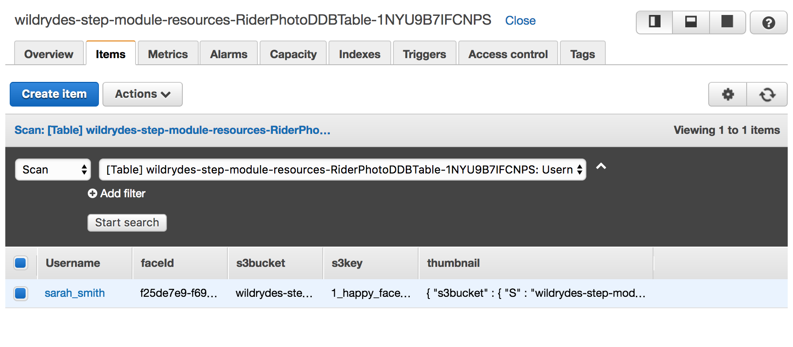

1. Amazon S3 콘솔로 이동하여 처리 한 사진의 썸네일 이미지가 썸네일 S3 버킷에 있는지 확인하십시오.

이제 AWS Step Functions를 사용하여 다단계 이미지 처리 워크 플로우를 구축했습니다! 워크 플로는 AWS API Gateway로 시작하거나 Amazon S3 업로드 이벤트에서 트리거하여 앱에 통합 될 수 있습니다.

## 추가 크레딧
**PhotoDoesNotMeetRequirement** 단계의 목적은 사용자에게 프로필 사진 확인에 실패했음을 알리고 다른 사진을 업로드하려고 시도하는 것입니다. 현재 실제로 알림을 보내지 않고 단순히 메시지를 반환하는 AWS Lambda 함수 `NotificationPlaceholderFunction` 을 사용합니다. Amazon Simple Email Service (SES)를 사용하여 Lambda 함수에서 이메일 알림 전송을 구현할수도 있습니다.

## 정리

1. AWS Step Functions 콘솔에서 `RiderPhotoProcessing` 상태 머신을 삭제합니다.

1. AWS Lambda 함수, Amazon S3 버킷 및 Amazon DynamoDB 테이블을 시작한 `wildrydes-step-module-resources`  AWS CloudFormation 스택을 삭제합니다.

	<details>
	<summary><strong>단계별 지침 (expand for details)</strong></summary><p>
	
	1. AWS CloudFormation Management Console에서 `wildrydes-step-module-resources` 스택을 선택하십시오.

	1. **Actions**에서 **Delete Stack**을 선택합니다.

	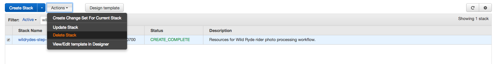
	
	1. **Yes, Delete**를 클릭합니다.
	
	</p></details>
	
1. Amazon Rekognition 컬렉션을 삭제합니다.


	<details>
	<summary><strong>단계별 지침 (expand for details)</strong></summary><p>
	
	1. 터미널 창에서 다음 명령을 실행하고 `REPLACE_WITH_YOUR_CHOSEN_AWS_REGION` 부분을 사용한 AWS 리전으로 바꿉니다. 

			aws rekognition delete-collection --region REPLACE_WITH_YOUR_CHOSEN_AWS_REGION --collection-id rider-photos
	
		예 :
	
			aws rekognition delete-collection --region us-east-1 --collection-id rider-photos
			aws rekognition delete-collection --region us-west-2 --collection-id rider-photos
			aws rekognition delete-collection --region eu-west-1 --collection-id rider-photos
	
	
	2. 명령이 성공적으로 실행되면, 다음과 같은 응답을 받게 됩니다. 

		```JSON
		{
	    	"StatusCode": 200
		}
		```
	
	</p></details>
