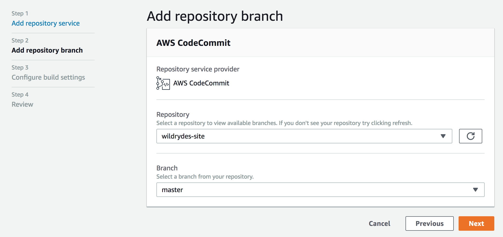
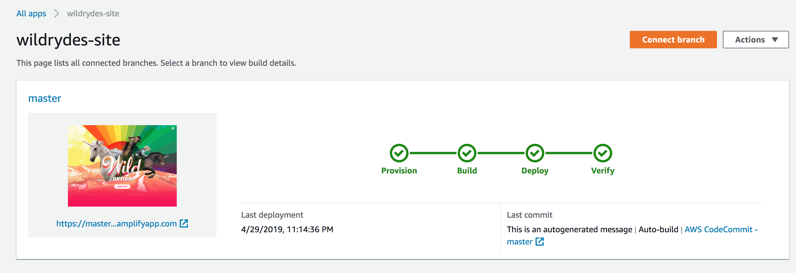
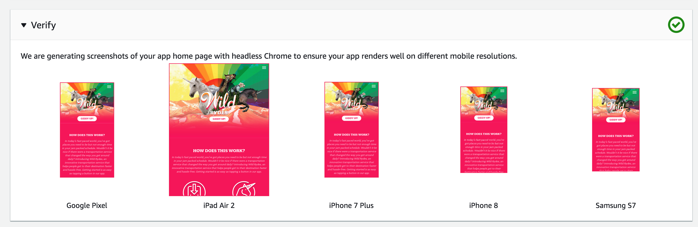
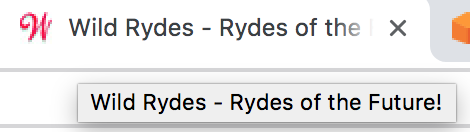

# 모듈 1: AWS Amplify Console을 사용한 정적 웹 호스팅

이 모듈에서는 웹 애플리케이션의 정적 리소스를 호스팅하도록 AWS Amplify Console을 구성합니다. 이후 진행할 다른 모듈에서 자바스크립트로 AWS Lambda과 Amazon API Gateway로 구성한 RESTful API을 호출하는 동적 기능을 추가할 것입니다. 

## 아키텍처 개요

이 모듈의 아키텍처는 매우 직관적입니다. HTML, CSS, JavaScript, 이미지 및 기타 파일을 포함한 모든 정적 웹 컨텐츠는 AWS Amplify Console에서 관리하고 Amazon CloudFront를 통해 제공됩니다. 그런 다음 최종 사용자는 AWS Amplify Console가 공개한 퍼블릭 웹 사이트 URL을 사용하여 사이트에 액세스합니다. 사이트를 사용하기 위해 웹 서버를 실행하거나 다른 서비스를 추가로 사용할 필요가 없습니다.


## 구현 지침

:heavy_exclamation_mark: 워크샵을 시작하기 전에 [실습 준비][setup]를 완료해야 합니다. 

각 섹션은 개요와 단계별 지침으로 구성되어 있으며, AWS 관리 콘솔에 익숙한 사용자라면 단계별 지침을 스텝별로 진행하지 않아도 개요만으로 충분히 워크샵을 진행할 수 있습니다. 

### 리전 선택

이 워크샵은 다음 서비스를 지원하는 리전에서 진행할 수 있습니다.

- AWS Amplify Console
- AWS CodeCommit

AWS 설명서의 [AWS 리전 테이블][region-services]에서 리전별로 어떤 서비스를 지원하는지 확인합니다. 다음은 Amplify Console과 CodeCommit을 지원하는 리전의 예시입니다. 
* 북아메리카: 오리건 주 오하이오 주 버지니아 북부
* 유럽: 아일랜드, 런던, 프랑크푸르트
* 아시아 태평양: 도쿄, 서울, 싱가포르, 시드니, 뭄바이

AWS 관리 콘솔의 오른쪽 상단의 드롭다운에서 워크샵을 수행할 리전을 선택합니다.


### Git 리포지토리 생성
사이트 리포지토리를 호스팅하기 위해 [AWS CodeCommit][commit]과 [GitHub][github] 중 하나를 선택합니다. 이미 GitHub 계정이 있다면 기존 계정을 사용할 수 있습니다. 또는, AWS 프리 티어로 포함된 [CodeCommit을 사용할 수 있습니다.][codecommit-free]

#### CodeCommit 사용
AWS Cloud9 개발 환경에는 IAM 사용자와 연결된 AWS 관리 임시 자격 증명이 제공됩니다. 이러한 자격 증명은 AWS CLI 자격 증명 도우미(credential-helper)와 함께 사용합니다. Cloud9 환경의 터미널에서 다음 두 명령을 실행하여 자격 증명 도우미를 활성화합니다.

```bash
git config --global credential.helper '!aws codecommit credential-helper $@'
git config --global credential.UseHttpPath true
```

리포지토리를 생성하고 Cloud9 환경으로 clone합니다:
1. [AWS CodeCommit console][codecommit-console]으로 이동합니다.
2. **Create Repository**를 클릭하세요.
3. **Repository name**을 "wildrydes-site"로 지정합니다.
4. **Create**을 클릭합니다.
5. *Clone URL* 드롭다운에서 *Clone HTTPS*를 클릭합니다. 

이제 Cloud9 개발 환경에서:
1. 터미널 창에서 `git clone` 뒤에 이전 단계에서 Copy한 리포지토리의 HTTPS URL을 붙여넣습니다:
    ```
    ec2-user:~/environment $ git clone https://git-codecommit.us-east-1.amazonaws.com/v1/repos/wildrydes-site
    Cloning into 'wildrydes-site'...
    warning: You appear to have cloned an empty repository.
    ec2-user:~/environment $ 
    ```

#### Github 단계 (Codecommit 대신 Github를 사용하는 경우에만 해당합니다. Codecommit을 이용한 실습자는 이 단계를 건너뛰고 '단계별 지시 사항'으로 이동합니다.)
**:white_check_mark: 단계별 지시 사항**
1. [GitHub][github]의 지시 사항에 따라 [Create a repository][create-repo]를 실행합니다. NOTE: commit하지 않은 상태로 리포지토리만 생성합니다. 
2. GitHub 자격 증명을 사용하여 리포지토리를 로컬로 복제
    1. 자격 증명이 로컬 컴퓨터에 없거나 오늘 실습에 Cloud9를 사용하려는 경우, 다음 단계에 따라 [새 SSH 키를 생성하고 ssh-agent에 추가][github-new-sshkey]합니다.
    2. [리포지토리를 clone합니다.][github-clone]

#### Git 리포지토리로 시작하기 
git 리포지토리를 만들고 로컬로 clone한 후 웹사이트에서 사용할 파일을 pull하여 리포지토리로 동기화합니다. 

**:white_check_mark: 단계별 지시 사항**
Cloud9 개발 환경(또는 로컬 컴퓨터)에서
1. 디렉토리를 리포지토리로 변경합니다:
    ```
    cd wildrydes-site/
    ```
2. S3에서 파일을 복사합니다:
    ```
    aws s3 cp s3://wildrydes-us-east-1/WebApplication/1_StaticWebHosting/website ./ --recursive
    ```
3. 이 파일들을 git에 commit합니다. (commit 시 이메일과 이름을 입력해야 할 수 있습니다.) :
    ```
    $ git add .
    $ git config --global user.email "<EMAIL ADDRESS>"
    $ git config --global user.name "<USER NAME>"
    $ git commit -m "initial checkin of website code"
    $ git push
    
    Username for 'https://git-codecommit.us-east-1.amazonaws.com': wildrydes-codecommit-at-xxxxxxxxx
    Password for 'https://wildrydes-codecommit-at-xxxxxxxxx@git-codecommit.us-east-1.amazonaws.com': 
    Counting objects: 95, done.
    Compressing objects: 100% (94/94), done.
    Writing objects: 100% (95/95), 9.44 MiB | 14.87 MiB/s, done.
    Total 95 (delta 2), reused 0 (delta 0)
    To https://git-codecommit.us-east-1.amazonaws.com/v1/repos/wildrydes-site
     * [new branch]      master -> master
    ```

### AWS Amplify Console을 사용하여 사이트 배포

이제 [AWS Amplify Console][amplify-console]을 이용하여 방금 commit한 웹 사이트를 배포합니다. Amplify Console은 정적 웹 응용 프로그램 코드를 저장할 장소를 설정하는 작업을 처리하고, 웹 애플리케이션의 수명주기를 간소화할 수 있도록 해줍니다. 또, 모범 사례를 활성화하는 여러 유용한 기능을 제공합니다.

**:white_check_mark: 단계별 지시 사항**
1. [Amplify Console 콘솔 페이지][amplify-console-console]를 시작합니다.
2. **Connect App**를 클릭합니다.
3.  오늘 사용한 *Repository service provider* 타입을 선택하고 **Next**을 클릭합니다. 
    1. GitHub를 사용한 경우 AWS Amplify가 GitHub 계정으로 접근할 수 있도록 허용해야 합니다.
4. 드롭다운에서 오늘 생성한 *Repository*와 *Branch*를 선택합니다.
    
    
5. Configure build settings 페이지에서 모든 기본값을 그대로 두고 **Next**을 클릭합니다. 
6. Review 페이지에서 **Save and deploy**를 클릭합니다. 
    
    Amplify Console에서 필요한 리소스를 생성하고 코드를 배포하는 데 몇 분 정도 걸립니다.

    
    

완료되면 사이트 이미지를 클릭하여 Wild Rydes 사이트로 이동합니다.


*master* 링크를 클릭하면 다양한 플랫폼에서의 샘플 렌더링을 포함해 웹 사이트 배포에 대한 다양한 정보가 표시됩니다:



### 웹 사이트 수정
리포지토리가 수정되면 AWS Amplify Console가 이를 인지하고 앱을 다시 구축하고 배포합니다. 이 프로세스를 테스트하기 위해 기본 페이지를 변경합니다.

**:white_check_mark: 단계별 지시 사항**
1. 여러분의 Cloud9 환경에서 리포지토리의 루트 디렉토리에서  ```index.html``` 파일을 엽니다.
2. 제목 줄을 수정합니다:
    ```
      <title>Wild Rydes</title>
    ```
    다음과 같이 변경합니다.
    ```
      <title>Wild Rydes - Rydes of the Future!</title>
    ```
    파일을 저장합니다. 
3. 변경 사항을 git 저장소에 다시 commit합니다:
    ```
    $ git add index.html 
    $ git commit -m "updated title"
    [master dfec2e5] updated title
     1 file changed, 1 insertion(+), 1 deletion(-)
    
    $ git push
    Counting objects: 3, done.
    Compressing objects: 100% (3/3), done.
    Writing objects: 100% (3/3), 315 bytes | 315.00 KiB/s, done.
    Total 3 (delta 2), reused 0 (delta 0)
    remote: processing 
    To https://git-codecommit.us-east-1.amazonaws.com/v1/repos/wildrydes-site
       2e9f540..dfec2e5  master -> master
   ```
    Amplify Console은 리포지토리의 업데이트를 인지하면 곧 사이트를 다시 구축하기 시작합니다. 꽤 빨리 말이죠! [Amplify Console console page][amplify-console-console] 로 돌아가 프로세스를 볼 수 있습니다. 
4. 완료되면 Wild Rydes 사이트를 다시 열고 제목이 변경되었는지 확인합니다.
    
    

### :star: 요약

:key: AWS Amplify Console을 사용하면 지속적인 통합 및 제공(CI/CD) 모델에 따라 정적 웹 사이트를 매우 쉽게 배포할 수 있습니다. Amplify Console은 보다 복잡한 자바 스크립트 프레임 워크 기반 애플리케이션도 빌드할 수 있으며 인기있는 모바일 플랫폼에서 보이는 것처럼 애플리케이션의 미리보기를 렌더링할 수 있습니다.

:wrench: 이 모듈에서는 Wild Rydes 비즈니스의 기반이 될 정적 웹 사이트를 만들었습니다.

### Next

:white_check_mark: 다음 모듈 [사용자 관리][user-management]로 이동합니다. Amazon Cognito 사용자 풀(User Pool)을 구성하여 애플리케이션 유저를 관리합니다. 

[setup]: ../0_Setup/
[commit]: https://aws.amazon.com/codecommit
[github]: https://github.com
[iam-console]: https://console.aws.amazon.com/iam/home
[codecommit-free]: https://aws.amazon.com/codecommit/pricing/
[codecommit-console]: https://console.aws.amazon.com/codesuite/codecommit/repositories
[create-repo]: https://help.github.com/en/articles/create-a-repo
[github-new-sshkey]: https://help.github.com/en/articles/generating-a-new-ssh-key-and-adding-it-to-the-ssh-agent
[github-clone]: https://help.github.com/en/articles/cloning-a-repository
[amplify-console]: https://aws.amazon.com/amplify/console/
[amplify-console-console]: https://console.aws.amazon.com/amplify/home
[user-management]: ../2_UserManagement/
[region-services]: https://aws.amazon.com/about-aws/global-infrastructure/regional-product-services/
