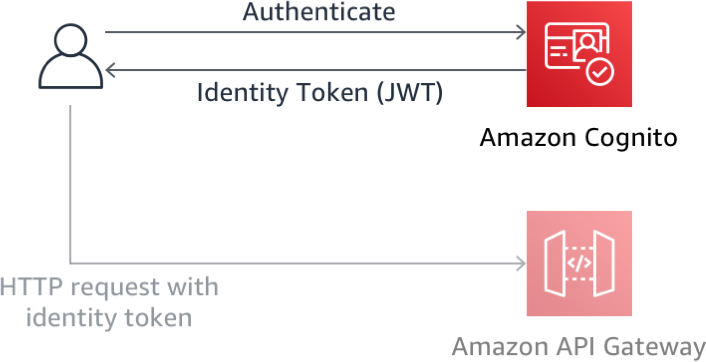
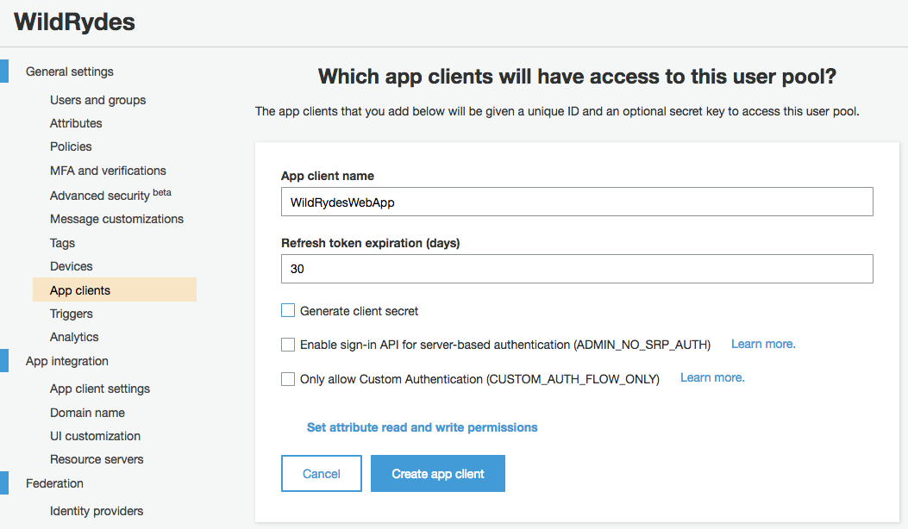

# 모듈 2 : Amazon Cognito 사용자 풀을 통한 사용자 인증 및 등록

이 모듈에서는 사용자 계정을 관리하기 위해 [Amazon Cognito][cognito] 사용자 풀(User Pool)을 생성합니다. 이를 통해 고객들이 사이트에서 회원 가입, 이메일 인증 및 로그인할 수 있습니다.

## 아키텍처 개요

사용자가 웹 사이트를 방문하면 처음에는 회원 가입부터 시작할 것입니다. 이 워크샵에서는 회원 가입을 위해 이메일 주소와 비밀번호만 요구하지만, Amazon Cognito는 기타 정보도 추가로 요구하도록 설정할 수 있습니다. 

회원 가입 시, Amazon Cognito가 사용자의 이메일 주소로 인증 코드를 보냅니다. 계정 확인을 위해 사용자는 사이트로 돌아와서 이메일을 통해 받은 인증 코드를 입력합니다. 테스트를 위해 가짜 이메일 주소를 사용하더라도 Amazon Cognito 콘솔에서 인증할 수 있는 방법이 있으니, 편하신 대로 워크샵을 진행할 수 있습니다. 

사용자가 확인된 계정(이메일 확인 프로세스 또는 콘솔을 통한 수동 확인)을 사용하면 로그인할 수 있습니다. 사용자가 로그인하면 사용자 이름(또는 이메일)과 비밀번호를 입력합니다. 그런 다음 JavaScript 함수는 Amazon Cognito와 통신하고 SRP(Secure Remote Password Protocol)를 사용하여 인증한 다음 일련의 JWT(JSON Web Tokens)을 받습니다. JWT에는 사용자의 자격 증명에 대한 클레임이 포함되어 있으며, 이 정보는 다음 모듈인 'RESTful APIs'에서 Amazon API Gateway로 구축한 RESTful API를 인증할 때 사용됩니다.




## 구현 지침

:heavy_exclamation_mark: 이 워크샵을 시작하기 전에 이전 모듈 [정적 웹 호스팅][static-web-hosting] 을 완료해야 합니다.

각 섹션은 개요와 단계별 지침으로 구성되어 있으며, AWS 관리 콘솔에 익숙한 사용자라면 단계별 지침을 스텝별로 진행하지 않아도 개요만으로 충분히 워크샵을 진행할 수 있습니다. 

### 1. Amazon Cognito 사용자 풀(User Pool)생성

#### 배경

Amazon Cognito는 사용자 인증을 위한 두 가지 메커니즘을 제공합니다. Cognito 사용자 풀을 사용하여 애플리케이션에 가입 및 로그인 기능을 추가하거나 Cognito 자격 증명 풀을 사용하여 Facebook, Twitter 또는 Amazon과 같은 소셜 자격 증명 공급자를 통해 SAML 자격 증명 솔루션을 사용하거나 자신의 자격증명 솔루션을 사용하여 사용자를 인증할 수 있습니다. 이 모듈에서는 Cognito 사용자 풀을 회원가입 및 로그인 페이지의 백엔드로 사용합니다.

콘솔에서 기본 설정을 사용하여 새 사용자 풀을 생성합니다. 풀이 생성되면 Pool ID를 확인합니다. 다음 섹션에서 이 값이 필요합니다.

**:white_check_mark: 단계별 지시 사항**

1. [Amazon Cognito 콘솔][cognito-console]로 이동합니다.
2. **Manage your User Pools**을 선택합니다.
3. **Create a User Pool**을 선택합니다.
4. **Pool name**으로 `WildRydes`을 입력하고 **Review Defaults**를 선택합니다.
    
5. 설정을 확인하고 **Create pool**을 선택합니다. 
6. 새로 생성한 사용자 풀의 Pool detail 페이지에서 **Pool Id**를 확인합니다. 

### 2. 사용자 풀에 앱 클라이언트 추가

Amazon Cognito 콘솔에서 사용자 풀을 선택한 다음 **App clients** 섹션을 선택합니다. 새 앱을 추가하고 'Generate client secret' 옵션이 비활성화 되었는지 확인합니다. Client secrets은 JavaScript SDK에서 지원되지 않습니다. 만약 'generated secret' 옵션을 활성화하신 채로 앱을 생성했다면, 삭제 후 올바르게 재생성합니다. 

**:white_check_mark: 단계별 지시 사항**
1. 왼쪽 내비게이션 바에서 **General settings** 섹션의 **App clients** 를 선택합니다.
1. **Add an app client** 을 선택합니다. 
1. app client에 `WildRydesWebApp`과 같은 이름을 입력합니다.
1. 'Generate client secret option'을 **Uncheck** 합니다. Client secrets은 브라우저 기반 애플리케이션에서 지원되지 않습니다. 
1. **Create app client** 을 선택합니다. 
   <kbd></kbd>
1. 새로 생성한 애플리케이션의 **App client id** 를 확인합니다. 

### 3. 웹사이트의 config.js 파일 업데이트

[/js/config.js][configjs] 파일은 사용자 풀 ID, 앱 클라이언트 ID 및 리전에 대한 설정을 담고 있습니다. 이전 단계에서 생성한 사용자 풀과 앱 클라이언트의 설정을 config.js 파일에서 수정한 후 git repository에 다시 commit합니다. 

**:white_check_mark: 단계별 지시 사항**
1. Cloud9의 development environment에서 `js/config.js` vi 편집기 등으로 엽니다.
1. `cognito` 섹션에서 이전 단계에서 생성한 사용자 풀과 앱 클라이언트 정보값으로 업데이트 합니다. 
    `userPoolId` 정보값은 Amazon Coginito 콘솔에서 해당 사용자 풀을 선택하면 상세 정보를 확인할 수 있습니다. 

    

    `userPoolClientId` 값은 좌측 내비게이션 바에서 **App clients** 을 클릭하여 확인할 수 있습니다. 이전 섹션에서 생성한 앱의 **App client id** 필드값을 사용합니다. 

    

    `region`의 값은 user pool을 생성해둔 AWS Region code와 같아야 합니다. 예를 들어,`us-east-1`은 북부 버지니아 리전이며 `us-west-2`는 오레곤 리전입니다. 어떤 코드를 사용해야할지 모르겠다면 Pool details 페이지에서 Pool ARN value로도 확인할 수 있습니다. 리전 코드는 `arn:aws:cognito-idp:`의 다음에 나오는 값입니다.

    수정된 config.js 파일은 다음과 유사할 것입니다. 사용자의 파일에 있는 실제 값들은 다를 수 있습니다.:
    ```JavaScript
    window._config = {
        cognito: {
            userPoolId: 'us-west-2_uXboG5pAb', // e.g. us-east-2_uXboG5pAb
            userPoolClientId: '25ddkmj4v6hfsfvruhpfi7n4hv', // e.g. 25ddkmj4v6hfsfvruhpfi7n4hv
            region: 'us-west-2' // e.g. us-east-2
        },
        api: {
            invokeUrl: '' // e.g. https://rc7nyt4tql.execute-api.us-west-2.amazonaws.com/prod,
        }
    };
    ```
1. 수정한 파일을 저장하되 파일명은 그대로 `config.js`로 유지합니다.
1. 변경사항을 git repository에 commit합니다:
    ```
    $ git add js/config.js 
    $ git commit -m "configure cognito"
    $ git push
    ...
    Counting objects: 4, done.
    Compressing objects: 100% (4/4), done.
    Writing objects: 100% (4/4), 415 bytes | 415.00 KiB/s, done.
    Total 4 (delta 3), reused 0 (delta 0)
    To https://git-codecommit.us-east-1.amazonaws.com/v1/repos/wildrydes-site
       7668ed4..683e884  master -> master
    ```

    Amplify Console이 변경사항을 감지하고 웹 애플리케이션을 다시 빌드하고 배포할 것입니다. 

**Note:** 등록, 인증, 로그인을 관리하기 위해 직접 브라우저단의 코드를 수정하는 대신, 첫 번째 모듈에서 이미 구축한 자원들을 활용했습니다.  [cognito-auth.js](../1_StaticWebHosting/website/js/cognito-auth.js) 파일은 UI 이벤트를 처리하고 적절한 Amazon Cognito Identity SDK 메소드를 invoke할 수 있는 코드를 포함합니다. SDK에 대해 더 많은 정보는 [project page on GitHub](https://github.com/aws/amazon-cognito-identity-js) 를 참고하십시오.

## 구현 검증

**:white_check_mark: 단계별 지시 사항**
1. 웹사이트 도메인의 `register.html`를 방문하거나 홈페이지에서  **Giddy Up!** 버튼을 클릭합니다.

1. 등록 양식을 작성하고 **Let's Ryde**를 클릭합니다. 회원가입 시 실제 또는 가짜 이메일을 사용할 수 있습니다. 패스워드는 최소 하나 이상의 대문자와 숫자, 특수문자를 포함해야 합니다. 계정이 생성되면 알림창이 뜹니다. 

1. 다음 중 해당하는 방법으로 계정 등록 여부를 확인합니다. 

  1. 실제 사용하는 이메일을 입력한 경우, 웹사이트 도메인의  `/verify.html` 페이지에 메일로 수신한 인증 코드를 입력해서 인증 과정을 마칠 수 있습니다. 이메일을 받지 못했다면 스팸함을 확인합니다. 실제 서비스에는 [Amazon SES(Simple Email Service)를 이용하여 사용자 풀 설정하기](http://docs.aws.amazon.com/cognito/latest/developerguide/cognito-user-pool-settings-message-customizations.html#cognito-user-pool-settings-ses-authorization-to-send-email)를 참고하여 실소유한 도메인을 통해 이메일을 발송할 것을 권장합니다. 

1. 가짜 이메일을 사용한 경우, Cognito console에서 수동으로 확인하는 과정이 필요합니다. 

    1. AWS console에서 Services를 클릭하여 Security, Identity & Compliance 하단의 **Cognito**를 선택합니다.
    1. **Manage your User Pools**을 선택합니다. 
    1. `WildRydes` 사용자 풀을 선택하고 좌측 네비게이션 바에서 **Users and groups**를 클릭합니다.
    1. 등록 페이지에서 제출했던 가짜 이메일 주소를 찾아 Username을 클릭해서 상세 정보 페이지로 들어갑니다. 
    1. **Confirm user**를 클릭하여 계정 생성 절차를 마칩니다. 

1. `/verify.html` 페이지 또는 Cognito 콘솔에서 새 유저를 인증하는 절차를 마쳤다면 `/signin.html` 페이지로 가서 등록 시 사용했던 이메일과 패스워드를 이용해 로그인합니다. 

1. 성공하면 `/ride.html` 페이지로 리다이렉트됩니다. "the API is not configured."라는 알림창이 뜰 것입니다. 

    

### :star: 요약

:key: Amazon Cognito는 사용자 관리를 위해 다음 두 가지 기능을 제공합니다: 1) 연합 자격 증명 (federated identities)과 2) [Amazon Cognito][cognito] 사용자 풀은 유저를 관리하기 위한 거의 모든 기능을 제공합니다 - 로그인 정보 확인, 패스워드 초기화, MFA (multifactor authentication) 이외에도 많은 기능을 제공합니다! 

:wrench: 이 모듈에서는 사용자 풀을 이용해 완전히 호스팅되고 관리되는 사용자 관리 시스템을 만들었습니다. 이 시스템을 통해 사용자를 인증하고 계정 정보를 관리할 수 있습니다. 당신의 웹 애플리케이션이 사용자 풀을 사용하도록 변경했으며 사이트에 로그인 양식을 제공하기 위해 AWS SDK를 활용했습니다.

### Next

:white_check_mark: 웹 애플리케이션에 성공적으로 로그인했다면, 다음 모듈 [서버리스 백엔드][serverless-backend] 을 진행합니다.

### Extra

*  **auth_token** 을 복사하여 [online JWT Decoder][jwt-decoder] 에 붙여넣습니다. 이 토큰이 어떤 정보를 가졌는지 확인할 수 있습니다. 

[static-web-hosting]: ../1_StaticWebHosting/
[amplify-console]: https://aws.amazon.com/amplify/console/
[cognito]: https://aws.amazon.com/cognito/
[setup]: ../0_Setup/
[serverless-backend]: ../3_ServerlessBackend/
[cognito-console]: https://console.aws.amazon.com/cognito/home
[configjs]: ../1_StaticWebHosting/website/js/config.js
[jwt-decoder]: https://jwt.io/