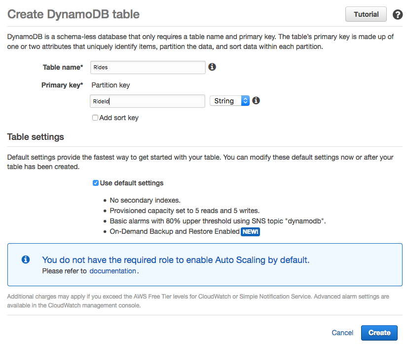
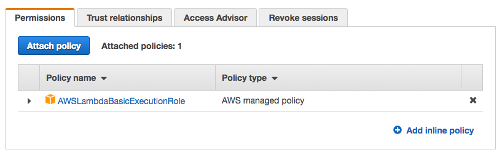
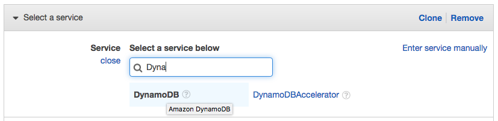
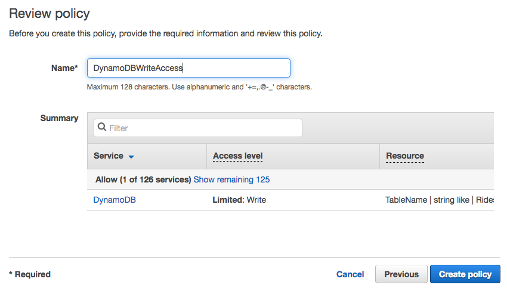
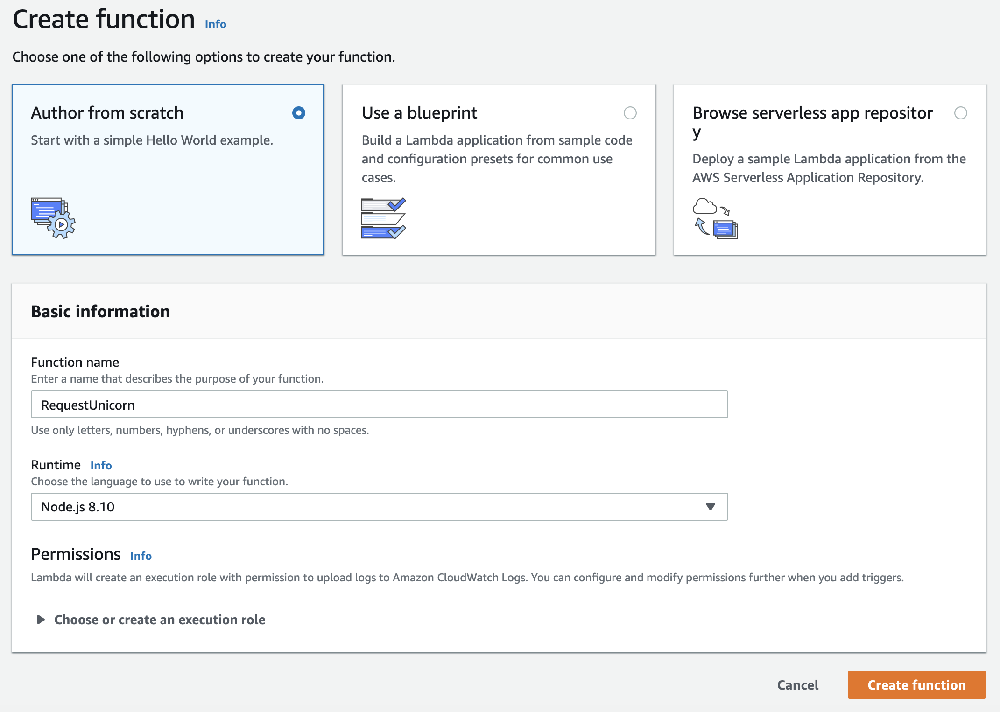
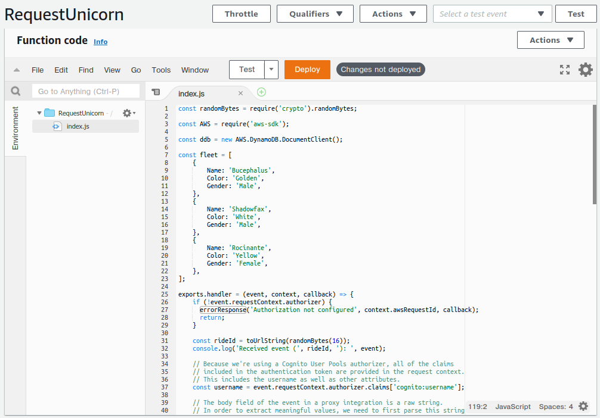
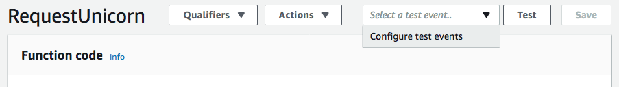
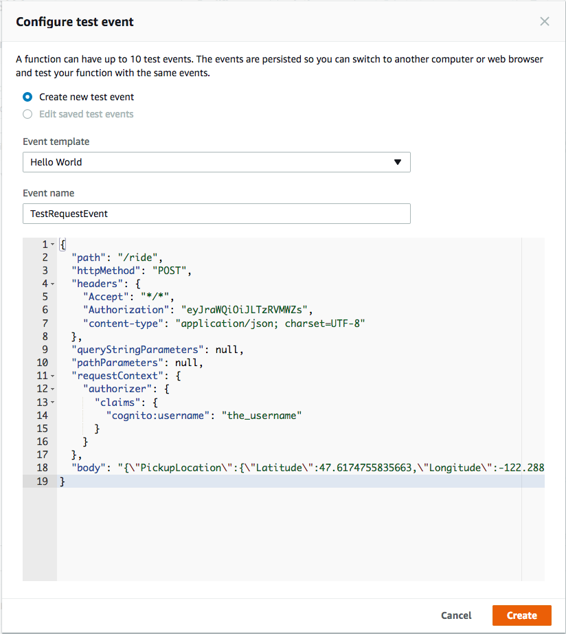

# 모듈 3: 서버리스 서비스 백엔드

이 모듈에서는 웹 애플리케이션의 요청을 처리하는 백엔드 프로세스를 구축하기 위해 [AWS Lambda][lambda]와 [Amazon DynamoDB][dynamodb]를 이용합니다. 첫번째 모듈에서 배포했던 브라우저 애플리케이션에서 사용자가 유니콘을 원하는 위치로 보낼 수 있게 됩니다. 이러한 요건을 위해 브라우저에서 실행중인 자바스크립트가 클라우드에서 실행중인 서비스를 호출합니다.

이번 모듈에서는 사용자가 유니콘을 요청할 때마다 호출할 Lambda 함수를 구현합니다. 이 함수는 유니콘을 고르고, 요청 내역을 DynamoDB 테이블에 레코드를 남기고, 배치된 유니콘에 대한 상세 정보를 프론트 엔드 애플리케이션으로 전달합니다. 


이 함수는 [Amazon API Gateway][api-gw]을 통해 브라우저에 호출됩니다. 이 연결은 다음 모듈에서 구현할 것이며, 이번 모듈에서는 함수만 단독으로 테스트합니다. 

## 구현 지침

:heavy_exclamation_mark: 이 모듈을 시작하시기 전에 [사용자 관리][user-management] 단계를 완료했는지 확인합니다. 

각 섹션은 개요와 단계별 지침으로 구성되어 있으며, AWS 관리 콘솔에 익숙한 사용자라면 단계별 지침을 스텝별로 진행하지 않아도 개요만으로 충분히 워크샵을 진행할 수 있습니다. 

### 1. Amazon DynamoDB 테이블 생성

Amazon DynamoDB 콘솔을 사용하여 새 DynamoDB 테이블을 생성합니다. 테이블 이름을 `Rides` 로 입력하고 파티션 키에  `RideId` 를 입력하고 타입은 String을 선택합니다. 테이블 이름과 파티션 키는 대소문자를 구분합니다. 정확한 이름을 입력했는지 확인합니다. 다른 설정들은 기본값으로 남겨둡니다. 

테이블을 생성되면 ARN 값을 확인합니다. 이 값은 다음 단계에서 필요합니다.

**:white_check_mark: 단계별 지시 사항**
1.  [Amazon DynamoDB Console][dynamodb-console]로 이동합니다.
1. **Create table** 을 클릭합니다. 
1. **Table name** 에 `Rides`를 기입합니다. 이 필드는 대소문자를 구분합니다. 
1. **Partition key** 에 `RideId` 를 기입하고 키 타입으로는 **String** 을 선택합니다. 이 필드는 대소문자를 구분합니다. 
1.  **Use default settings** 에 체크하고 **Create**을 클릭합니다.
    
1. 새 테이블의 Overview 섹션의 맨 아래로 스크롤하여 **ARN**을 확인하십시오. 다음 섹션에서 이 값이 필요합니다. 

### 2. Lambda 함수에 대한 IAM role 생성

#### 배경

모든 Lambda 함수는 각각 IAM role을 가지며, 이 role은 이 함수가 다른 AWS 서비스와 어떤 상호 작용을 할 수 있는지를 정의합니다. 이번 단계에서는 Lambda 함수가 Amazon CloudWatch Logs에 로그를 기록하고 DynamoDB 테이블에 데이터를 쓸 수 있도록 IAM role을 생성합니다.

#### 개요

IAM 콘솔을 사용하여 role을 생성합니다. 이름을 `WildRydesLambda`로 부여하고 role type으로 AWS Lambda를 선택합니다. Amazon CloudWatch Logs에 쓰기 권한과 DynamoDB 테이블에 항목을 넣을 수 있는 권한을 부여하는 정책을 연결해야 합니다.
 
필요한 CloudWatch Logs 권한을 부여하기 위해 `AWSLambdaBasicExecutionRole`라는 관리형 정책을 이 role에 연결합니다. 또한, 이전 섹션에서 생성한 DynamoDB 테이블에 `ddb:PutItem` 액션을 허용하기 위해 커스텀 인라인 정책을 생성합니다. 

**:white_check_mark: 단계별 지시 사항**
1.  [AWS IAM Console][iam-console]로 이동
1. 좌측 내비게이션 바에서 **Roles**를 선택하고 **Create role**를 클릭합니다. 
1. **Choose the service that will use this role**에서 **Lambda**를 선택하고 **Next: Permissions**을 클릭합니다. 
    **Note:** Lambda 등 서비스를 선택하면 이 서비스가 어떤 권한을 가질 수 있는지 미리 정의된 정책(Policy) 리스트를 볼 수 있습니다. AWS 관리 콘솔이 아닌 CLI, AWS CloudFormation 등 다른 방식으로 Role을 생성하는 경우, 여러분이 직접 정책을 작성할 수도 있습니다. 
1. **Filter** 에서 `AWSLambdaBasicExecutionRole`을 검색하여 찾은 후 role 이름의 왼쪽 체크박스를 선택합니다.
1. **Next: Tags**를 클릭하고 필요한 태그를 생성합니다. 
1. **Next: Review** 를 클릭합니다.
1. **Role name**으로 `WildRydesLambda`를 입력합니다. 
1. **Create role**을 클릭합니다. 

다음 단계에서 이번에 생성한 IAM role에 DynamoDB 테이블에 액세스할 수 있도록 권한을 추가합니다.

**:white_check_mark: 단계별 지시 사항**
1. IAM 콘솔에서 role 페이지의 검색창에 `WildRydesLambda`를 입력하여 찾은 후 이 IAM role의 이름을 클릭합니다. 
1. Permissions 탭에서 오른쪽 아래에 있는 **Add inline policy** 링크를 선택하여 새 인라인 정책을 생성합니다. 
    
1. **Choose a service**을 선택합니다.
1. **Find a service**라는 검색창에 `DynamoDB`를 입력해서 찾은 후 **DynamoDB** 를 선택합니다. 
    
1. **Select actions**을 선택합니다.
1. **Filter actions** 라는 검색창에 `PutItem`을 입력하여 찾은 후 **PutItem** 을 선택합니다. 
1. **Resources** 섹션을 선택합니다. 
1. **Specific** 옵션을 선택하고 **table** 섹션의 Add ARN link를 선택합니다. 
1. 이전 섹션에서 생성한 테이블의 ARN을 복사하여 **Specify ARN for table** 필드에 붙여넣고 **Add**를 클릭합니다. (Region, Account, Table name은 자동 완성됩니다.)
1. **Review Policy**를 선택합니다. 
1.  정책 이름(policy name)에 `DynamoDBWriteAccess`를 입력하고 **Create policy**를 클릭합니다. 
    

### 3. 요청 처리를 위한 Lambda 함수 생성

#### 배경

AWS Lambda는 HTTP 요청 등의 이벤트에 대한 응답으로 코드를 실행합니다. 이 단계에서는 유니콘을 배차하기 위해 웹 애플리케이션의 API 요청을 처리하는 핵심 기능을 빌드합니다. 다음 모듈에서는 Amazon API Gateway를 사용하여 사용자들의 브라우저에서 호출할 수 있는 HTTP 엔드 포인트를 표시하는 RESTful API를 생성합니다. 이 단계에서 생성 한 Lambda 함수를 해당 API에 연결함으로써 웹 애플리케이션을 위한 모든 기능을 갖춘 백엔드를 만들게 됩니다.

#### 개요

AWS Lambda 콘솔을 통해 API 요청을 처리할 `RequestUnicorn` 이라는 Lambda 함수를 생성합니다. 함수 코드로는 [requestUnicorn.js](requestUnicorn.js) 라는 기 제공된 예제 구현을 활용합니다. 파일을 복사하여 AWS Lambda 콘솔의 편집기에 붙여넣기만 하면 됩니다. 

이 함수가 이전 단계에서 생성한 `WildRydesLambda`라는 IAM role을 사용하도록 설정했는지 확인합니다. 

**:white_check_mark: 단계별 지시 사항**
1. [AWS Lambda][lambda-console]로 이동합니다.
1. **Create function**을 선택합니다. 
1. **Author from scratch** 카드에서 기본 설정값을 유지합니다. 
1. **Name** 필드에 `RequestUnicorn` 를 입력합니다. 
1. **Runtime**으로는 **Node.js 8.10** 를 선택합니다.
2. **Permissions** 의  *Choose or create an execution role* 를 확장합니다.
1. **Role** 드롭다운에서 `Use an existing role`을 선택했는지 확인합니다.  
1. **Existing Role** 드롭다운에서 `WildRydesLambda`을 선택합니다. 
    
1. **Create function**을 클릭합니다. 
1. **Function code** 섹션까지 아래로 스크롤하여 **index.js** 의 기존 코드를 [requestUnicorn.js](requestUnicorn.js)의 코드로 대체합니다. 
    
1. 오른쪽 위에 있는 **"Save"** 버튼을 클릭합니다. 

## 구현 검증

이번 모듈에서는 AWS Lambda 콘솔을 이용하여 생성한 함수를 테스트합니다. 다음 모듈에서는 API 게이트웨이와 함께 REST API를 추가하여 첫 번째 모듈에서 구축한 브라우저 기반 애플리케이션에서 함수를 호출할 수 있게 됩니다. 

**:white_check_mark: 단계별 지시 사항**
1. 함수의 메인 편집 화면에서 **Select a test event...** 드롭다운을 찾아 **Configure test events** 을 선택합니다.     
1. **Create new test event** 을 선택된 상태로 유지합니다.
1. **Event name** 필드에 `TestRequestEvent`를 입력합니다.
1. 다음 테스트 이벤트를 복사하여 편집기에 붙여넣습니다.

    ```JSON
    {
        "path": "/ride",
        "httpMethod": "POST",
        "headers": {
            "Accept": "*/*",
            "Authorization": "eyJraWQiOiJLTzRVMWZs",
            "content-type": "application/json; charset=UTF-8"
        },
        "queryStringParameters": null,
        "pathParameters": null,
        "requestContext": {
            "authorizer": {
                "claims": {
                    "cognito:username": "the_username"
                }
            }
        },
        "body": "{\"PickupLocation\":{\"Latitude\":47.6174755835663,\"Longitude\":-122.28837066650185}}"
    }
    ```
    
1. **Create**을 클릭합니다. 
1. 메인 편집 화면에서 드롭다운에서 `TestRequestEvent` 을 선택한 채로 **Test** 를 클릭합니다. 
1. 페이지 맨 위로 스크롤하여 **Execution result** 섹션의 **Details** 를 펼칩니다.
1. 실행 결과가 성공적이였는지, 함수 실행 결과가 다음과 같은지 확인합니다. 
    ```JSON
    {
      "statusCode": 201,
      "body": "{\"RideId\":\"1h0zDZ-6KLZaEQCPyqTxeQ\",\"Unicorn\":{\"Name\":\"Shadowfax\",\"Color\":\"White\",\"Gender\":\"Male\"},\"UnicornName\":\"Shadowfax\",\"Eta\":\"30 seconds\",\"Rider\":\"the_username\"}",
      "headers": {
        "Access-Control-Allow-Origin": "*"
      }
    }
    ```

### :star: 요약

:key: [AWS Lambda][lambda] 는 서버리스 함수 서비스로(serverless functions as a service), 애플리케이션을 실행하기 위한 서버 관리의 부담을 없애줍니다. 트리거를 구성하고 함수가 데이터베이스나 데이터스토어 또는 인터넷의 퍼블릭 서비스나 자신의 Amazon VPC(Virtual Private Cloud) 내 다른 서비스 등, 거의 모든 서비스와 인터페이스할 수 있도록 IAM role을 설정합니다. [Amazon DynamoDB][dynamodb]는 서버를 관리할 필요 없이 대량의 트래픽과 데이터를 처리하기 위해 자동으로 확장하는 비관계형 데이터베이스 서비스입니다. 

:wrench: 이 모듈에서는 DynamoDB 테이블을 생성한 다음 Lambda 함수를 만들어 데이터를 기록합니다. 이 함수는 다음 모듈에서 Amazon API Gateway를 통해 웹 애플리케이션과 연동되고 사용자들의 유니콘 탑승 세부 정보를 기록합니다. 

### Next

:white_check_mark:  Lambda 콘솔을 통해 새 함수를 테스트가 완료되었으면 다음 [RESTful APIs][restful-apis]모듈로 이동합니다.

[amplify-console]: https://aws.amazon.com/amplify/console/
[cognito]: https://aws.amazon.com/cognito/
[lambda]: https://aws.amazon.com/lambda/
[api-gw]: https://aws.amazon.com/api-gateway/
[dynamodb]: https://aws.amazon.com/dynamodb/
[static-web-hosting]: ../1_StaticWebHosting/
[user-management]: ../2_UserManagement/
[restful-apis]: ../4_RESTfulAPIs/
[dynamodb-console]: https://console.aws.amazon.com/dynamodb/home
[iam-console]: https://console.aws.amazon.com/iam/home
[lambda-console]: https://console.aws.amazon.com/lambda/home