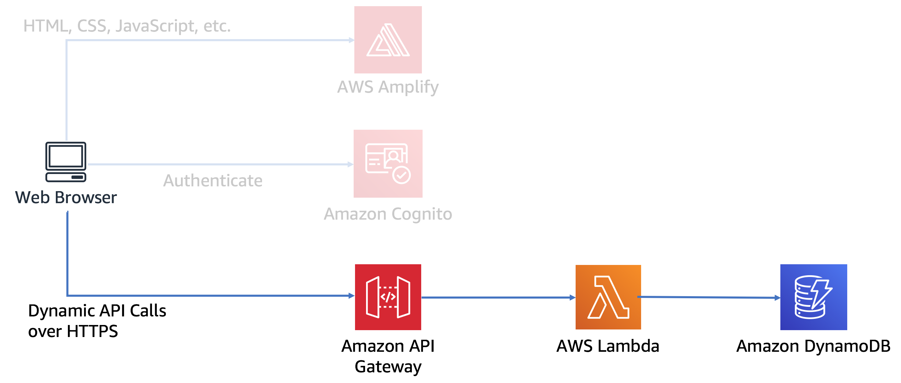
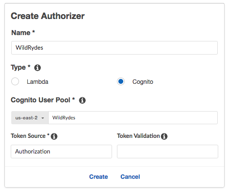
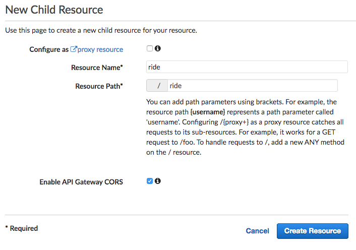
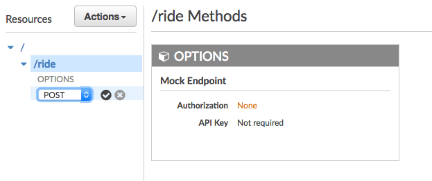

# 모듈 4: RESTful APIs with AWS Lambda and Amazon API Gateway

이 모듈에서는 [이전 모듈][serverless-backend]에서 구축한 Lambda 함수를 API Gateway를 통해 RESTful API로 노출시켜 퍼블릭 인터넷에서 접근 가능하게 합니다. [사용자 관리][user-management] 모듈에서 생성한 Amazon Cognito의 사용자 풀(user pool)로 보호합니다. 이 구성을 통해 노출된 API로 AJAX 호출을 보내는 클라이언트 사이드 자바 스크립트를 추가함으로써 정적으로 호스팅된 웹사이트는 동적인 웹 애플리케이션이 됩니다. 



위의 다이어그램은 이번 모듈에서 구성할 API Gateway 컴포넌트가 이전 단계에서 구축한 기존 컴포넌트들과 어떻게 통합되는지 보여줍니다. 흐리게 처리된 구성 요소들은 이전 단계에서 이미 구축한 아이템들입니다. 

첫번째 모듈에서 배포한 정적 웹 사이트는 이미 이 모듈에서 빌드할 API와 상호 작용하는 페이지를 가지고 있습니다. /ride.html의 페이지에는 유니콘 라이드를 요청하기 위한 간단한 지도 기반 인터페이스가 있습니다. /signin.html 페이지에서 인증하면 사용자는 지도에서 픽업 위치를 클릭하여 선택할 수 있으며 오른쪽 상단 모서리에 있는 "유니콘 요청" 버튼을 클릭함으로써 탑승 요청을 보낼 수 있습니다. 

이 모듈은 API의 클라우드 구성 요소들을 빌드하기 위한 과정에 초점을 두지만, 혹시 브라우저 코드가 어떻게 이 API를 호출하는 역할을 수행하는지 알고 싶다면 웹사이트의 [ride.js](../1_StaticWebHosting/website/js/ride.js) 파일을 참고하십시오. 애플리케이션은 원격 요청을 위해 jQuery의 [ajax()](https://api.jquery.com/jQuery.ajax/) 메소드를 이용합니다. 

## 구현 지침

:heavy_exclamation_mark: 워크샵을 시작하기 전에 [서버리스 백엔드][serverless-backend] 단계를 완료했는지 확인합니다.

각 섹션은 개요와 단계별 지침으로 구성되어 있으며, AWS 관리 콘솔에 익숙한 사용자라면 단계별 지침을 스텝별로 진행하지 않아도 개요만으로 충분히 워크샵을 진행할 수 있습니다. 

### 1. 새 REST API 생성하기
Amazon API Gateway 콘솔을 이용하여 `WildRydes`라는 이름의 새 API를 생성합니다.

**:white_check_mark: 단계별 지시 사항**
1. [Amazon API Gateway Console][api-gw-console]로 이동합니다.
1. **Get Started**을 선택합니다. 
1. **REST API**, **Build** 를 선택합니다.

     

1. **REST**, **New API** 를 선택하고 **API Name** 이름으로  `WildRydes`를 입력합니다. 
1. **Endpoint Type** 드롭다운에서 `Edge optimized`를 선택합니다. 
    ***Note***: Edge optimized는 인터넷을 통해 접근하는 퍼블릭 서비스에 최적화되어 있습니다. 리전 엔드포인트는 일반적으로 주로 동일한 AWS 리전 내에서 액세스하는 API에 사용됩니다. 프라이빗 API는 Amazon VPC 내부의 인터널 서비스를 위한 것입니다.
1. **Create API**를 클릭합니다. 

    

### 2. Cognito User Pools Authorizer 생성

#### 배경
Amazon API Gateway는 Cognito User Pools이 반환한 JWT 토큰을 사용하여 API 콜을 인증할 수 있습니다. 이번 단계에서는 [User Management][user-management]에서 생성한 사용자 풀을 이용하여 API의 인증자(Authorizer)를 구성합니다. 

#### 개요
Amazon API Gateway 콘솔에서 API에 대한 새로운 Cognito 사용자 풀 인증자를 생성합니다. 이전 모듈에서 생성한 사용자 풀의 상세정보를 이용하여 구성합니다. 현재 웹 사이트의 /signin.html 페이지를 통해 로그인 한 후 보이는 인증 토큰을 복사하여 붙여 넣는 방법으로 콘솔에서 구성을 테스트할 수 있습니다.

**:white_check_mark: 단계별 지시 사항**
1. 새로 생성한 API에서 **Authorizers**를 선택합니다.
1. **Create New Authorizer**를 선택합니다.
1. Authorizer 이름으로 `WildRydes`를 입력합니다.
1. 타입으로는 **Cognito**를 선택합니다. 
1. **Cognito User Pool**의 리전 드롭다운에서, 이전 User Management 모듈에서 생성했던 Cognito 사용자 풀과 동일한 리전을 선택합니다. (기본적으로는 현재의 리전이 선택됩니다.)
1. **Cognito User Pool** 이름에 `WildRydes`를 입력합니다. (사용자 풀에 다른 이름을 줬다면 그 이름을 입력합니다.) 
1. **Token Source**에 `Authorization`를 입력합니다.
1. **Create**을 클릭합니다. 

    

#### 인증자 구성 검증

**:white_check_mark: 단계별 지시 사항**
1. 새 브라우저 탭을 열고 웹사이트의 도메인의 `/ride.html` 페이지에 방문합니다. 
1. 만약 로그인 페이지로 리다이렉트되면 지난 모듈에서 생성한 사용자 정보로 로그인합니다. 그러면 다시 `/ride.html` 페이지로 리다이렉트될 것입니다. 
1. `/ride.html`의 알림창에서 인증 토큰을 복사합니다.
1. 인증자를 생성했던 이전 탭으로 이동합니다. 
1. 인증자의 카드 하단에서 **Test**를 클릭합니다. 
1. 팝업 대화창의 **Authorization Token** 필드에 복사한 인증 토큰값을 붙여넣습니다. 
    

1. **Test** 버튼을 클릭하여 응답 코드가 200이고 사용자의 클레임이 표시되는지 확인합니다.

### 3. 새 리소스와 메소드 생성하기
 API 내에 /ride라는 새 리소스를 만듭니다. 그런 다음 해당 리소스에 대한 POST 메소드를 작성하고, 이 모듈의 첫 번째 단계에서 작성한 RequestUnicorn 함수가 지원하는 Lambda 프록시 통합을 사용하도록 구성합니다.

**:white_check_mark: 단계별 지시 사항**
1. 왼쪽의 네비게이션 바에서 WildRydes API의 **Resources** 를 클릭합니다. 
1. **Actions** 드롭다운에서 **Create Resource**를 선택합니다. 
1. **Resource Name**으로 `ride` 를 입력합니다.
1. **Resource Path**가 `ride`로 되어있는지 확인합니다.
1. **Enable API Gateway CORS** 체크박스를 활성화합니다. 
1. **Create Resource** 클릭합니다. 

    

1. 새로 생성한 `/ride` 리소스를 선택한 상태에서, **Action** 드롭다운에서 **Create Method**를 선택합니다. 
1. 새 드롭다운에서 `POST`를 선택하고 **체크마크를 클릭합니다**.

    
1. **Integration type**으로 **Lambda Function**을 선택합니다. 
1. **Use Lambda Proxy integration** 박스를 체크합니다.
1. **Lambda Region**은 Lambda 함수를 생성한 리전을 선택합니다.
1. **Lambda Function**에 이전 모듈에서 생성한 함수의 이름인 `RequestUnicorn`을 입력합니다. 
1. **Save**를 클릭합니다. 함수가 존재하지 않는다는 에러가 뜬다면 이전 모듈에서 사용했던 것과 같은 리전을 선택했는지 재확인합니다. 

    

1. 함수 호출 권한을 Amazon API Gateway에 부여하라는 메시지가 표시되면 **OK**를 클릭합니다.
1. **Method Request** 카드를 선택합니다.
1. **Authorization** 옆의 연필 아이콘을 클릭합니다.
1. 드롭다운 리스트에서 'WildRydes' Cognito 사용자 풀 인증자를 선택하고 체크마크를 클릭하여 업데이트 합니다. 

    

### 4. API 배포
Amazon API Gateway 콘솔에서 Actions, Deploy API를 선택합니다. 새로운 스테이지를 만들라는 메시지가 나타납니다. 스테이지 이름으로 'prod'를 사용합니다.

**:white_check_mark: Step-by-step directions**
1. **Actions** 드롭다운 리스트에서 **Deploy API**를 선택합니다.
1. **Deployment stage**의 드롭다운 리스트에서 **[New Stage]** 를 선택합니다. 
1. **Stage Name**에 `prod`를 입력합니다.
1. **Deploy**를 클릭합니다. 
1. **Invoke URL**을 확인합니다. 다음 섹션에서 사용하게 됩니다. 

### 5. 웹 사이트 구성 업데이트
웹 사이트 배포에서 /js/config.js 파일을 업데이트하여 방금 만든 스테이지의 호출 URL을 포함시킵니다. Amazon API Gateway 콘솔의 스테이지 편집기 페이지 맨 위에서 호출 URL을 직접 복사하여 사이트의 /js/config.js 파일에서 _config.api.invokeUrl 키에 붙여 넣어야 합니다. 구성 파일을 업데이트 할 때 이전 모듈에서 Cognito 사용자 풀에 업데이트한 내용이 그대로 포함되어 있는지 확인합니다.

**:white_check_mark: 단계별 지시 사항**
1. Cloud9 개발 환경에서 `js/config.js`을 엽니다.
1. config.js 파일의 **api** 키에 **invokeUrl** 설정을 업데이트합니다. Set the value to the **Invoke URL** 의 값은 이전 단계에서 생성한 배치 스테이지의 URL입니다. 
    업데이트한 `config.js` 파일의 설정은 아래와 같습니다. 실습자의 파일에 들어갈 실제 값들은 다를 것입니다. 
    ```JavaScript
    window._config = {
        cognito: {
            userPoolId: 'us-west-2_uXboG5pAb', // e.g. us-east-2_uXboG5pAb
            userPoolClientId: '25ddkmj4v6hfsfvruhpfi7n4hv', // e.g. 25ddkmj4v6hfsfvruhpfi7n4hv
            region: 'us-west-2' // e.g. us-east-2
        },
        api: {
            invokeUrl: 'https://rc7nyt4tql.execute-api.us-west-2.amazonaws.com/prod' // e.g. https://rc7nyt4tql.execute-api.us-west-2.amazonaws.com/prod,
        }
    };
    ```

1. 수정한 파일을 수정하고 파일 이름은 그대로 `config.js`으로 보존합니다.
1. git repository에 변경사항을 commit합니다. 
    ```
    $ git add js/config.js 
    $ git commit -m "configure api invokeURL"
    $ git push
    ...
    Counting objects: 4, done.
    Compressing objects: 100% (4/4), done.
    Writing objects: 100% (4/4), 422 bytes | 422.00 KiB/s, done.
    Total 4 (delta 3), reused 0 (delta 0)
    To https://git-codecommit.us-east-1.amazonaws.com/v1/repos/wildrydes-site
       c15d5d5..09f1c9a  master -> master
    ```

    [Amplify Console][amplify-console-console]이 변경사항을 감지하고 웹 애플리케이션을 다시 빌드하고 배포합니다. Amplify Console에서 배포가 완료되는 과정을 확인합니다. 

## 구현 검증

**:white_check_mark: 단계별 지시 사항**
1. 웹사이트 도메인의 `/ride.html` 페이지를 방문합니다. 
1. 로그인 페이지로 리디렉션되는 경우 이전 모듈에서 생성한 사용자로 로그인합니다.
1. 지도가 로딩되면 임의로 아무데나 클릭하여 픽업 위치를 지정해봅니다. 
1. **Request Unicorn**을 클릭합니다. 오른쪽 사이드 바에 유니콘이 오고 있다는 알림이 표시되고 유니콘 아이콘이 지정된 픽업 위치로 날아오는 것을 볼 수 있습니다.

### :star: 요약

:key: [Amazon API Gateway][api-gw] 는 개발자가 모든 규모에서 API를 쉽게 생성, 게시, 유지 관리, 모니터링할 수 있는 안전한 완전 관리형 서비스입니다. [Amazon Cognito][cognito], [AWS Lambda][lambda]와 같은 백엔드를 통해 쉽게 Authorization을 플러그인 하여 완전한 서버리스 API를 생성할 수 있습니다.

:wrench: 이 모듈에서는 API Gateway를 사용하여 이전 모듈에서 작성된 Lambda 함수에 REST API를 제공했습니다. 여기에서 API 엔드포인트를 사용하도록 웹 사이트를 업데이트했고 사용자가 유니콘 라이딩을 요청할 수 있으며 라이딩에 대한 정보는 이전에 생성된 DynamoDB 테이블에 저장됩니다.

:star: 축하합니다. Wild Rydes 웹 애플리케이션 워크숍을 완료했습니다! 추가적인 서버리스 사용 사례를 다루는 [다른 워크샵](../../README.md#workshops)도 확인해보십시오.

### Next

:white_check_mark: 생성한 리소스를 삭제하기 위해 [정리 안내서][cleanup]를 참고합니다. 

[amplify-console]: https://aws.amazon.com/amplify/console/
[amplify-console-console]: https://console.aws.amazon.com/amplify/home
[api-gw]: https://aws.amazon.com/api-gateway/
[api-gw-console]: https://console.aws.amazon.com/apigateway/home
[cleanup]: ../9_CleanUp/
[cognito-console]: https://console.aws.amazon.com/cognito/home
[cognito]: https://aws.amazon.com/cognito/
[configjs]: ../1_StaticWebHosting/website/js/config.js
[dynamodb-console]: https://console.aws.amazon.com/dynamodb/home
[dynamodb]: https://aws.amazon.com/dynamodb/
[iam-console]: https://console.aws.amazon.com/iam/home
[jwt-decoder]: https://jwt.io/
[lambda-console]: https://console.aws.amazon.com/lambda/home
[lambda]: https://aws.amazon.com/lambda/
[restful-apis]: ../4_RESTfulAPIs/
[serverless-backend]: ../3_ServerlessBackend/
[setup]: ../0_Setup/
[static-web-hosting]: ../1_StaticWebHosting/
[user-management]: ../2_UserManagement/
