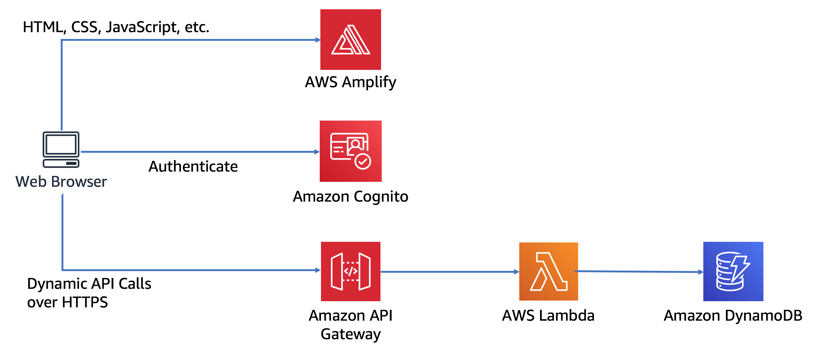

## 서버리스 웹 애플리케이션 워크샵

본 워크샵에서는 사용자가 [Wild Rydes][wildrydes] 서비스를 통해 현재 있는 위치에서 유니콘 호출 및 탑승을 할 수 있는 스타트업 아이디어를 구현한다는 시나리오로 함께 웹 애플리케이션을 만들어 배포해 봅니다. 이 서비스는 사용자에게 HTML 기반 사용자 인터페이스를 제공하여, 사용자가 원하는 위치를 표시하고 유니콘 요청을 하면, 근방의 유니콘을 보낼 수 있도록 RESTful 웹 서비스로 백엔드를 제공합니다. 또한, 사용자가 유니콘 타기를 요청하기 전에 기본적으로 회원 가입을 하고 로그인 할 수 있는 기능을 제공합니다.

애플리케이션 아키텍처는 [AWS Lambda][lambda], [Amazon API Gateway][api-gw], [Amazon S3][s3], [Amazon DynamoDB][dynamodb], [Amazon Cognito][cognito], [AWS Amplify Console][amplify-console]를 활용합니다. Amplify Console은 S3를 통해 사용자의 브라우저에 로드되는 HTML, CSS, JavaScript 및 이미지 파일을 포함한 정적 웹 리소스를 호스팅합니다. 브라우저에서 실행되는 JavaScript는 Lambda 및 API Gateway를 사용하여 빌드된 공용 백엔드 API에서 데이터를 송수신합니다. Amazon Cognito는 백엔드 API를 보호하기 위해 사용자 관리 및 인증 기능을 제공합니다. 마지막으로, DynamoDB는 API의 Lambda 함수로 데이터를 저장할 수 있는 데이터베이스 기능을 제공합니다.

전체 아키텍처의 그림은 아래 다이어그램을 참조하십시오.

### 모듈

 이 워크샵은 4 개의 모듈로 나뉩니다. 각 모듈은 무엇을 빌드할 것인지에 대한 시나리오와 실제로 구축하고 작업을 검증할 수 있는 단계별 지침을 제공합니다.

| Module | Description |
| ---------------- | -------------------------------------------------------- |
| [정적 웹 호스팅][static-web-hosting] |CodeCommit 또는 GitHub에서 git 리포지토리를 생성한 다음, 사이트 코드를 푸쉬하여 AWS Amplify Console을 사용하여 정적 웹 사이트를 배포합니다. |
| [사용자 관리][user-management] | Amazon Cognito를 사용하여 웹 사이트에 대한 사용자 관리를 구성합니다. |
| [서버리스 백엔드][serverless-backend] | Amazon DynamoDB 테이블에 데이터를 유지하는 AWS Lambda 함수를 생성합니다. |
| [RESTful API][restful-apis] | 정적 사이트가 호출할 수있는 RESTful API로써 Amazon API Gateway를 통해 Lambda 함수를 노출합니다. |

:warning: 이 모듈은 순서대로 진행되도록 설계되었습니다. 

워크샵을 완료하신 후 [정리 안내서][cleanup]에 따라 생성된 모든 자원들을 삭제할 수 있습니다.

### Next

:white_check_mark: [실습 준비][setup]를 참고하여 AWS Cloud9 IDE를 구성하고 AWS 계정 등 사전 준비사항을 설정합니다. 

[wildrydes]: http://wildrydes.com/
[unicorns]: http://www.wildrydes.com/unicorns.html
[amplify-console]: https://aws.amazon.com/amplify/console/
[cognito]: https://aws.amazon.com/cognito/
[lambda]: https://aws.amazon.com/lambda/
[api-gw]: https://aws.amazon.com/api-gateway/
[s3]: https://aws.amazon.com/s3/
[dynamodb]: https://aws.amazon.com/dynamodb/
[setup]: 0_Setup/
[static-web-hosting]: 1_StaticWebHosting/
[user-management]: 2_UserManagement/
[serverless-backend]: 3_ServerlessBackend/
[restful-apis]: 4_RESTfulAPIs/
[cleanup]: 9_CleanUp/
